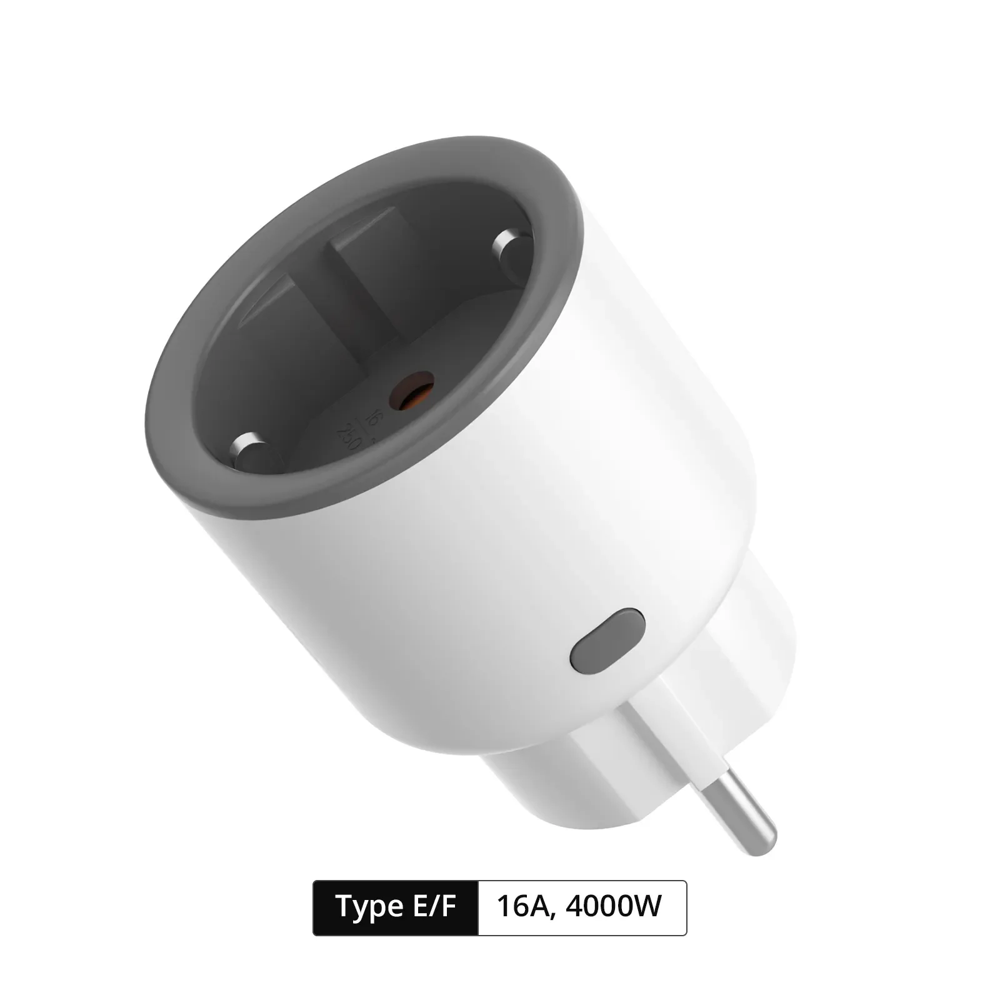

## GPIO Pinout

| Pin    | Function                           |
| ------ | ---------------------------------- |
| GPIO9  | Push Button (HIGH = off, LOW = on) |
| GPIO4  | Relay and its status red LED       |
| GPIO5  | Status LED                         |
| GPIO7  | TX pin (CSE7759B meter)            |

## Links

- [Product Page](https://itead.cc/product/sonoff-iplug-wi-fi-smart-plug-s60/)
- [Sonoff S60 version Europe : tasmotized](https://github.com/arendst/Tasmota/discussions/21255)

## Basic Configuration

```yaml
# You should only need to modify the substitutions.
substitutions:
  device_name: ssonoff-s60tpf
  friendly_name: Sonoff S60TPF

# Nothing below should need modification.
esphome:
  name: ${device_name}
  friendly_name: ${friendly_name}

esp32:
  board: esp32-c3-devkitm-1
  framework:
    type: esp-idf

logger:
api:
captive_portal:
ota:

wifi:
  ssid: !secret wifi_ssid
  password: !secret wifi_password
  ap:

status_led:
    pin:
      number: GPIO5
      inverted: true

switch:
  - id: switch_1
    platform: gpio
    name: "Relay"
    pin: GPIO4
    restore_mode: ALWAYS_ON

binary_sensor:
  - platform: gpio
    id: button_1
    internal: true
    pin:
      number: GPIO9
      inverted: true
    on_press:
      - switch.toggle: switch_1
    filters:
      - delayed_on: 10ms
      - delayed_off: 10ms

sensor:
  - platform: cse7766
    current:
      name: ${friendly_name} Current
    voltage:
      name: ${friendly_name} Voltage
    power:
      name: ${friendly_name} Power
    energy:
      name: ${friendly_name} Energy

uart:
  rx_pin: GPIO7
  baud_rate: 4800
  parity: EVEN

```
