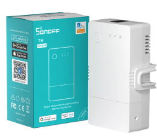

## GPIO Pinout

| Pin    | Function                           |
| ------ | -----------------------------------|
| GPIO00 | Push Button (HIGH = off, LOW = on) |
| GPIO13 | Right LED (Green/Auto)             |
| GPIO15 | Middle LED (Blue/WiFi)             |
| GPIO16 | Left LED (Red/Relay)               |
| GPIO21 | Relay                              |
| GPIO25 | Dallas Sensor Bus Data In/Out      |
| GPIO27 | Dallas Sensor 3.3V Power           |

## Configuration using DS18B20 temperature sensor

Will be exposed as a climate control system in Home Assistant.

Button usage:

- Short press: Manually turn on or off relay
- Long press: Manually turn on or off climate control

LED meaning:

- Left LED (Red): Lit when relay is turned on
- Middle LED (Blue) : Lit when WiFi is connected
- Right LED (Green) : Lit when climate control is turned on

```yaml
# Sonoff THR316 Smart Temperature and Humidity Monitoring Switch
# Assumes that a DS18B20 temperature sensor is connected
substitutions:
  friendly_name: "Sonoff THR316"
  device_name: sonoffthr316

esphome:
  name: $device_name
  on_boot:
    - priority: 90
      then:
      # Make sure the relay is in a known state at startup
      - switch.turn_off: relay
      # Default to running the climate control in Home mode
      - climate.control:
          id: climate_control
          preset: "Home"

esp32:
  board: nodemcu-32s

wifi:
  ssid: !secret wifi_ssid
  password: !secret wifi_password
  ap:
    ssid: $device_name

captive_portal:

logger:
  level: INFO
  baud_rate: 0

api:
  encryption:
    key: !secret api_encryption_key

ota:
  password: ""

#optional
web_server:
  port: 80

time:
  - platform: homeassistant
    id: homeassistant_time

sensor:
  - platform: wifi_signal
    name: $friendly_name Wifi RSSI
    update_interval: 60s

  - platform: uptime
    id: uptime_sensor
    internal: True
    on_raw_value:
      then:
        - text_sensor.template.publish:
            id: uptime_human
            state: !lambda |-
              int seconds = round(id(uptime_sensor).raw_state);
              int days = seconds / (24 * 3600);
              seconds = seconds % (24 * 3600);
              int hours = seconds / 3600;
              seconds = seconds % 3600;
              int minutes = seconds /  60;
              seconds = seconds % 60;
              return (
                (days ? to_string(days) + "d " : "") +
                (hours ? to_string(hours) + "h " : "") +
                (minutes ? to_string(minutes) + "m " : "") +
                (to_string(seconds) + "s")
              ).c_str();

  - platform: template
    name: $friendly_name ESP32 Internal Temp
    device_class: temperature
    unit_of_measurement: °C
    id: esp32_temp
    lambda: return temperatureRead();

  # External DS18B20 Digital Temperature Sensor
  - platform: dallas
    index: 0
    name: $friendly_name Temperature
    id: temp

binary_sensor:
  - platform: gpio
    pin: GPIO00
    id: reset
    internal: true
    filters:
      - invert:
      - delayed_off: 10ms
    on_click:
      - max_length: 350ms # short press to toggle the relay
        then:
          - switch.toggle: relay
          # Turn off climate control
          - climate.control:
              id: climate_control
              mode: "OFF"
      - min_length: 360ms # long press to toggle climate control
        max_length: 3s
        then:
          - if:
              condition:
                lambda: |-
                  return id(climate_control).mode == CLIMATE_MODE_OFF;
              then:
                # We need to turn off realy due to a bug in the climate
                # component. If the relay is on and climate control is
                # turned on in idle mode (target temp < set temp) the relay
                # will not be turned off automatically. It works fine if
                # the climate control is turned on in heat mode (target temp >
                # set temp), i.e. the relay will be turned on.
                - switch.turn_off: relay
                - climate.control:
                    id: climate_control
                    mode: "HEAT"
              else:
                climate.control:
                  id: climate_control
                  mode: "OFF"
switch:
  - platform: gpio
    name: $friendly_name
    pin: GPIO21
    id: relay
    restore_mode: RESTORE_DEFAULT_OFF
    on_turn_on:
      - delay: 500ms
      - light.turn_on: switch_led
    on_turn_off:
      - delay: 500ms
      - light.turn_off: switch_led
  - platform: restart
    name: $friendly_name Restart
  # This is needed to power the external sensor.
  # It receives 3v3 from this pin, which is pulled up on boot.
  - platform: gpio
    pin: GPIO27
    id: sensor_power
    restore_mode: ALWAYS_ON

text_sensor:
  - platform: template
    name: $friendly_name Uptime
    id: uptime_human
    icon: mdi:clock-start
  - platform: wifi_info
    ip_address:
      name: $friendly_name IP
    ssid:
      name: $friendly_name SSID
    bssid:
      name: $friendly_name BSSID

light:
  - platform: status_led
    id: switch_led
    internal: True
    pin:
      number: GPIO16
      inverted: True
  - platform: status_led
    id: wifi_status_led
    internal: True
    pin:
      number: GPIO15
      inverted: True
  - platform: status_led
    id: auto_led
    internal: True
    pin:
      number: GPIO13
      inverted: True

interval:
  - interval: 30s
    then:
      if:
        condition:
          wifi.connected:
        then:
          - light.turn_on: wifi_status_led
        else:
          - light.turn_off: wifi_status_led

# DS18B20 Digital Temperature Sensor Hub
dallas:
  - pin: GPIO25
    update_interval: 10s

climate:
  - platform: thermostat
    id: climate_control
    name: $friendly_name Climate Control
    sensor: temp
    min_heating_off_time: 5s
    min_heating_run_time: 5s
    min_idle_time: 5s
    heat_deadband: 2
    heat_action:
      - switch.turn_on: relay
    idle_action:
      - switch.turn_off: relay
    off_mode:
      - switch.turn_off: relay
    default_preset: Home
    preset:
      - name: Home
        default_target_temperature_low: 20 °C
    on_state:
    - if:
        condition:
          lambda: |-
            return id(climate_control).mode == CLIMATE_MODE_OFF;
        then:
          - light.turn_off: auto_led
    - if:
        condition:
          lambda: |-
            return id(climate_control).mode == CLIMATE_MODE_HEAT;
        then:
          - light.turn_on: auto_led
```
