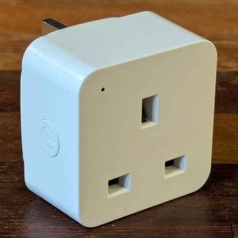
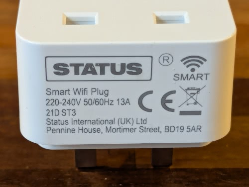
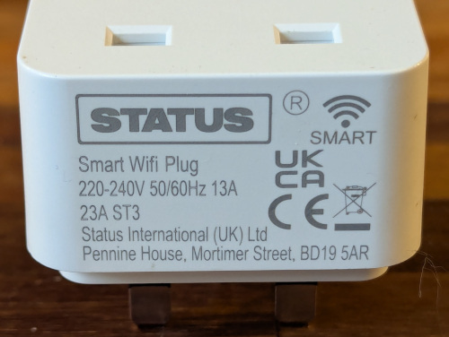
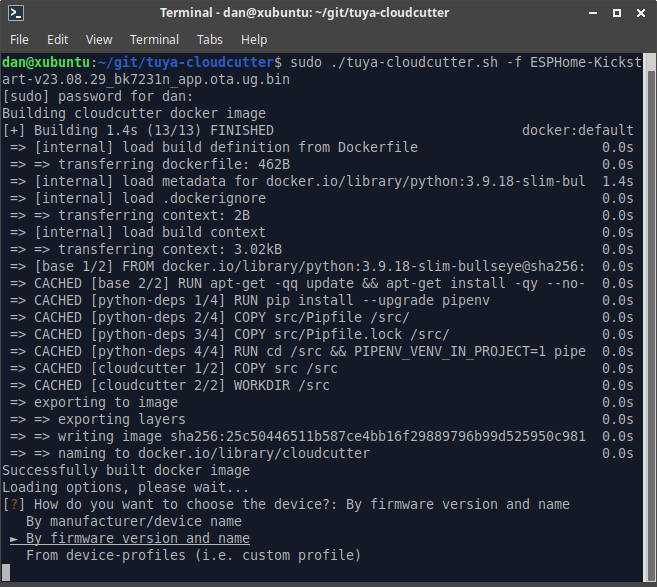
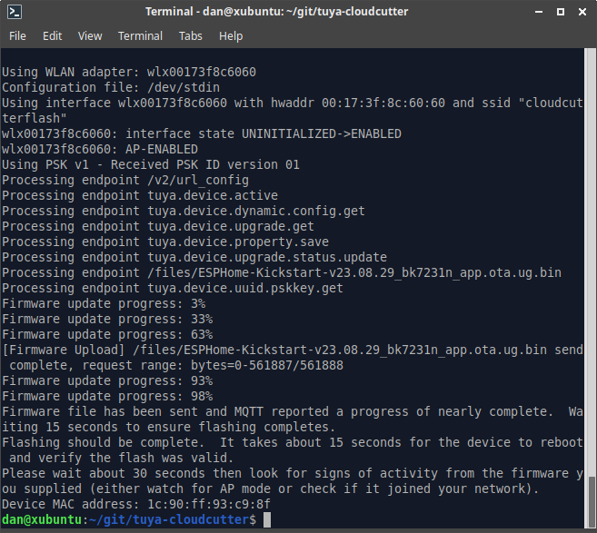

These are Tuya manufactured devices branded by Status International (UK) LTD.

https://statussmart.com/

There's no power monitoring, only relay control.

I've collected three different model numbers: **21D ST3** / **21G ST3** / **23A ST3**. Apart from the model they're visually identical except for the colour of one internal status LED. Each has slightly different GPIO pinouts.





Model 21G was sacraficed to reverse engineer, and contains a Tuya WB2S module, which uses the BK7231T microcontroller. 21D also uses this controller, however 23A uses a BK7231T controller.

Despite using plenty of heat I was unable to open the case without considerable damage. Fortunately, these models can be flashed wirelessly using [Tuya Cloudcutter](https://github.com/tuya-cloudcutter/tuya-cloudcutter).

**WARNING - if you do open the case, remember these devices have no isolation between the mains and low voltage side. NEVER connect anything to the device while connected to the mains supply.**

### Flashing with Tuya Cloudcutter

While this isn't a full tutorial on Tuya Cloudcutter, replacing the firmware is simple, although it took me a few attempts to figure out. You'll need a linux host with Docker installed and a spare unconfigured wireless interface. You'll also need to know the firmware version each plug uses.

These instructions will probably work for other Beken-based devices if you can identify the firmware version and MCU type.

At time of writing, models 21D/G use 1.0.7 and 23A uses 1.1.8. If newer firmware is installed, Tuya might have patched it against using Cloudcutter. To determine the version you'll need to pair up with the Status Smart app (Tuya's own app may work, not tested). Edit/manage the device and follow Device Update to view the current version.

* Check out the project https://github.com/tuya-cloudcutter/tuya-cloudcutter
* Put the plug into AP mode, by holding the button down for 5 seconds to enter EZ mode (fast flashing LED), then hold again to enter AP mode (slow flashing LED).
* Run: `sudo ./tuya-cloudcutter.sh -f FIRMWARE` where FIRMWARE is either the ESPhome Kickstart file or your pre-compiled ESPHome device firmware. I prefer to use the Kickstart firmware first.

Models 21D/G use the `ESPHome-Kickstart-v23.08.29_bk7231t_app.ota.ug.bin` file, while 23A uses `ESPHome-Kickstart-v23.08.29_bk7231n_app.ota.ug.bin`, both located in located in `custom-firmware`. Your version number may differ in the future.

* When prompted, select `By firmware version and name`. For the BK7231T versions with 1.0.7 I selected `1.0.7 - BK7231T / oem_bk7231s_rnd_switch` and for the BK7231N 1.1.8 model I used `1.1.8 - BK7231N / oem_bk7231n_plug`. I suspect all that matters is matching up the version with the correct MCU.



* Follow instructions. When prompted, power cycle the plug, and re-enter AP mode again. The process should then complete within a minute or two. If you receive a message about flashing unsuccessful, verify the firmware version and try either BK7231T or BK7231N MCU variants. It took me a few attempts before figuring out the 23A models use a different MCU to the one I disassembled.

* After completion, if you used the Kickstart firmware, you should see a Kickstart AP appear (eg kickstart-bk7231n). Connect, and configure your wireless network. Power cycle, then visit http://kickstart-bk7231n.local or http://kickstart-bk7231t.local depending on the variant.



From the kickstart firmware web interface, you can validate the GPIO pins are as expected, and upload the configured ESPHome firmware (compile with manual download in ESPHome, choose UF2 package).

### GPIO Pinout

| Pin    | Function BK7231T | Function BK7231N |
|--------|------------------|------------------|
| P6     | Button           | Red LED                      |
| P7     | Green LED        | Blue LED         |
| P8     | Red LED          | Button           |
| P24    | Relay            | Relay            |

### Basic configuration

Configuration below for models 21D/G (with BK7231T). For 23A or other models with BK7231N, change board to `generic-bk7231n-qfn32-tuya`, and update pins as detailed above.

```yaml
substitutions:
  device_name: "status-plug-01"
  friendly_name: "Status Plug 01"
  main_icon: "power-socket-uk"
  # Default Relay State
  # Aka: `restore_mode` in documentation
  # Options: `RESTORE_DEFAULT_OFF`, `RESTORE_DEFAULT_ON`, `ALWAYS_ON`, ALWAYS_OFF`
  default_state: "RESTORE_DEFAULT_OFF"

esphome:
  name: "${device_name}"
  friendly_name: "${friendly_name}"

bk72xx:
  board: generic-bk7231t-qfn32-tuya

logger:

api:
  encryption:
    key: !secret api_encryption_key

ota:
  - platform: esphome
    password: !secret ota_password

wifi:
  ssid: !secret wifi_ssid
  password: !secret wifi_password

  # Enable fallback hotspot (captive portal) in case wifi connection fails
  ap:
    ssid: "${device_name}"
    password: !secret ap_password

captive_portal:

time:
  - platform: sntp
    id: sntp_time

text_sensor:
  - platform: libretiny
    version:
      name: LibreTiny Version

binary_sensor:
  - platform: gpio
    id: binary_switch_1
    pin:
      number: P6
      inverted: true
      mode: INPUT_PULLUP
    on_press:
      then:
        - switch.toggle: switch_1

switch:
  - platform: gpio
    name: "${friendly_name}"
    icon: "mdi:${main_icon}"
    id: switch_1
    restore_mode: "${default_state}"
    pin: P24
    on_turn_on:
      - light.turn_on:
          id: led
          brightness: 100%
          transition_length: 0s
    on_turn_off:
      - light.turn_off:
          id: led
          transition_length: 0s

output:
  - platform: libretiny_pwm
    id: state_led
    pin:
      number: P7
      inverted: true

light:
  - platform: monochromatic
    output: state_led
    id: led

status_led:
  pin:
    number: P8
    inverted: true
```
