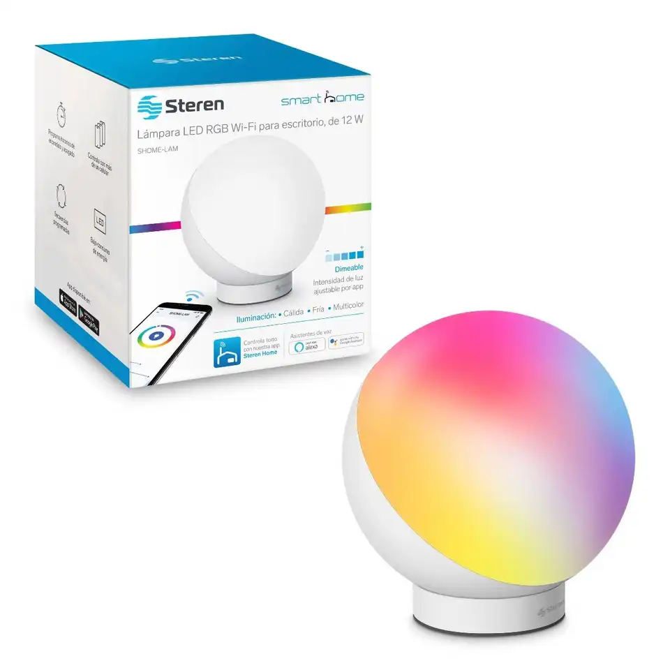
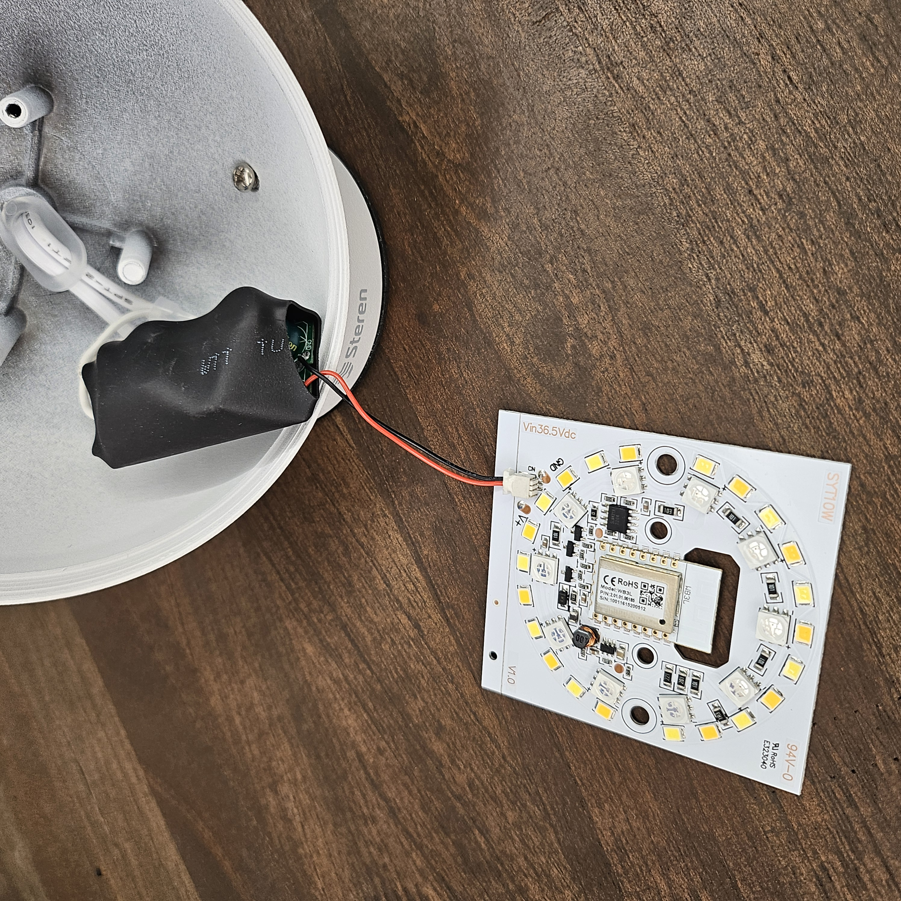
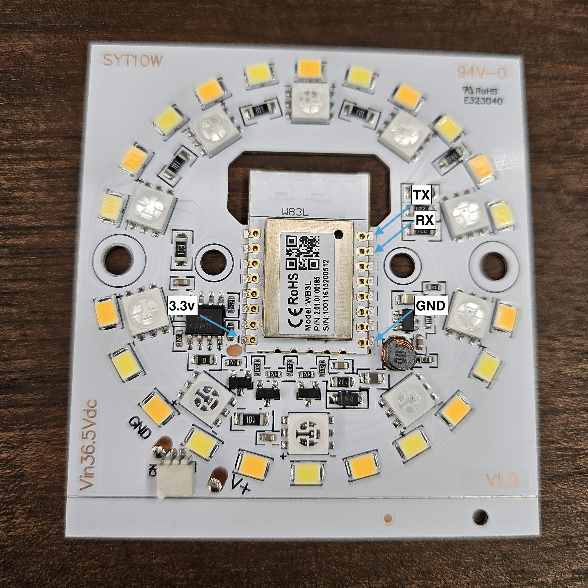

Smart desk lamp with a sleek design, it has RGB and warm/cold white LEDs.
it uses pwm to control each channel.
You can flash it, you can use tuya cloud-cutter, or you can swap out the chip.

I attempted to flash the chip multiple times, but my FTDI adapter couldn’t provide enough current for a successful process. In the end, I followed Digiblur’s Tuya Cloudcutter guide, which is referenced in the ESPHome documentation for BK72xx, and that did the trick.

## Device Details

- **Model**: SHOME-LAM
- **Board**: BK7231 (WB3L variant)
- **Link**: [Lámpara LED Wi-Fi\* RGB+W multicolor de 12 W](https://www.steren.com.mx/lampara-led-wi-fi-multicolor-para-escritorio-de-12-w.html)

## Images


_Promotional image from website._


_Unscrew the diffuser. The board is connected to the power source via a connector._

## Pinout and Configuration


_Internal circuit board showcasing the chipset._

### GPIO Mapping

| GPIO | Function   | Description           |
| ---- | ---------- | --------------------- |
| P8   | Red        | RGB LED Red Control   |
| P26  | Blue       | RGB LED Blue Control  |
| P24  | Green      | RGB LED Green Control |
| P6   | Warm White | White LED Control     |
| P7   | Cold White | White LED Control     |

## Note

The lamp is enclosed in metal, which may affect Wi-Fi signal strength. Ensure it is close to the router or use a repeater if needed.

### YAML Configuration

```yaml
bk72xx:
  board: wb3l

output:
  - platform: libretiny_pwm
    id: red
    pin: P8
  - platform: libretiny_pwm
    id: blue
    pin: P26
  - platform: libretiny_pwm
    id: green
    pin: P24
  - platform: libretiny_pwm
    id: warm_white
    pin: P6
  - platform: libretiny_pwm
    id: cold_white
    pin: P7

light:
  - platform: rgbww
    name: "Light"
    id: rgb_light
    restore_mode: ALWAYS_OFF
    red: red
    green: green
    blue: blue
    warm_white: warm_white
    cold_white: cold_white
    cold_white_color_temperature: 6500 K
    warm_white_color_temperature: 2000 K
    color_interlock: True
```
