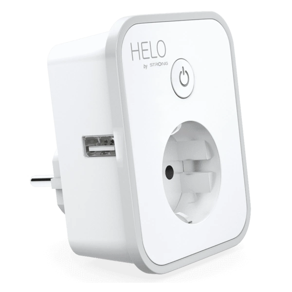
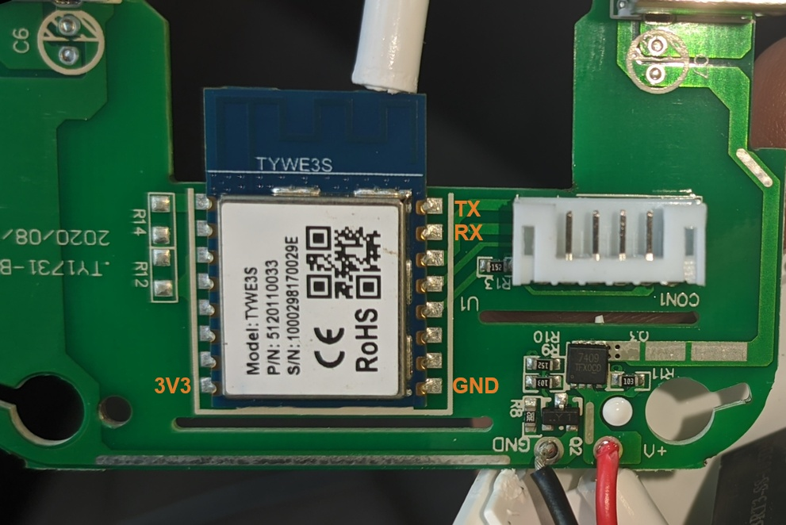

This plug has a socket output switched by a relay and a separately switchable dual USB power output. Has a rubber edge around the front face, and a push button above the socket. It contains a TYWE3S module and a BL0937 power monitoring chip.

## GPIO Pinout

| Pin    | Function                           |
| ------ | ---------------------------------- |
| GPIO00 | Button                             |
| GPIO04 | BL0937 CF                          |
| GPIO05 | HLWBL CF1                          |
| GPIO12 | HLWBL SELi                         |
| GPIO13 | Status LED (inverted)              |
| GPIO14 | Relay 1 (socket)                   |
| GPIO15 | Relay 2 (USB power)                |

## Initial Setup

Remove the 4 screws at the back of the device. Requires triangular bit to unscrew case, but Torx 7 also works. Remove the daughterboard by unscrewing the interal screws. The daughter-board is held by 3 internal smaller screws, remove that too, but be careful as wires are short. No need to remove the main board, as the MCU is on the daughter-board. Disconnect the internal cable connecting the two. This way the module becomes relatively easily accessible.

The TYWE3S module is ESP8266-based, so it can be flashed directly with ESPHome. You need to solder your USB-TTL adapter to the RX, TX, GND and 3V3 pins, then just hold down the onboard button while powering on the adapter. When only the red LED lights up, the board is in bootloader mode.



## Basic Configuration

```yaml
substitutions:
  device_name: plug-helo-plusb
  friendly_name: "Helo PLUSB Plug"
  device_description: "Strong Helo PLUSB 2x USB Power Monitoring Plug (HELO-PLUSB-EU)"
  voltage_div: "1655.66630552546"  # Lower value gives lower voltage readout. Calibrate for higher accuracy.
  current_res: "0.00092" # Higher value gives lower watt readout. Calibrate for higher accuracy.
  current_mul: "0.914285714285714" # Muliplier for current sensor filter. Calibrate for higher accuracy.

esphome:
  name: ${device_name}
  comment: ${device_description}
  platform: ESP8266
  board: esp01_1m
  esp8266_restore_from_flash: True

sensor:
  - platform: hlw8012
    model: BL0937
    sel_pin:
      number: GPIO12
      inverted: true
    cf_pin: GPIO4
    cf1_pin: GPIO5
    change_mode_every: 4
    update_interval: 10s
    current:
      name: ${friendly_name} Current
      disabled_by_default: true
      filters:
        - multiply: ${current_mul}
    voltage:
      name: ${friendly_name} Voltage
    power:
      name: ${friendly_name} Power
    current_resistor: ${current_res}
    voltage_divider: ${voltage_div}

binary_sensor:
  - platform: gpio
    pin: GPIO00
    id: button
    internal: true
    filters:
      - invert:
      - delayed_off: 10ms
    on_multi_click:
    - timing: #short press to toggle socket relay
        - ON for at most 1s
      then:
        - switch.toggle:
            id: switch_out
    - timing: #long press to toggke USB power output
        - ON for at least 1s
      then:
        - switch.toggle:
            id: switch_usb

output:
  - platform: gpio
    pin: GPIO14
    id: relay1
  - platform: gpio
    pin: GPIO15
    id: relay2

switch:
  - platform: output
    name: ${friendly_name} Socket
    icon: mdi:power-socket-de
    restore_mode: RESTORE_DEFAULT_OFF
    output: relay1
    id: switch_out
  - platform: output
    name: ${friendly_name} USB
    icon: mdi:usb-port
    restore_mode: RESTORE_DEFAULT_OFF
    output: relay2
    id: switch_usb
    on_turn_on:
      light.turn_on: onboard_led
    on_turn_off:
      light.turn_off: onboard_led

light:
  - platform: status_led
    id: onboard_led
    internal: True
    pin:
      number: GPIO13
      inverted: true
```
