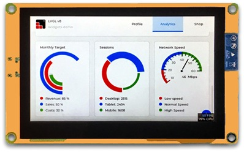
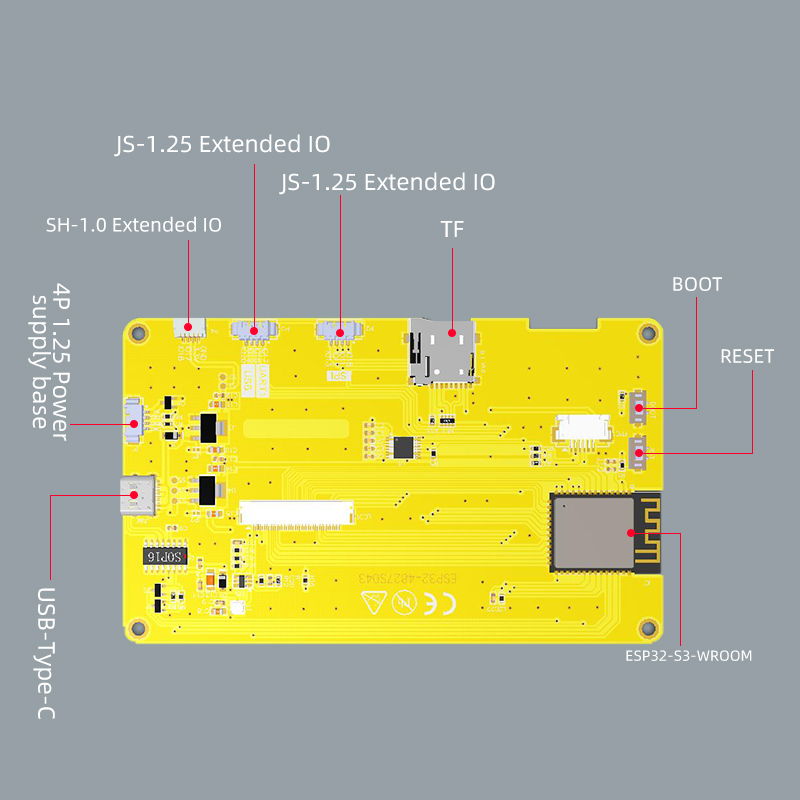
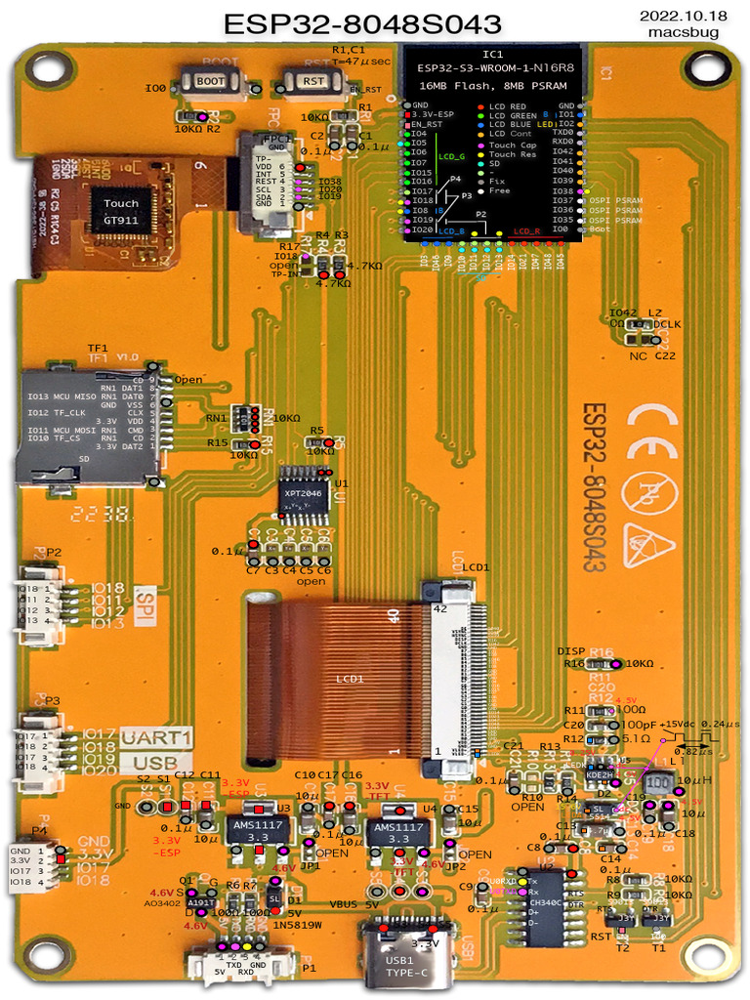

## Image







## Product specs

| Feature      | Spec                    |
| ------------ | ----------------------- |
| Screen       | IPS RGB LCD 800*480 |
| Touch screen | gt911                   |
| CPU          | ESP32-S3                |
| Flash        | 16MB                    |
| PSRAM        | 8MB                     |

## Basic Config

```yaml
esphome:
  name: "sunton-esp32-8048s043c"
  friendly_name: "Sunton ESP32 800*480 4.3"
  platformio_options:
    board_build.flash_mode: dio
  on_boot:
    priority: -100
    then:
      - script.execute: inactivity_timer
      - component.update: my_display

esp32:
  board: esp32-s3-devkitc-1
  variant: esp32s3
  flash_size: 16MB
  framework:
    type: esp-idf
    sdkconfig_options:
      COMPILER_OPTIMIZATION_SIZE: y
      CONFIG_ESP32S3_DEFAULT_CPU_FREQ_240: "y"
      CONFIG_ESP32S3_DATA_CACHE_64KB: "y"
      CONFIG_ESP32S3_DATA_CACHE_LINE_64B: "y"
      CONFIG_SPIRAM_FETCH_INSTRUCTIONS: y
      CONFIG_SPIRAM_RODATA: y
psram:
  mode: octal
  speed: 80MHz

logger:

captive_portal:

api:
  encryption:
    key: !secret encryption_key

ota:
  - platform: esphome
    password: !secret ota_password
    
wifi:
  ssid: !secret wifi_ssid
  password: !secret wifi_password

i2c:
  - id: bus_a
    scl: GPIO20
    sda: GPIO19

display:
  - id: my_display
    platform: rpi_dpi_rgb
    dimensions:
      width: 800
      height: 480
    rotation: 0
    color_order: RGB
    de_pin: 40
    hsync_pin: 39
    vsync_pin: 41
    pclk_pin: 42
    pclk_inverted: true
    pclk_frequency: 16MHz # unsure about this
    hsync_front_porch: 8
    hsync_pulse_width: 4
    hsync_back_porch: 8
    vsync_front_porch: 8
    vsync_pulse_width: 4
    vsync_back_porch: 8
    data_pins:
      red: [45, 48, 47, 21, 14]
      green: [5, 6, 7, 15, 16, 4]
      blue: [8, 3, 46, 9, 1]
    update_interval: never
    auto_clear_enabled: false    
    lambda: |-
      it.print(400, 240,id(roboto_48),TextAlign::CENTER, "Hello Viet Nam");
    
touchscreen:
  platform: gt911
  transform:
    mirror_x: false
    mirror_y: false
  on_touch:
    then:
      - script.execute: inactivity_timer
output:
  - platform: ledc
    pin: GPIO2
    id: backlight_pwm

light:
  - platform: monochromatic
    output: backlight_pwm
    name: "Đèn nền"
    id: back_light
    restore_mode: ALWAYS_ON

font:
  - file: "gfonts://Roboto" 
    id: roboto_48
    size: 48

script:
  - id: inactivity_timer
    mode: restart
    then:
      - if:
          condition:
            light.is_off: back_light
          then:
            - light.turn_on:
                id: back_light
      - delay: !lambda 'return id(sleep_time).state * 1000;'
      - light.turn_off:
          id: back_light      
number:
  - platform: template
    name: "Sleep time"
    id: sleep_time
    optimistic: true
    initial_value: 15
    restore_value: yes
    unit_of_measurement: "s"
    device_class: duration
    mode: box
    min_value: 5
    max_value: 600
    step: 1
```
