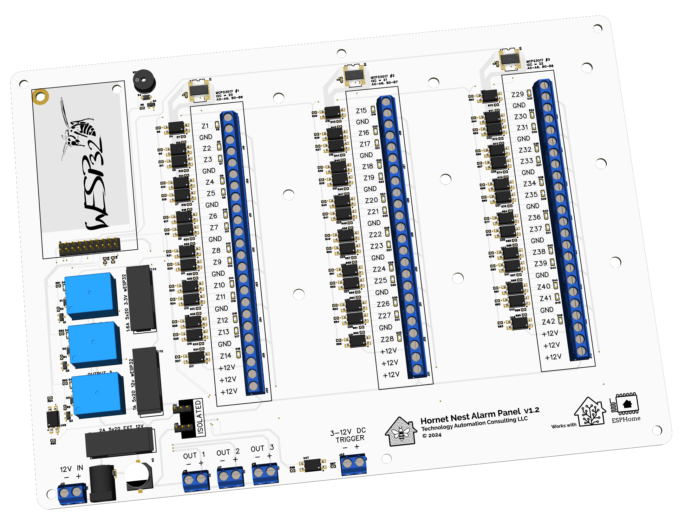
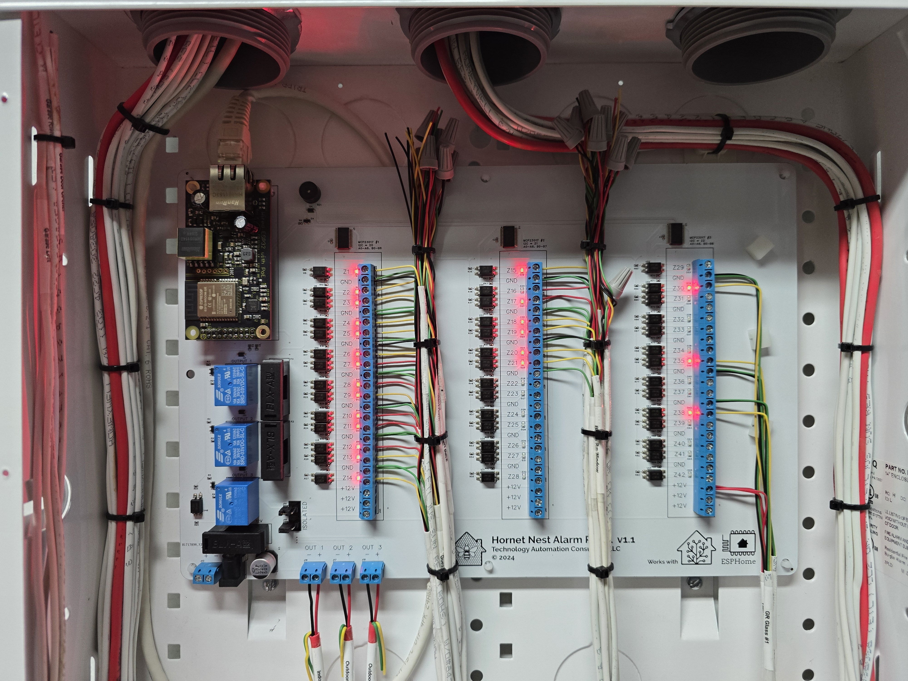

## Description

The **Hornet Nest Alarm Panel** is an advanced, PoE-enabled security and automation panel, designed for seamless integration with Home Assistant and ESPHome. With 42 zones, relay outputs, and comprehensive input options, this panel offers an adaptable solution for connecting traditional alarm systems and custom automation needs to a modern smart home setup.

## Key Features

- **42 Optoisolated Zones/Inputs** for enhanced protection
- **3 Relay Outputs** for 12V devices
- **Wiegand Keypad Support** for access control integration
- **Pre-flashed wESP32** for immediate ESPHome compatibility
- **PoE or External Power** options for flexible installation
- **Fuse-protected 3.3V & 12V Rails** for board safety
- **3-12V Trigger Input** for expanded device support

## Quick Start

Get started quickly by adopting and flashing your Hornet Nest Alarm Panel with the latest ESPHome firmware:

1. Plug a PoE powered ethernet cable into the Hornet Nest Alarm Panel.
2. Open the **ESPHome Dashboard** and locate the device "hornet-nest-XXXXXX" (where XXXXXX is a unique hexadecimal identifier).
3. Click on the **Adopt** option on the device.
4. The **Adopt Device** dialog will open.  You can rename your device if desired and then click the **Adopt** option again.
5. The **Configuration Created** dialog will open and indicate that a new configuration needs to be installed on the device, click the **Install** button.
6. ESPHome will begin to compile the new firmware. When the line **"INFO Sucessfully uploaded program."** is diplayed, click **STOP** to close the window.
7. Discover the Hornet Nest Alarm Panel in **Home Assistant** > **Settings** > **Devices & Services**.
8. Click **Configure** on the new device to add it into Home Assistant.

## Links

- [Crowd Supply](https://www.crowdsupply.com/technology-automation-consulting/hornet-nest-alarm-panel)
- [GitHub](https://github.com/taconsultingllc/hornet-nest-alarm-panel/tree/main)

## Pictures

