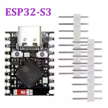

A module composed of:

- ESP32 S3 chip
- 1 x WS2812B LED
- 4Mb Flash
- 2Mb PSRAM

Powered by USB-C  
Also has a battery charging circuit.  
Documentation:

- [Product details](./Pinouts.webp)

## GPIO Pinout

| PIN           | ESP32 | Description                                                             |
|---------------|-------|-------------------------------------------------------------------------|
| WS2811 LED    | 48    | Controlling WS2812B LED                                                 |

## Product Images



## Device Specific Config

```yaml
esphome:
  name: tenstar-robot-esp32-s3-supermini
  friendly_name: esp32 s3 tenstar robot
  on_boot:
    # default to green LED when connecting
    - light.turn_on: 
        id: status_light
        brightness: 20%
        red: 0%
        green: 100%
        blue: 0%

esp32:
  board: esp32-s3-devkitc-1
  variant: esp32s3
  framework:
    type: esp-idf
  flash_size: 4MB

psram:
  mode: quad
  speed: 80MHz

# Enable logging
logger:
          
ota:
  - platform: esphome
    password: !secret ota_password
    on_begin:
      then:
        # Turn the LED Red when OTA Updating
        - light.turn_on: 
            id: status_light
            brightness: 40%
            red: 40%
            green: 0%
            blue: 0%
            transition_length: 0s
        - lambda: "id(status_light).loop();"

wifi:
  ssid: !secret wifi_ssid
  password: !secret wifi_password

  # Enable fallback hotspot (captive portal) in case wifi connection fails
  ap:
    ssid: "Esp32-S3-Whitescreen"
    password: !secret fallback_wifi_password

captive_portal:

web_server:
  port: 80

light:
  - platform: esp32_rmt_led_strip
    id: status_light
    chipset: WS2812
    pin: GPIO48
    num_leds: 1
    rgb_order: GRB
    name: "WS2812B Light"
    restore_mode: ALWAYS_ON 
```

## Example with Home Assistant Status indication

```yaml
esphome:
  name: tenstar-robot-esp32-s3-supermini
  friendly_name: esp32 s3 tenstar robot
  on_boot:
    # default to green LED when connecting
    - light.turn_on: 
        id: status_light
        brightness: 20%
        red: 0%
        green: 100%
        blue: 0%

esp32:
  board: esp32-s3-devkitc-1
  variant: esp32s3
  framework:
    type: esp-idf
  flash_size: 4MB

psram:
  mode: quad
  speed: 80MHz

# Enable logging
logger:

# Enable Home Assistant API
api:
  encryption:
    key: !secret api_key
  on_client_connected:
    - if:
        condition:
          lambda: 'return (0 == client_info.find("Home Assistant "));'
        then:
        # Turn the LED Blue when connected
        - light.turn_on: 
            id: status_light
            brightness: 40%
            red: 0%
            green: 0%
            blue: 100%
ota:
  - platform: esphome
    password: !secret ota_password
    on_begin:
      then:
        # Turn the LED Red when OTA Updating
        - light.turn_on: 
            id: status_light
            brightness: 40%
            red: 40%
            green: 0%
            blue: 0%
            transition_length: 0s
        - lambda: "id(status_light).loop();"

wifi:
  ssid: !secret wifi_ssid
  password: !secret wifi_password

  # Enable fallback hotspot (captive portal) in case wifi connection fails
  ap:
    ssid: "Esp32-S3-Whitescreen"
    password: !secret fallback_wifi_password

captive_portal:

web_server:
  port: 80

light:
  - platform: esp32_rmt_led_strip
    id: status_light
    chipset: WS2812
    pin: GPIO48
    num_leds: 1
    rgb_order: GRB
    name: "WS2812B Light"
    restore_mode: ALWAYS_ON 
```
