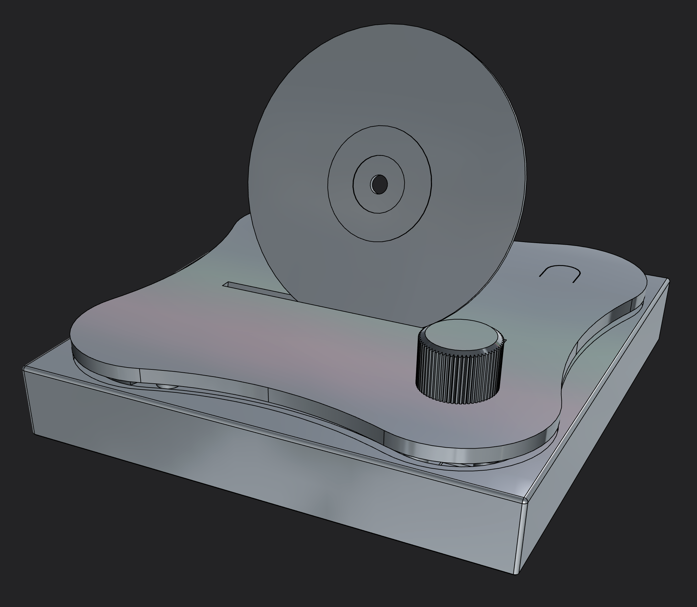

TagTuner is a device that enables you to access music playlists or albums using NFC tags.\
It only works when integrated with Home Assistant media players and the Music Assistant music library is optional. This setup seamlessly blends your digital only music collection with the tactile experience of playing a physical record, tape or cd.\
Physical music media offer several advantages:

- it's easy
- it's fast
- it's inclusive

TagTuner is made with [ESPHome](https://www.esphome.io) and includes

- an NFC reader
- a dial
- a button
- a multicolor LED light

All of this is housed in a sleek, custom design case.

Here is an exploded view of the TagTuner 3D model with a round tag card \

For code and build instructions, please visit project page at https://luka6000.github.io/TagTuner
