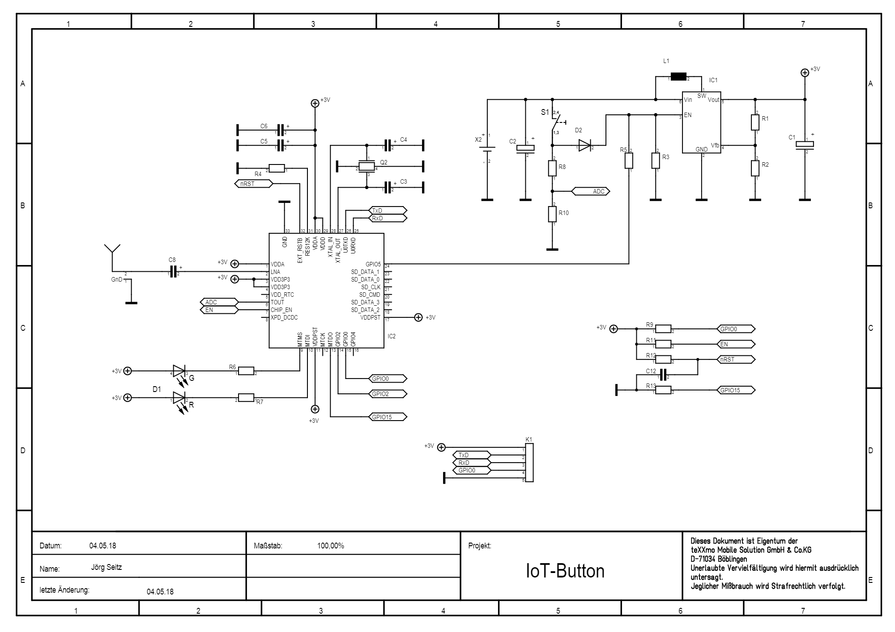

## Device Information

- [Product Information](http://www.iot-button.eu/index_en.html)
- [Original Source Code](https://github.com/teXXmo/TheButtonProject)

## Product Images




## Flashing Pinout

| Pin Hole Shape | Purpose |
| ------ | ----------------------- |
| [ ] | 3V3 Input (do not connect if powering off of battery) |
| ( ) | Txd |
| ( ) | Rxd |
| ( ) | GPIO0 (must pull to ground before flashing) |
| ( ) | Gnd |

## Basic Configuration

```yaml
substitutions:
  name: iot_button_1
  static_ip: <your ip address>
  gateway: <your gateway>
  subnet: <your subnet mask>

globals:
  - id: message_sent
    type: bool
    restore_value: no
    initial_value: "false"

esphome:
  name: ${name}
  on_boot:
    # Raise the power pin very early (pri 700) to keep the ESP awake
    # until we're done sending the event
    priority: 700
    then:
      - output.turn_on: power_pin

esp8266:
  board: esp8285

wifi:
  ssid: !secret wifi_ssid
  password: !secret wifi_password
  fast_connect: true

  manual_ip:
    static_ip: ${static_ip}
    gateway: ${gateway}
    subnet: ${subnet}

  # Enable fallback hotspot (captive portal) in case wifi connection fails
  ap:
    ssid: "ESPHome_Button_1"
    password: !secret ap_fallback_password

captive_portal:

api:
  encryption:
    key: !secret api_encryption_key

ota:
  password: !secret ha_api_password

script:
  - id: send_event
    then:
      - logger.log: "Waiting for API connection"
      - wait_until:
          api.connected:

      - logger.log: "Sending ESPHome event"
      - delay: 0.5s
      - homeassistant.event:
          event: esphome.button_pressed
          data:
            device_id: ${name}
      - globals.set:
          id: message_sent
          value: "true"
      - delay: 0.5s

logger:

sensor:
  - platform: adc
    pin: A0
    id: button_adc
    internal: true
    update_interval: 10s
    on_value_range:
      above: 0.5
      then:
        - script.execute: send_event
        - wait_until:
            lambda: return id(message_sent);

        - logger.log: "Shutting down"
        - output.turn_off: power_pin

# The D5 pin turns the vreg on & off. Setting to off will shut down the device.
output:
  - platform: gpio
    pin: GPIO5
    id: power_pin

  - platform: esp8266_pwm
    pin: GPIO12
    id: led_red_pin

  - platform: esp8266_pwm
    pin: GPIO14
    id: led_green_pin
```
