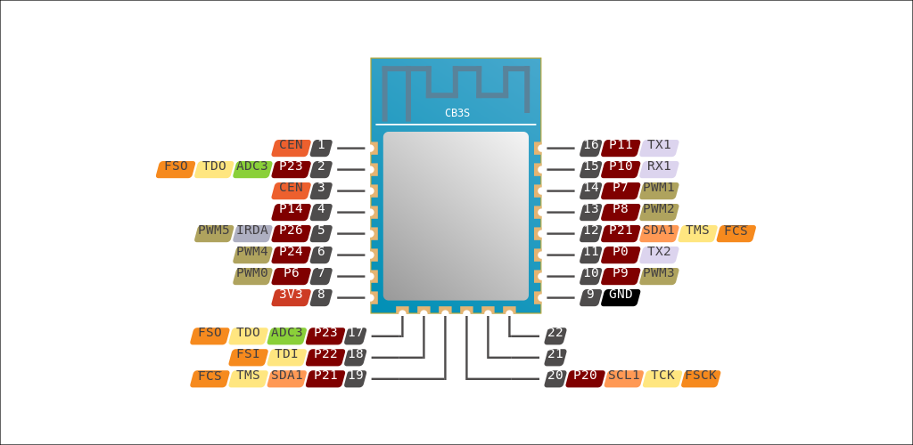

## GPIO Pinout

| Pin    | Function                            |
| ------ | ----------------------------------- |
| P23    | Green LED top button (inverted)     |
| P9     | blue LED all buttons (inverted)     |
| P26    | Red LED middle button (inverted)    |
| P10    | Open button                         |
| P7     | Stop button                         |
| P8     | Close button                        |
| P14    | Open Relay                          |
| P24    | Close Relay                         |

## General

The Tekkar curtain switch has three buttons: one for opening, one for closing, and one for stopping.
It also has a green status LED and three blue backlight LEDs, which can only be controlled together.
The switch uses the CB3S BK7231N chip.


## Flashing/Soldering

To flash the chip, the front cover needs to be removed. After removing it, the circuit board can be taken out by pulling it off. On the bottom side of the circuit board, you will find the CB3S chip. Connect `RX1` (`P10`), `TX1` (`P11`), `GND` and `3V3` to a USB to TTL serial adapter. For a stable connection, the easiest method is to solder the four pins.
> Note: In my case, it was necessary to desolder the entire chip because the connection could not be established.



For flashing, you can use `ltchiptool`. Once you have soldered and connected, start `ltchiptool`. While it is actively trying to connect, briefly bridge either one of the `CEN` pins to ground and then release.

## Basic Configuration

```yaml
bk72xx:
  board: cb3s

binary_sensor:
  - platform: gpio
    id: open_button
    pin: P10
    name: "Open"
    filters:
      - invert:
    on_press:
      then:
        - cover.open: curtain

  - platform: gpio
    id: stop_button
    pin: P7
    name: "Stop"
    filters:
      - invert:
    on_press:
      then:
        - cover.stop: curtain
      
  - platform: gpio
    id: close_button
    pin: P8
    name: "Close"
    filters:
      - invert:
    on_press:
      then:
        - cover.close: curtain

cover:
  - platform: template
    name: "Curtain Bedroom"
    id: curtain
    optimistic: true
    open_action:
      - switch.turn_off: relay_close
      - switch.turn_on: relay_open
      - delay: 16s                      # Adjust according to your setup
      - switch.turn_off: relay_open
    close_action:
      - switch.turn_off: relay_open
      - switch.turn_on: relay_close
      - delay: 16s                      # Adjust according to your setup
      - switch.turn_off: relay_close
    stop_action:
      - switch.turn_off: relay_open
      - switch.turn_off: relay_close

switch:
  - platform: gpio
    id: relay_open
    pin: P14
    name: "Relay Open"

  - platform: gpio
    id: relay_close
    pin: P24
    name: "Relay Close"

output:
  - platform: gpio
    id: led_green_out
    pin: P23
    inverted: true

  - platform: gpio
    id: led_blue_out
    pin: P9
    inverted: true

light:
  - platform: binary
    name: "LED"
    id: led_green
    output: led_green_out
    restore_mode: RESTORE_DEFAULT_OFF

  - platform: binary
    name: "Backlight"
    id: led_blue
    output: led_blue_out
    restore_mode: RESTORE_DEFAULT_OFF

# Status LED
#status_led:
#  pin:
#    number: P23
#    inverted: true
```
