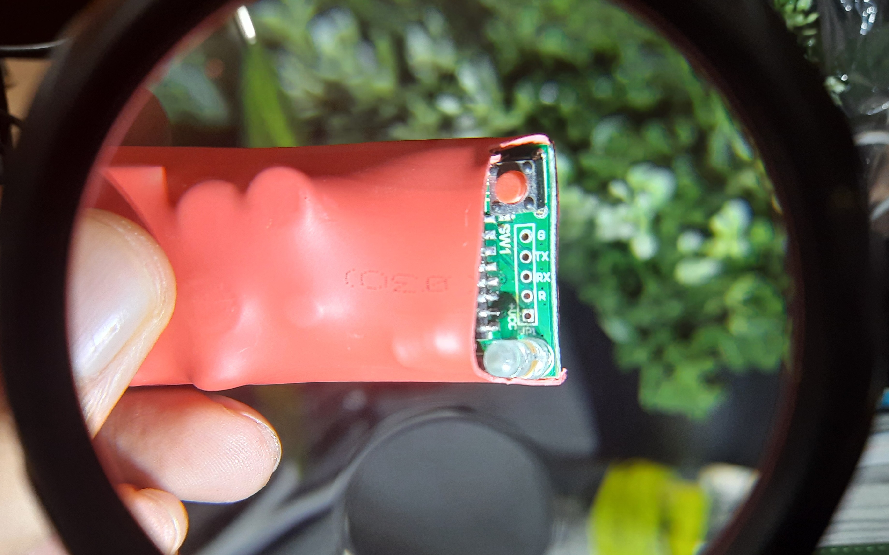
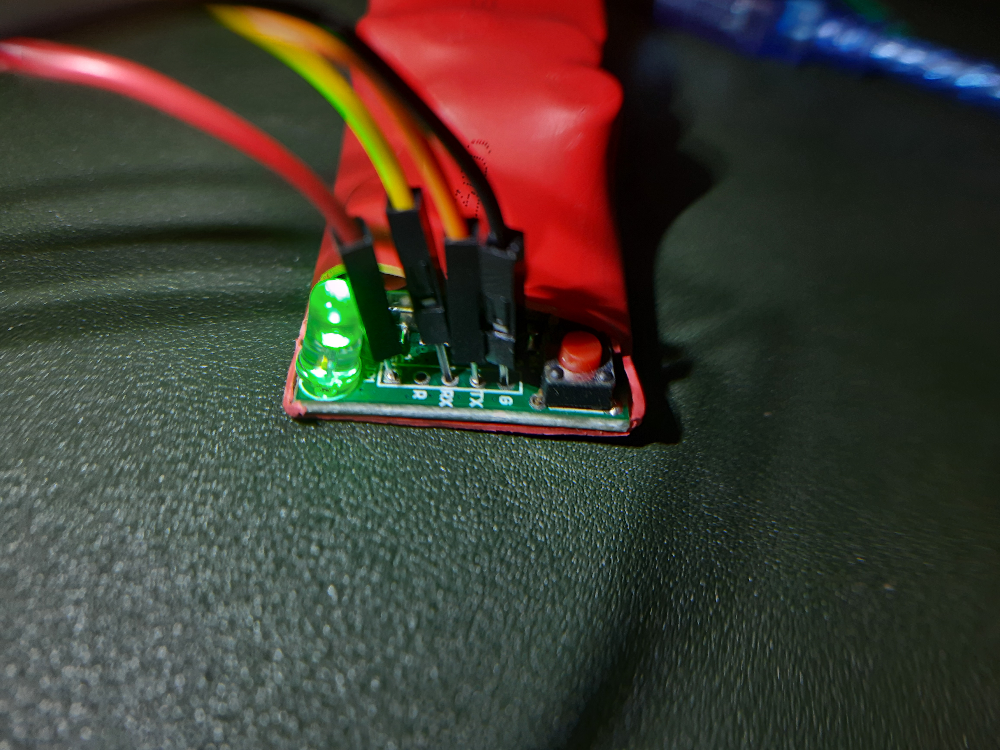
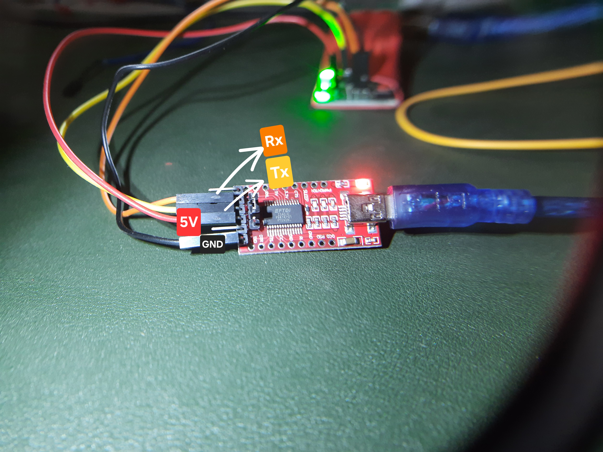

## Device Info

- **Name:** Tinxy 1 Node 16A Relay
- **Chip:** ESP8266EX

This guide will (probably) also work with 10A version of the same device.

[Product on Manufacturer Site](https://tinxy.in/product/tinxy-ac-geyser-smart-wifi-switch/)

## Flashing with Serial



1. The Ground, 5V VCC, TX, and RX pads are located on the bottom side of the PCB. Connect a serial adapter
   to these pads as follows:

   | Serial Adapter | Tinxy Pad |
   |----------------|-----------|
   | GND            | GND       |
   | RX             | TX        |
   | TX             | RX        |
   | *ignore*       | R         |
   | 5V VCC         | +VCC      |

   You may use male dupont pin to directly insert into the pads for connection (Although it may be finicky
    but works since we are only flashing through serial once). Other methods like soldering wires or using
    pogo pins may also be used as per your convenience.

   
   

2. You will have to press the button next to pads to put the device into flashing mode before connecting the
    serial adapter and powering on the device.
3. There is a hardware watchdog that will restart the device within 15 to 30 seconds if it does not detect a
    PWM signal on GPIO14. So you will have to be quick in putting the device into flashing mode and starting
    the flash process as soon as you power on the device.
4. Get the bin file and command ready for flashing as below.
5. If you want to backup the existing firmware, you can use the following command:

   ```bash
   esptool --port /dev/ttyUSB0 --baud 921600 read-flash 0x0 0x400000 tinxy-backup.bin    
   ```

6. Use esptool to flash the device. Make sure to use higher baud rate like 921600 for faster flashing otherwise
    you may brick your device as watchdog will reboot it before flashing is complete. Although you can always
    try again.

   ```bash
   esptool --port /dev/ttyUSB0 --baud 921600 write_flash 0x0 tinxy.bin
   ```

7. Once flashing is complete, disconnect the serial adapter and power cycle the device. It should now boot into
    ESPHome firmware and ota updates should work.

## ESPHome Configuration

You can use the following ESPHome configuration for the which includes support for controlling the relays and a
power-on state selection as provided by the manufacturer.

```yaml
esp8266:
  board: esp01_1m

substitutions:
  name: tinxy-1n-16a-relay
  friendly_name: Tinxy 1N 16A Relay

esphome:
  name: ${name}
  friendly_name: ${friendly_name}

  on_boot:
    - priority: 600  # High priority to start this first
      then:
        # Set a 50% duty cycle to keep the watchdog happy
        - output.turn_on: watchdog_heartbeat
        - output.set_level:
            id: watchdog_heartbeat
            level: 50%
    - priority: -100.0
      then:
        - if:
            condition:
              lambda: 'return id(power_on_select).state == "Off";'
            then:
              - logger.log: "Power-On State is 'Off'. Turning relay off."
              - switch.turn_off: relay_1
            else:
              - if:
                  condition:
                    lambda: 'return id(power_on_select).state == "On";'
                  then:
                    - logger.log: "Power-On State is 'On'. Turning relay on."
                    - switch.turn_on: relay_1
                  else:
                    # This is the "Restore" state. We do nothing and let the
                    # switch's own 'restore_mode' handle it.
                    - logger.log: "Power-On State is 'Restore'. Restoring from memory."

logger:
  baud_rate: 0 # disable logging via uart as it hinders with mcu on board

# Home Assistant
api:
ota:
  - platform: esphome
    password: !secret ota_password

wifi:
  ssid: !secret wifi_ssid
  password: !secret wifi_password

  ap:
    ssid: "esp ${name}"
    password: !secret ap_password

captive_portal:
web_server:

select:
  - platform: template
    name: "${friendly_name} Power-On State"
    id: power_on_select
    icon: "mdi:power-settings"
    options: ["Restore", "Off", "On"]
    restore_value: yes
    optimistic: true
    entity_category: "config"


# Watchdog PWM (CRITICAL - DO NOT REMOVE)
# This provides the required PWM signal to GPIO14 to prevent reboots.
# according to tinxy support any frequency with 50% duty cycle will work
output:
  - platform: esp8266_pwm
    pin: GPIO14
    id: watchdog_heartbeat
    frequency: 500 Hz

status_led:
  pin: GPIO12

switch:
  - platform: gpio
    name: "Smart Switch"
    pin: GPIO05
    id: relay_1
    restore_mode: RESTORE_DEFAULT_OFF

# Inputs (Physical switch)
binary_sensor:
  - platform: gpio
    pin:
      number: GPIO04
      mode: INPUT_PULLUP
      inverted: true
    name: "Physical Switch Input"
    id: physical_switch
    filters:
      # This delay helps since the signal from physical switch may be noisy
      - delayed_off: 500ms # Edit this time as per your requirement if you observe false turn off triggers
    on_state:
      then:
        # Wait for the user-defined delay to ensure the state is stable
        # This delay is to compensate for power fluctuations.
        - delay: !lambda 'return id(switch_delay_ms).state;'
        # After the delay, re-check the current state of the switch.
        - if:
            condition:
              binary_sensor.is_on: physical_switch
            then:
              # If the switch is still ON, turn the relay on.
              - switch.turn_on: relay_1
            else:
              # If the switch is now OFF, turn the relay off.
              - switch.turn_off: relay_1
```
