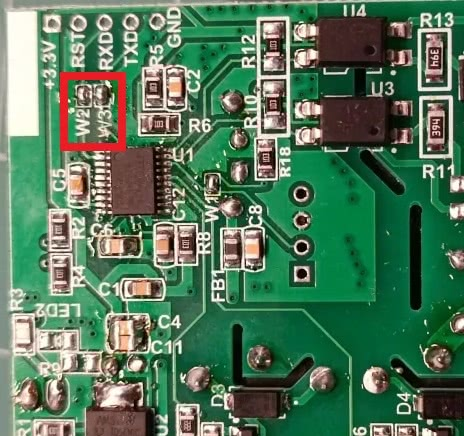

Tinxy 4 Node Retrofit Module with Fan Regulator
[Amazon Link](https://amzn.eu/d/2V1PDRS)


## Preparing the device for flashing

Start by carefully removing the heat shrink sleeve. Next, desolder the W2 and W3 bridges located on the backside of the Tinxy board, as shown in the provided image. Connect wires from the Tinxy board's RXD, TXD, 3.3V, and GND pads to a USB TTL adapter, making sure to swap the connections for RXD and TXD.

Press and hold the Tinxy reset button while connecting the TTL adapter to your computer. Flash the firmware as soon as the esp8266 is detected, as the soldered on esp8266 tends to reboot if it didnt detect pwm signal from the MCU on GPIO14.

Once the flashing is complete, resolder the W2 and W3 bridges as before, remove the TTL wires, and reapply the heat shrink sleeve to complete the modification.

**Note**: Unlike other devices, Tinxy Esp8266 communicates with the MCU using serial data to activate the relay. So its neccessry to disconnect the W2 and W3 serial bridge between Esp and MCU to ensure no intereference while flashing and reconnecting it is crucial to esnsure proper functioning.

Knowledge Credit: [Tinxy Forum](https://forum.tinxy.in/t/flashing-custom-firmware-like-tasmota-or-esphome-and-then-restoring-back-to-original/32)

As of 10/2024, Tinxy 4N with fan regulator devices failed flashing with the esphome web flasher because it uses a baud rate of 115200.
If flashing doesn't work, try flashing via [esptool.py](https://github.com/espressif/esptool) where the baud rate can be set.
The baud rate was identified to be 460800.  If this fails in the future try other baud rates.

## esptool.py Code

```bash
python3 -m esptool --port /dev/ttyUSB0 --baud 460800 --before no_reset --after hard_reset write_flash -fm dio 0x00000 firmware.bin
```

## Esp Code

```yaml
esphome:
  name: tinxy-4node
  friendly_name: tinxy-4node
  on_boot:
    - priority: 200.0
      then:
        - output.turn_on: gen_pwm_test
        - output.set_level:
            id: gen_pwm_test
            level: 50%
  includes:
    - uart_read_line_sensor.h
output:
  - platform: esp8266_pwm
    id: gen_pwm_test
    pin: GPIO14
    frequency: 1000 Hz
  - platform: template
    id: fanoutput
    type: float
    write_action:
    - uart.write: ""
esp8266:
  board: esp01_1m
# Enable logging
logger:
  baud_rate: 0
  level: verbose
# Enable Home Assistant API
api:
  encryption:
    key: ""
ota:
  password: ""
wifi:
  ssid: ""
  password: !secret wifi_password
  power_save_mode: none
  fast_connect: true
status_led:
  pin:
    number: GPIO12
    inverted: yes
uart:
  id: uart_bus
  tx_pin: 1
  rx_pin: 3
  baud_rate: 9600
text_sensor:
  - platform: custom
    lambda: |-
      auto my_custom_sensor = new UartReadLineSensor(id(uart_bus));
      App.register_component(my_custom_sensor);
      return {my_custom_sensor};
    text_sensors:
      id: "uart_readline"
      name: "UART Feedback"
      on_value:
        then:
          - lambda: |-
              ESP_LOGD("main", "The current value is %s", x.c_str());
              if (id(uart_readline).state == "41") {
                id(relay4_wall_switch).publish_state(true);
                id(relay4).publish_state(true);
              } if(id(uart_readline).state == "40") {
                id(relay4_wall_switch).publish_state(false);
                id(relay4).publish_state(false);
              }
              if (id(uart_readline).state == "31") {
                id(relay3_wall_switch).publish_state(true);
                id(relay3).publish_state(true);
              } if(id(uart_readline).state== "30") {
                id(relay3_wall_switch).publish_state(false);
                id(relay3).publish_state(false);
              }
              if (id(uart_readline).state == "21") {
                id(relay2_wall_switch).publish_state(true);
                id(relay2).publish_state(true);
              } if(id(uart_readline).state== "20") {
                id(relay2_wall_switch).publish_state(false);
                id(relay2).publish_state(false);
              }
              if (id(uart_readline).state == "11") {
                id(relay1_wall_switch).publish_state(true);
                auto call = id(fan_1).turn_on();
                call.perform();
              } if(id(uart_readline).state== "10") {
                id(relay1_wall_switch).publish_state(false);
                auto call = id(fan_1).turn_off();
                call.perform();
              }
binary_sensor:
  - platform: template
    name: "Relay4 Wall Switch"
    id: relay4_wall_switch
  - platform: template
    name: "Relay3 Wall Switch"
    id: relay3_wall_switch
  - platform: template
    name: "Relay2 Wall Switch"
    id: relay2_wall_switch
  - platform: template
    name: "Relay1 Wall Switch"
    id: relay1_wall_switch
switch:
  - platform: template
    name: "Relay2"
    id: relay2
    optimistic: true
    restore_mode: RESTORE_DEFAULT_OFF
    turn_on_action:
      - uart.write: '#2100#'
    turn_off_action:
      - uart.write: '#2000#'
  - platform: template
    name: "Relay3"
    id: relay3
    optimistic: true
    restore_mode: RESTORE_DEFAULT_OFF
    turn_on_action:
      - uart.write: '#3100#'
    turn_off_action:
      - uart.write: '#3000#'
  - platform: template
    name: "Relay4"
    id: relay4
    optimistic: true
    restore_mode: RESTORE_DEFAULT_OFF
    turn_on_action:
      - uart.write: '#4100#'
    turn_off_action:
      - uart.write: '#4000#'
fan:
  - platform: speed
    output: fanoutput
    id: fan_1
    speed_count: 3
    name: "Fan"
    on_turn_on:
      - uart.write: !lambda |-
          static std::string myUartStringsOn[4] = {"#1100#", "#1033#", "#1066#", "#1100#"};
          if(id(fan_1).speed == 0)
            id(fan_1).speed = 1;
          std::string chosenString = myUartStringsOn[id(fan_1).speed];
          std::vector<uint8_t> vec(chosenString.begin(), chosenString.end());
          return vec;
    on_turn_off:
      - uart.write: '#1000#'
    on_speed_set:
    - if:
        condition:
          lambda: return (id(fan_1).state);
        then:
          - uart.write: !lambda |-
              static std::string myUartStringsOn[4] = {"#1100#", "#1033#", "#1066#", "#1100#"};
              std::string chosenString = myUartStringsOn[id(fan_1).speed];
              std::vector<uint8_t> vec(chosenString.begin(), chosenString.end());
              return vec;
number:
  - platform: template
    name: "Switch Delay"
    id: "switchdelay"
    optimistic: true
    restore_value: true
    initial_value: "60"
    min_value: 5
    max_value: 100
    step: 1
    set_action:
      then:
        - uart.write: !lambda |-
            int multiplexer = 625 + static_cast<int>((x - 5) * 25);
            String uartValue = "(";
            if (multiplexer < 1000) {
              uartValue += "0";
            }
            uartValue += String(multiplexer, DEC) + ")";
            std::vector<unsigned char> uartBytes(uartValue.begin(), uartValue.end());  
            return uartBytes;
```

## Uart reading library

Place the uart_read_line_sensor.h library under esphome directory

```Library
#include "esphome.h"
class UartReadLineSensor : public Component, public UARTDevice, public TextSensor {
 public:
  UartReadLineSensor(UARTComponent *parent) : UARTDevice(parent) {}
  void setup() override {
    // nothing to do here
  }
  int readline(int readch, char *buffer, int len)
  {
    static int pos = 0;
    int rpos;
    if (readch > 0) {
      switch (readch) {
        case ';': // Return on CR
          rpos = pos;
          pos = 0;  // Reset position index ready for next time
          return rpos;
        default:
          if (pos < len-1) {
            buffer[pos++] = readch;
            buffer[pos] = 0;
          }
      }
    }
    // No end of line has been found, so return -1.
    return -1;
  }
  void loop() override {
    const int max_line_length = 20;
    static char buffer[max_line_length];
    while (available()) {
      if(readline(read(), buffer, max_line_length) > 0) {
        publish_state(buffer);
      }
    }
  }
};
```
