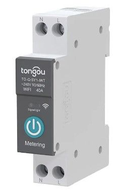
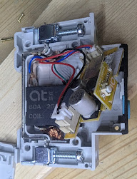
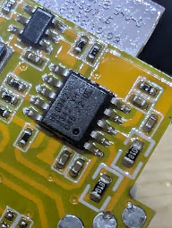
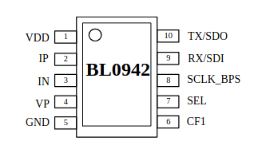
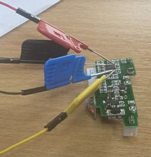

Maker: <https://www.tongou.net/>

Also on Aliexpress.

## Installation

*NOTE*: Try not to lose the original calibration data. If you have set up the device with Tuya, first see [Calibration](#calibration) and extract the calibration data from the running unit. And make sure you read the full 2MiB of the original flash before overwriting it.

These units generally ship with a firmware which is no longer exploitable by tuya-fwcutter,
so some disassembly will be required to flash using serial.

First, the 6 rivets need to be drilled out with a 2mm drill bit. You'll need something to replace
these when you reassemble the unit; M1.6 nuts and 16mm bolts work well.

Once open, lift out the control board so that you can see the BL0942 chip on the reverse side,
behind the CBU module:

 

All the pins you need to flash the device are accessible from the BL0942 with SOIC probes:

- VDD / +3.3v (pin 1)
- GND (pin 5)
- RX (pin 9)
- TX (pin 10)

Note that the TX pin of the BL0942 corresponds to the RX pin of the BL72xx module, and vice versa.



You don't need to completely remove the board from the device, as shown in the picture below. But do not attempt to flash it while it's connected to the mains!



When ltchiptool says `Getting bus... (now, please do reboot by CEN or by power off/on)` first make sure you have read the [Calibration](#calibration) section and you are *reading* the flash before overwriting it. Then disconnect and reconnect the GND line, and it should proceed.

## Calibration

The factory calibration settings for the BL0942 are available in two ways. First, as DPS values 22-25 in the Tuya API, as reported by tools such as [tinytuya](https://pypi.org/project/tinytuya/), for example:

```python
#!/bin/python3

import tinytuya
d = tinytuya.OutletDevice(
      dev_id='DEVICE_ID_HERE',
      address='IP_ADDRESS_HERE',
      local_key='LOCAL_KEY_HERE',
      version=3.4)

data = d.status()
print("UREF: %d" % data['dps']['22'])
print("IREF: %d * 10" % data['dps']['23'])
print("PREF: %d / 10" % data['dps']['24'])
print("EREF: %d" % data['dps']['25'])
```

Sample results:

```us
UREF: 15968
IREF: 12418 * 10
PREF: 3091 / 10
EREF: 2653
```

Alternatively, the values may be stored in flash in the "key value store" Tuya partition, typically at address `0x001d5000`:

```us
001d5000  60 3e 00 00 82 30 00 00  13 0c 00 00 5d 0a 00 00  |`>...0......]...|
```

- UREF = 0x3e60 = 15968
- IREF = 0x3082 = 12418 (times ten to make 124180)
- PREF = 0xc13 = 3091 (divide by ten to make 309.1)
- EREF = 0xa5d = 2653

You can use these checks to validate the values you see:

- PREF = UREF × IREF × 3537 / (305978 × 73989)
- EREF = PREF × 3600000 / 419430.4

Applying those sanity checks to the example above, we get:

- PREF = 12968 × 124180 × 3537 / (305978 × 73989) = 309.8 *(close enough)*
- EREF = 309.1 × 3600000 / 419430.4 = 2653.0 *(spot on)*

The PREF values in the Tuya firmware are often a little lower than the calculation would suggest, but close enough that you can be confident you're looking at the right values.

If the calibration data are not available, it's still possible to calibrate the voltage and current against an external meter, and the power and energy calibrations can be calculated from that.

## GPIO Pinout

| Pin    | Function              |
| ------ | --------------------- |
| RX1    | BL0942 Tx             |
| TX1    | BL0942 Rx             |
| P9     | Power LED (inverted)  |
| P15    | Status LED (inverted) |
| P27    | Button (inverted)     |
| P24    | Relay forward         |
| P26    | Relay reverse         |

## Configuration

- Per-device configuration:

```yaml
substitutions:
  name: "power-light-spare2"
  tongou_name: "10A spare 2"
  voltage_ref: "15968"
  current_ref: "124180"
  power_ref: "309.1"
  energy_ref: "2653"

packages:
  tongou: !include tongou.yaml # below
```

- Generic config (`tongou.yaml`):

```yaml
# tongou.yaml
esphome:
  name: ${name}

bk72xx:
  board: generic-bk7231n-qfn32-tuya

packages:
  base: !include base.yaml # WiFi and MQTT settings.

logger:
  level: DEBUG

network:
  enable_ipv6: false # Not supported on BL72xx yet

mqtt:
  on_connect:
    then:
      - light.turn_on: led
  on_disconnect:
    then:
      - light.turn_off: led

text_sensor:
  - platform: libretiny
    version:
      name: LibreTiny Version

light:
  - platform: status_led
    internal: true
    pin:
      number: P15
      inverted: true
    id: led
    restore_mode: ALWAYS_OFF

binary_sensor:
  - platform: gpio
    name: button
    id: button
    internal: true
    pin:
      number: P17
      inverted: true
    filters:
     - delayed_off: 10ms
    on_press:
      then:
         switch.toggle: relay

switch:
  - platform: gpio
    internal: true
    pin: P24
    id: relay_on
    restore_mode: ALWAYS_OFF
  - platform: gpio
    internal: true
    pin: P26
    id: relay_off
    restore_mode: ALWAYS_OFF
  - platform: gpio
    pin:
      number: P9
      inverted: true
    id: relay
    name: Relay
    # On by default should be fine as this is not a safety device
    restore_mode: RESTORE_DEFAULT_ON
    on_turn_on:
      then:
       - switch.turn_off: relay_off
       - switch.turn_on: relay_on
       - delay: 100ms
       - switch.turn_off: relay_on
    on_turn_off:
      then:
       - switch.turn_off: relay_on
       - switch.turn_on: relay_off
       - delay: 100ms
       - switch.turn_off: relay_off

uart:
  id: uart_bus
  tx_pin: TX1
  rx_pin: RX1
  baud_rate: 4800
  stop_bits: 1

sensor:
  - platform: internal_temperature
    name: "${tongou_name} Internal Temperature"

  - platform: bl0942
    uart_id: uart_bus
    line_frequency: 50Hz
    address: 0
    update_interval: 20s
    current:
      name: ${tongou_name} Current
    voltage:
      name: ${tongou_name} Voltage
    power:
      name: ${tongou_name} Power
      filters:
        multiply: -1
    energy:
      name: ${tongou_name} Energy
    frequency:
      name: ${tongou_name} Frequency
      accuracy_decimals: 2
    voltage_reference: ${voltage_ref}
    current_reference: ${current_ref}
    power_reference: ${power_ref}
    energy_reference: ${energy_ref}

```
