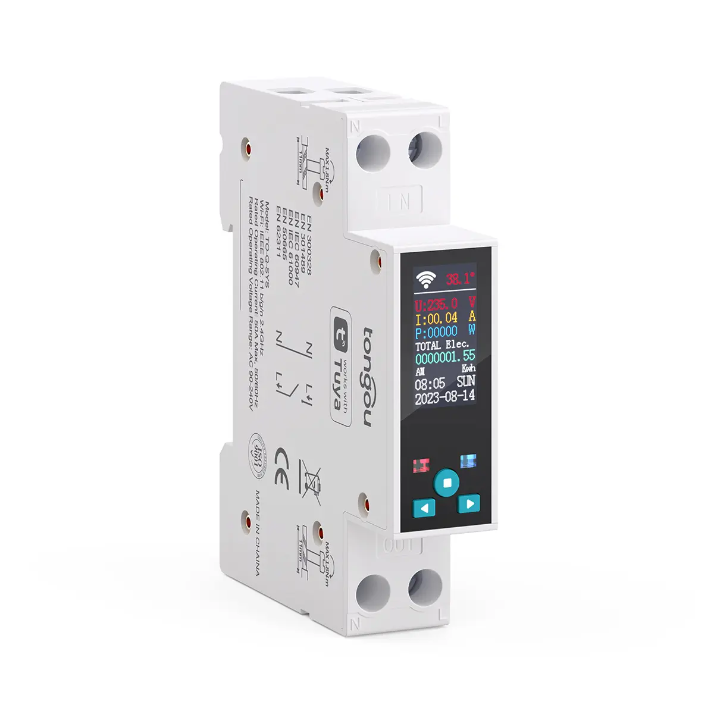
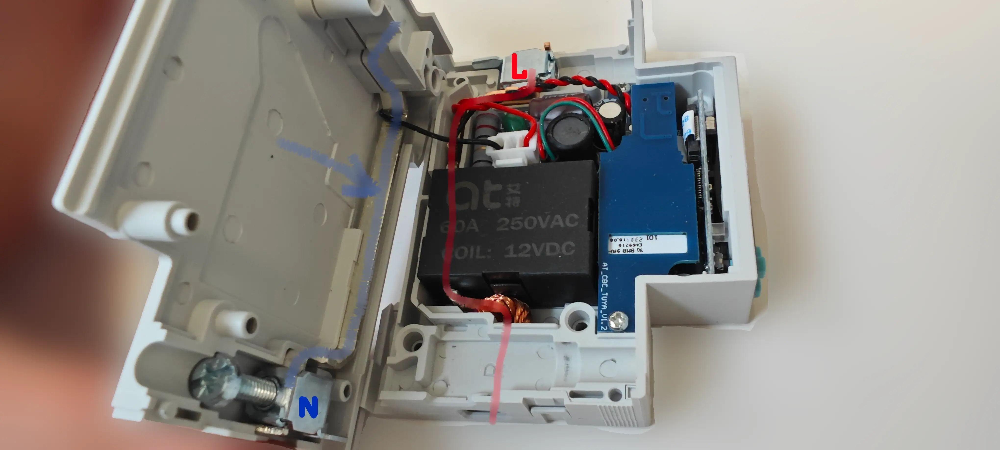
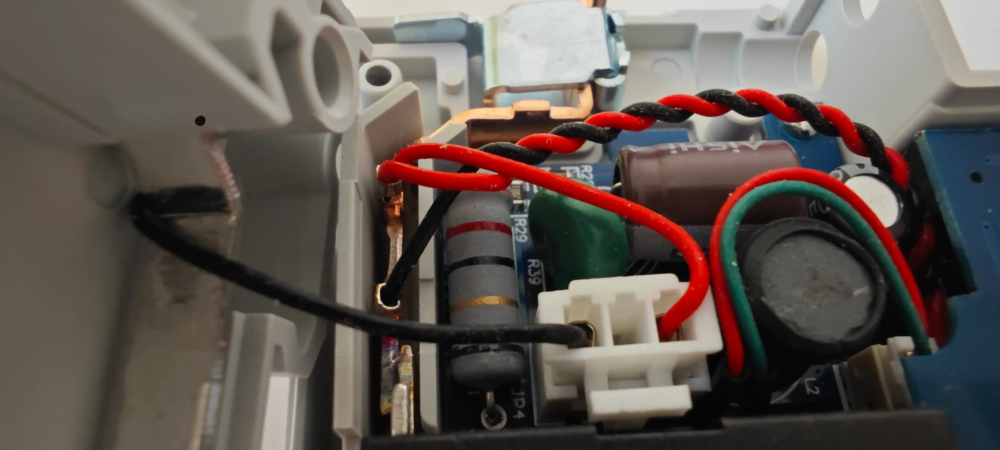
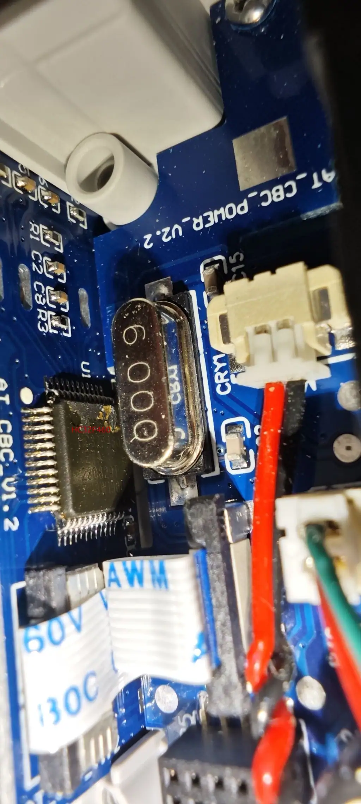
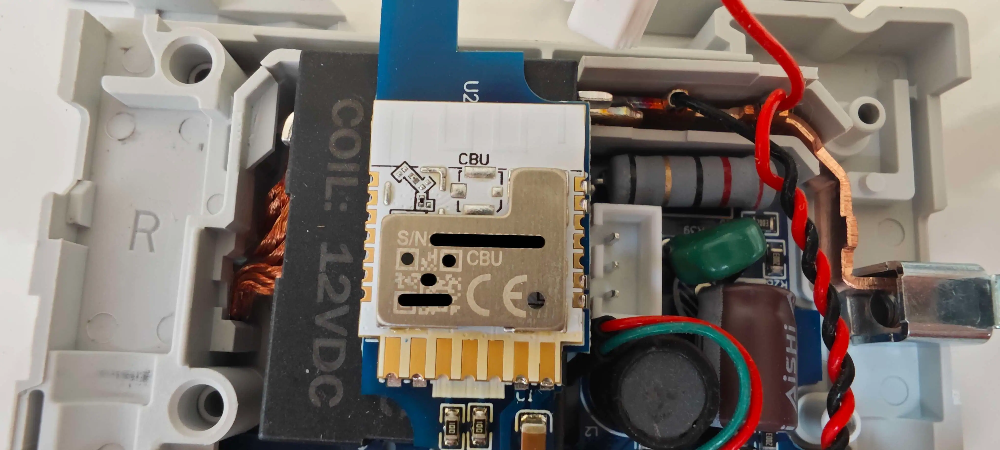
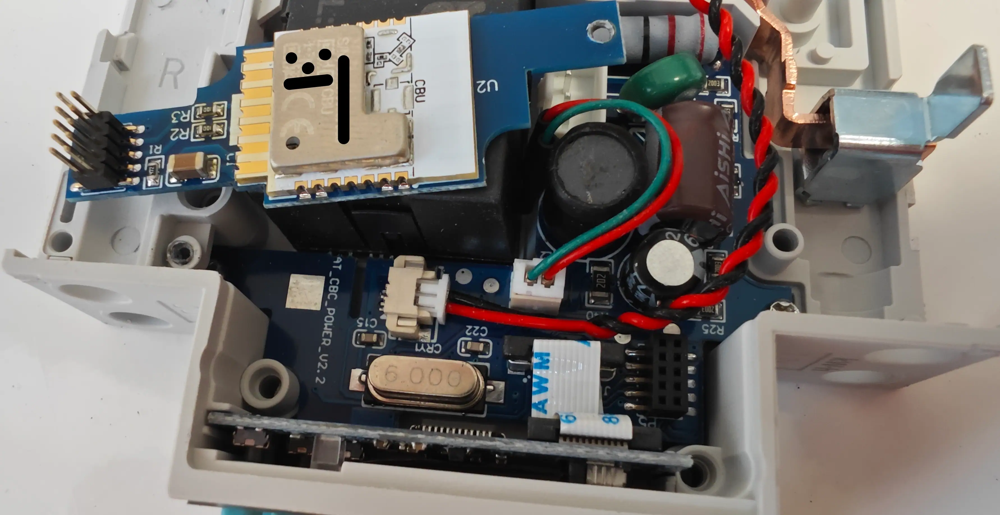

## Device Overview

The [device](https://www.tongou.com/product/single-phase-din-rail-smart-meter) is a DIN-rail power meter with a relay inside. Some aspects to consider:

- This is not an IEC/EN 60898 compliant circuit breaker. The relay inside is able to break the circuit and is rated for 60A (markings on the relay, 50A rating on the device box), however, it's not meant to be used a circuit breaker - use smart MCBs instead if you need one (Tongou has smart MCBs as well);
- It only breaks the line connected to the L terminal - the N terminal is simply attached to a piece of metal spanning the body of the device;
- The relay inside is [bistable](https://en.wikipedia.org/wiki/Relay#Latching_relay) as it maintains its position without power applied. If you set the power-on mode via the MCU, the old state will be maintained until the MCU is powered on and only then will it set the state based on the policy that was set (always on, always off, restore previous);
- The MCU inside is [HC32F460](https://m.huazhoucn.com/upFiles/common/2023/04/HC32F460%20series%20Datasheet%20Rev1.3.pdf) and is accessible via UART1 of the CBU board (the same UART that is used for flashing). It runs the firmware that complies with the standard [Tuya MCU protocol](https://developer.tuya.com/en/docs/mcu-standard-protocol/MCUSDK-wifi-base?id=Kd2bxu84567gk);
- The MCU firmware actually interfaces with the metering sensors and so calibration is not required.
- Some MCU settings are only possible to configure remotely (like the prepaid switch ones), some are only possible to set via the physical buttons (like the period of time for which the measured parameters must stay above/below the limits so that the configured action gets triggered) and some are possible to set remotely and via on-device buttons (like the limits themselves).





## UART Buffer Size Adjustment

The MCU sends Tuya data points quickly and needs 300+ bytes of UART buffer space. The CBU chip running ESPHome is not able to process incoming bytes fast enough so many data points get discarded with the default buffer size of 64 bytes.

As of [Libretiny 1.8.0](https://github.com/libretiny-eu/libretiny/releases/tag/v1.8.0) it is possible to adjust the RX buffer size using a framework option so make sure to set `LT_SERIAL_BUFFER_SIZE: 512` which is large enough for the incoming messages from the MCU.

## Flashing Instructions

The PSU inside that provides power to the control board has isolation from the mains unlike in some other products: a multimeter will show MOhms if you attach the neutral wire of the control board and the N terminal. However, avoid trying to reflash the device when it's powered from mains - this is too dangerous for your hardware and well-being.

The main board with the CBU chip is easily detachable from the main board but pins are very small (not the usual 2.54mm or 1.27mm dupont pins). When detached you can use something like PCBite hands-free probes, crafted [PIZZAbite](https://github.com/whid-injector/PIZZAbite) probes or simply various kinds of hooks (e.g. [1](https://aliexpress.com/item/1005001998124173.html) or [2](https://aliexpress.com/item/32661192484.html)).

[CBU](https://docs.libretiny.eu/boards/cbu/#pinout) needs 4 pins to be flashed:

- RX1 (connect to TX of your UART)
- TX1 (connect to RX of your UART)
- 3.3V
- GND




## Disassembly and Reassembly

The rivets holding the device together seem to be DIN 7340 type B (d1 = 2mm, L ~= 16mm) hollow rivets. As the rivets are small in diameter it is not possible to remove them without drilling. Drill a `2mm` hole to remove the rivets.

In order to reassemble the device you will need a [tap](https://en.wikipedia.org/wiki/Tap_and_die) and a set of [M2.5](https://en.wikipedia.org/wiki/ISO_metric_screw_thread#Preferred_sizes) screws with a length of `15mm - 18mm` (`18mm` being the width of the device). Do it in the following order:

- Separate the two plastic parts of the device's body after drilling the rivets out;
- Drill a `2.5mm` hole in one part;
- In the other part, use the metric tap to create a [thread](https://en.wikipedia.org/wiki/Screw_thread) for an M2.5 screw.

## Data Points

Provided that the UART buffer size is increased, you should see the data points during the Tuya module initialization.

```log
  [05:08:59][C][tuya:041]: Tuya:
  [05:08:59][C][tuya:058]:   Datapoint 1: int value (value: 38)
  [05:08:59][C][tuya:058]:   Datapoint 125: int value (value: 38)
  [05:08:59][C][tuya:054]:   Datapoint 6: raw (value: 00.00.00.00.00.00.00.00 (8))
  [05:08:59][C][tuya:056]:   Datapoint 11: switch (value: OFF)
  [05:08:59][C][tuya:058]:   Datapoint 13: int value (value: 0)
  [05:08:59][C][tuya:056]:   Datapoint 16: switch (value: OFF)
  [05:08:59][C][tuya:062]:   Datapoint 101: enum (value: 0)
  [05:08:59][C][tuya:062]:   Datapoint 102: enum (value: 2)
  [05:08:59][C][tuya:062]:   Datapoint 103: enum (value: 1)
  [05:08:59][C][tuya:062]:   Datapoint 104: enum (value: 2)
  [05:08:59][C][tuya:062]:   Datapoint 105: enum (value: 0)
  [05:08:59][C][tuya:062]:   Datapoint 107: enum (value: 2)
  [05:08:59][C][tuya:062]:   Datapoint 109: enum (value: 0)
  [05:08:59][C][tuya:062]:   Datapoint 110: enum (value: 0)
  [05:08:59][C][tuya:056]:   Datapoint 112: switch (value: ON)
  [05:08:59][C][tuya:058]:   Datapoint 114: int value (value: 50)
  [05:08:59][C][tuya:058]:   Datapoint 115: int value (value: 280)
  [05:08:59][C][tuya:058]:   Datapoint 116: int value (value: 165)
  [05:08:59][C][tuya:058]:   Datapoint 118: int value (value: 1000)
  [05:08:59][C][tuya:058]:   Datapoint 119: int value (value: 2000)
  [05:08:59][C][tuya:058]:   Datapoint 120: int value (value: 10)
  [05:08:59][C][tuya:058]:   Datapoint 131: int value (value: 247)
  [05:08:59][C][tuya:058]:   Datapoint 137: int value (value: 600)
  [05:08:59][C][tuya:056]:   Datapoint 111: switch (value: OFF)
  [05:08:59][C][tuya:056]:   Datapoint 141: switch (value: OFF)
  [05:08:59][C][tuya:058]:   Datapoint 140: int value (value: 5)
  [05:08:59][C][tuya:062]:   Datapoint 142: enum (value: 2)
  [05:08:59][C][tuya:060]:   Datapoint 138: string value (value: )
  [05:08:59][C][tuya:074]:   Product: '{"p":"kmnzgh4yn8pa0lqh","v":"1.1.3","m":2}'
```

The meaning of the data points is explained in the YAML config.

## Configuration

The YAML config below has been tested with the MCU firmware `1.1.3`.

```yaml
esphome:
  name: to-q-sys-jwt
  name_add_mac_suffix: true
  platformio_options:
    # This is a mandatory section at the time of writing: it will get the UART buffer size increased.
    platform_packages:
      - framework-arduino-api @ https://github.com/dshcherb/ArduinoCore-API/archive/refs/tags/2025.1.4.zip

bk72xx:
  board: cbu
  framework:
    options:
      # Increase the UART buffer size via a Libretiny-specific option.
      LT_SERIAL_BUFFER_SIZE: 512
    version: latest

logger:

web_server:

captive_portal:

mdns:

api:
  encryption:
    key: !secret api_key

ota:
  - platform: esphome
    password: !secret ota_password

wifi:
  ssid: !secret wifi_ssid
  password: !secret wifi_password
  ap:

uart:
  rx_pin: RX1
  tx_pin: TX1
  baud_rate: 115200
  rx_buffer_size: 512


time:
  - platform: homeassistant
    id: homeassistant_time

# Register the Tuya MCU connection
tuya:
  id: tuya_component
  time_id: homeassistant_time
  on_datapoint_update:
    - sensor_datapoint: 6
      datapoint_type: raw
      then:
        - lambda: |-
            // volts with one digit after decimal point.
            id(voltage_sensor).publish_state((x[0] << 8 | x[1]) * 0.1);
            // amperes with 3 digits after decimal point.
            id(current_sensor).publish_state(((x[2] << 16 | x[3] << 8) | x[4]) * 0.001);
            // kilo watts with 3 digits after decimal point.
            id(power_sensor).publish_state(((x[5] << 16 | x[6] << 8) | x[7]) * 0.001);

number:
  - platform: "tuya"
    name: "Under-voltage Threshold"
    number_datapoint: 116
    device_class: voltage
    unit_of_measurement: "V"
    min_value: 100
    max_value: 280
    step: 1
  - platform: "tuya"
    name: "Over-voltage Threshold"
    number_datapoint: 115
    device_class: voltage
    unit_of_measurement: "V"
    min_value: 100
    max_value: 280
    step: 1
  - platform: "tuya"
    name: "Over-current Threshold"
    number_datapoint: 114
    device_class: current
    unit_of_measurement: "A"
    min_value: 1
    max_value: 50
    step: 0.1
  - platform: "tuya"
    name: "Temperature Threshold"
    number_datapoint: 118
    unit_of_measurement: "°C"
    device_class: temperature
    # In 100s °C
    min_value: -25
    max_value: 100
    multiply: 10.0
    step: 0.1
  - platform: "tuya"
    name: "Over-Power Threshold"
    number_datapoint: 119
    device_class: power
    unit_of_measurement: "W"
    min_value: 5
    # The value in the original app is 26000, however, the device is rated to
    # switch up to 50 Amps and 240 V AC (the relay inside is marked as 60A).
    # So it's better to cap the threshold at 240 * 50 = 12000 W.
    max_value: 12000
    step: 1
  - platform: "tuya"
    name: "Screen Brightness"
    number_datapoint: 140
    min_value: 1
    max_value: 5
    step: 1
  - platform: "tuya"
    # Called "Actively Report Time" in the developer API. This is actually an interval
    # for the MCU to report all data points to the main module over UART. The original
    # app limit is 60 seconds but lower values are possible. It may take some time for the
    # Tuya component to handle incoming bytes for all data points so use with care.
    name: "Reporting Interval"
    number_datapoint: 137
    unit_of_measurement: "S"
    min_value: 5 # 60
    max_value: 600
    step: 1
  - platform: "tuya"
    name: "Balance Shortage Threshold"
    device_class: energy
    number_datapoint: 120
    unit_of_measurement: "kW·h"
    min_value: 1
    max_value: 500
    step: 1
  - platform: "tuya"
    id: charge_electricity
    # The electricity allowance for the "prepayment switch" mode.
    # Charging will not work if the prepayment switch is off (this logic
    # is built into the MCU firmware).
    name: "Charge Electricity"
    number_datapoint: 14
    device_class: energy_storage
    unit_of_measurement: "kW·h"
    min_value: 0
    max_value: 9999 # 999999
    datapoint_hidden:
      datapoint_type: int
      initial_value: 0
      restore_value: false
    step: 0.1
    multiply: 100

select:
  - platform: "tuya"
    name: "Under-voltage Action"
    enum_datapoint: 103
    optimistic: true
    options:
      0: 'Ignore'
      1: 'Alarm'
      2: 'Trip'
  - platform: "tuya"
    name: "Over-voltage Action"
    enum_datapoint: 102
    optimistic: true
    options:
      0: 'Ignore'
      1: 'Alarm'
      2: 'Trip'
  - platform: "tuya"
    name: "Over-current Action"
    enum_datapoint: 104
    optimistic: true
    options:
      0: 'Ignore'
      1: 'Alarm'
      2: 'Trip'
  - platform: "tuya"
    name: "Over-power Action"
    enum_datapoint: 105
    optimistic: true
    options:
      0: 'Ignore'
      1: 'Alarm'
      2: 'Trip'
  - platform: "tuya"
    name: "Over-temperature Action"
    enum_datapoint: 107
    optimistic: true
    options:
      0: 'Ignore'
      1: 'Alarm'
      2: 'Trip'
  - platform: "tuya"
    # What to do when the device is running out of the electricity budget.
    # It is not possible to trip on shortage: in fact, it does not make sense
    # because there's still budget. In the pre-paid mode the relay will be tripped
    # when the balance is zeroed out.
    name: "Balance Shortage Action"
    enum_datapoint: 101
    optimistic: true
    options:
      0: 'Ignore'
      1: 'Alarm'
  - platform: "tuya"
    name: "Relay Power-on State"
    enum_datapoint: 142
    optimistic: true
    options:
      0: 'Power Off'
      1: 'Power On'
      2: 'Last State'

text_sensor:
  - platform: libretiny
    version:
      name: LibreTiny Version
  - platform: "tuya"
    # Seems to indicate whether the module is online (Wi-Fi connected) per the MCU
    # based on the feedback from the main module.
    name: "Online Status"
    sensor_datapoint: 109
    filters:
      # The Tuya DP is an enum which is converted to human-readable strings.
      - map:
        - 1 -> Offline
        - 0 -> Online
  - platform: "tuya"
    name: "Last MCU Event"
    sensor_datapoint: 110
    filters:
      # The Tuya DP is an enum which is converted to human-readable strings denoting
      # the status of the last event processed by the MCU. Clearing it manually just
      # results in the MCU resetting it back to what it was so this is a sensor.
      - map:
        - 0 -> Normal
        - 1 -> Over Current Trip
        - 2 -> Over Power Trip
        - 3 -> High Temp Trip
        - 4 -> Over Voltage Trip
        - 5 -> Under Voltage Trip
        - 6 -> Over Current Alarm
        - 7 -> Over Power Alarm
        - 8 -> High Temp Alarm
        - 9 -> Over Voltage Alarm
        - 10 -> Under Voltage Alarm
        - 11 -> Remote ON
        - 12 -> Remote OFF
        - 13 -> Manual ON
        - 14 -> Manual OFF
        # Actually irrelevant for this device because this power meter does not
        # have current leakage detection.
        - 15 -> Leakage Trip
        - 16 -> Leakage Alarm
        - 17 -> Restore Default
        - 18 -> Automatic Closing
        - 19 -> Electricity Shortage
        # On MCU firmware 1.1.3 (latest at the time of writing) it seems like this
        # alarm is not cleared by the MCU even if the balance is topped up past the
        # shortage threshold. Doing a local or remote on/off will clear it but it's
        # not always practical. Setting the DP to Normal manually is overridden by
        # the MCU.
        # Product: '{"p":"kmnzgh4yn8pa0lqh","v":"1.1.3","m":2}'
        - 20 -> Electricity Shortage Alarm

sensor:
  - platform: "tuya"
    # Also known as Total Forward Energy
    name: "Total Electricity Consumption"
    sensor_datapoint: 1
    device_class: "energy"
    unit_of_measurement: "kW·h"
    state_class: "measurement"
    filters:
      # The values stored in the MCU need to be processed for display.
      - multiply: 0.01
    accuracy_decimals: 2
  - platform: "tuya"
    name: "Forward Electricity"
    sensor_datapoint: 125
    device_class: "energy"
    unit_of_measurement: "kW·h"
    state_class: "measurement"
    icon: "mdi:meter-electric-outline"
    accuracy_decimals: 2
    filters:
      # The values stored in the MCU need to be processed for display.
      - multiply: 0.01
  - platform: "tuya"
    name: "Real-time Temperature"
    sensor_datapoint: 131
    state_class: "measurement"
    unit_of_measurement: "°C"
    device_class: "temperature"
    accuracy_decimals: 1
    filters:
      # The values stored in the MCU need to be processed for display.
      - multiply: 0.1
    icon: "mdi:temperature-celcius"
  - platform: "tuya"
    name: "Electricity Balance"
    sensor_datapoint: 13
    state_class: "measurement"
    unit_of_measurement: "kW·h"
    device_class: "energy"
    accuracy_decimals: 2
    filters:
      # The values stored in the MCU need to be processed for display.
      - multiply: 0.01
    icon: "mdi:home-battery-outline"
  - platform: "template"
    id: current_sensor
    name: "Real-time Current"
    unit_of_measurement: "A"
    state_class: "measurement"
    device_class: "current"
    icon: "mdi:current-ac"
    accuracy_decimals: 3
  - platform: "template"
    id: power_sensor
    name: "Real-time Power"
    unit_of_measurement: "kW"
    state_class: "measurement"
    device_class: "power"
    icon: "mdi:lightning-bolt"
    accuracy_decimals: 3
  - platform: "template"
    id: voltage_sensor
    name: "Real-time Voltage"
    unit_of_measurement: "V"
    state_class: "measurement"
    device_class: "voltage"
    icon: "mdi:flash-triangle"
    accuracy_decimals: 1


switch:
  - platform: "tuya"
    # Off - circuit is "open", i.e. phase is broken, neutral wire is always connected in hardware.
    # On - circuit is "closed", i.e. phase is connected via the built-in relay.
    # The relay will be turned off (circuit is broken) whenever DP 11 (Prepayment switch) is
    # off. The "Prepayment switch" has to do with how this device is marketed: i.e. for rental
    # properties where somebody pays for electricity used.
    name: "Circuit Breaker Switch"
    switch_datapoint: 16
    icon: "mdi:restart"
    device_class: outlet
  - platform: "tuya"
    # Automatic Reclosing refers to a feature that closes the circuit
    # (i.e. allows the current to flow through the relay) automatically
    # upon coming back to normal conditions.
    # Auto-closing is available only when the device recovers from
    # under/over-voltage conditions, not other parameters due to safety
    # reasons.
    name: "Automatic Closing"
    switch_datapoint: 112
    restore_mode: DISABLED
  - platform: "tuya"
    # Reset the MCU to default settings.
    name: "Reset MCU to Defaults"
    switch_datapoint: 113
  - platform: "tuya"
    # Report MCU state changes (including electricity measurements) at the
    # predefined reporting interval (see DP 137).
    name: "Report State Changes"
    switch_datapoint: 111
    restore_mode: DISABLED
  - platform: "tuya"
    # Whether to use the energy balance datapoint or not to determine if the
    # relay should be on or off (the actual behavior will also depend on
    # whether DP 101 is set to alarm or break the circuit). If this mode
    # is disabled, the on-device switch button will not be limited if balance
    # is zero.
    name: "Prepayment Switch Mode"
    switch_datapoint: 11
  - platform: "tuya"
    id: clear_electricity_switch
    # Clear the remaining electricity budget.
    name: "Clear Remaining Electricity"
    switch_datapoint: 12
    internal: true
  - platform: "tuya"
    name: "Screen On"
    # Enable or disable the on-device screen. Does not block buttons
    # on the device: i.e. one can still trip the switch.
    switch_datapoint: 141
    inverted: true

button:
  - platform: template
    # Clearing the balance in the "Prepaid switch mode" will result in the relay
    # breaking the circuit. Use with care. If the balance is zero when the
    # prepaid mode is turned on, the relay will be tripped as well.
    name: "Clear Balance"
    icon: "mdi:checkbox-blank-off-outline"
    on_press:
      - switch.turn_on: clear_electricity_switch
      - delay: 1s
      # The flag isn't cleared automatically by the MCU so it's done manually.
      - switch.turn_off: clear_electricity_switch
```
