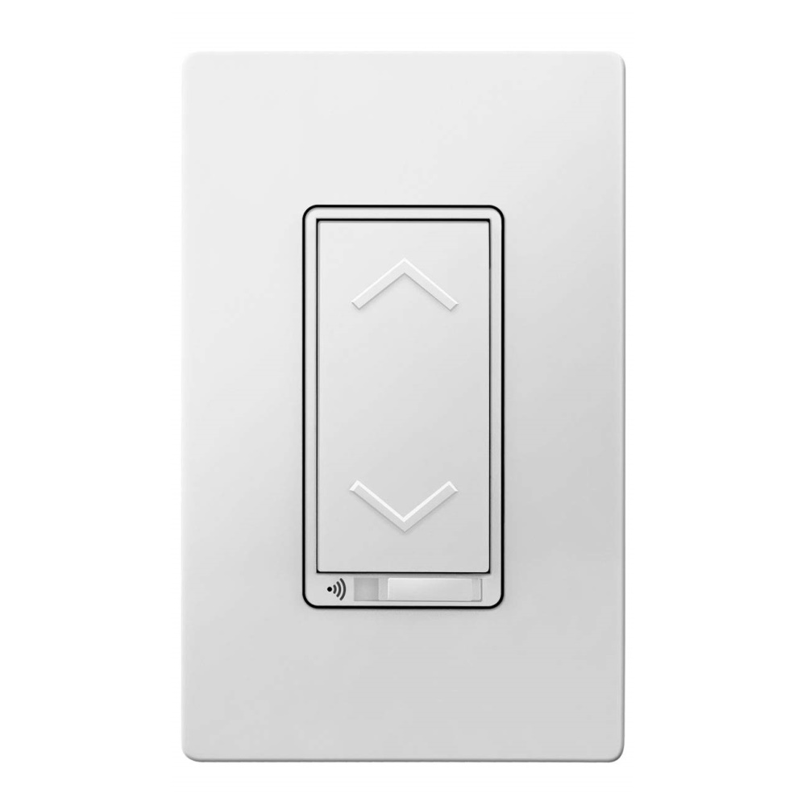

TOPGREENER TGWF500D 3-Way Smart Dimmer Switch

[Amazon Link](https://amzn.to/2SA4lPl)

## Notes

This TuyaMCU requires a baud rate of 9600.

## GPIO Pinout

| Pin   | Function |
| ----- | -------- |
| GPI15 | Tuya Tx  |
| GPI15 | Tuya Rx  |

## Basic Configuration

```yaml
substitutions:
  device_name: familyroom_light_1 #change
  friendly_name: Family Room Light #change
  icon: "mdi:light-switch"

esphome:
  name: ${device_name}
  platform: ESP8266
  board: esp01_1m
  name_add_mac_suffix: true
    
# OTA flashing
ota:
  - platform: esphome

wifi: # Your Wifi network details
  
# Enable fallback hotspot in case wifi connection fails  
  ap:

# Enabling the logging component
logger:
  level: DEBUG
  baud_rate: 0

# Enable Home Assistant API
api:

# Enable the captive portal
captive_portal:

web_server:
  port: 80

uart:
  rx_pin: GPIO13
  tx_pin: GPIO15
  baud_rate: 9600

tuya:

sensor:
  - platform: wifi_signal
    name: ${friendly_name} WiFi Signal
    update_interval: 60s

  - platform: uptime
    name: ${friendly_name} Uptime

light:
  - platform: "tuya"
    name: ${friendly_name}
    dimmer_datapoint: 3
    switch_datapoint: 1
    min_value: 10
    max_value: 255
```
