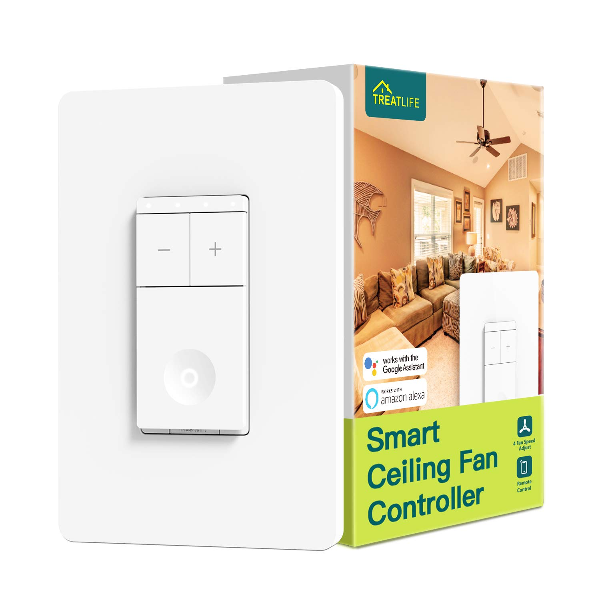

Treatlife DS02F Switch

[Amazon Link](https://www.amazon.com/gp/product/B08P5D3ZKW)

## Notes

The Treatlife DS02F is similar to the DS03, but lacking the control for the light.

This is not for the faint of heart. This device comes with a Tuya WB3S chip, which is not ESP based. Luckily, the main board has the appropriate footprint for an ESP-12F. Further instructions can be found [here](https://community.home-assistant.io/t/treatlife-dual-outlet-indoor-dimmer-plug-wb3s-to-esp-12-transplant/256798). When desoldering the WB3S chip, take care if you use a heat gun near the black foam light guards around the speed LEDs and main switch LED. When overheated, the foam shrinks to less than half its original size. With a little patience, it is instead possible to peel the foam and adhesive off the PCB, set them to the side, and replace them after swapping out the WB3S.

Like the Treatlife DS03, the Tuya MCU UART runs at a baud rate of 115200. You may see a warning like `Invalid baud_rate: Integration requested baud_rate 9600 but you have 115200!` logged, but it is safe to ignore.

## GPIO Pinout

| Pin   | Function |
| ----- | -------- |
| GPIO1 | Tuya Tx  |
| GPIO3 | Tuya Rx  |

## Basic Configuration

```yaml
esphome:
  name: ds02f

esp8266:
  board: esp01_1m

# Enable logging
logger:

# Enable Home Assistant API
api:

ota:

wifi:
  ssid: "ssid"
  password: "PASSWORD"

  # Enable fallback hotspot (captive portal) in case wifi connection fails
  ap:
    ssid: "DS02F Fallback Hotspot"
    password: "ul57sDUAqbcl"

captive_portal:

uart:
  rx_pin: GPIO3
  tx_pin: GPIO1
  baud_rate: 115200

tuya:

fan:
  - platform: "tuya"
    name: Treatlife DS02F Speed
    switch_datapoint: 1
    speed_datapoint: 3
    speed_count: 4
```
