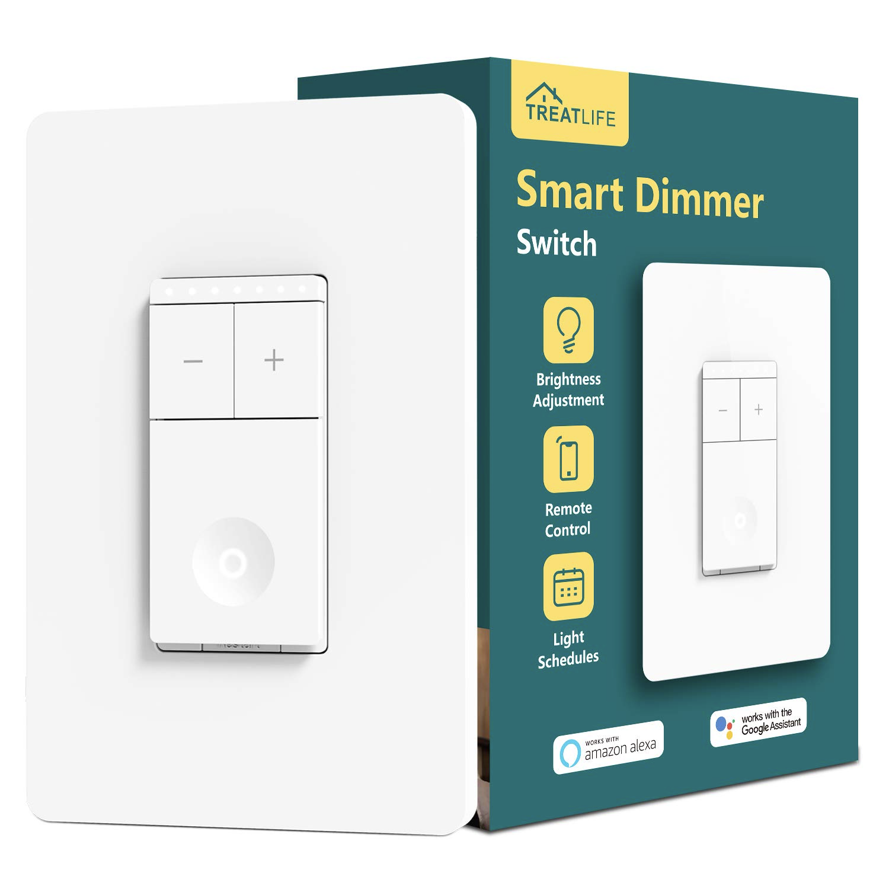

Treatlife DS02S Switch

[Amazon Link](https://amzn.to/2RHB44M)

## Notes

This TuyaMCU requires a baud rate of 9600, unlike the DS03 dimmer.

July 2021 - New device purchased now has Tuya WB3S Wifi Microcontroller in place of the previous TYWE3S, which is not ESP based. Luckily, the main board still has the appropriate footprint for an ESP-12F. Further instructions on how to swap microcontrollers can be found [here](https://community.home-assistant.io/t/treatlife-dual-outlet-indoor-dimmer-plug-wb3s-to-esp-12-transplant/256798)


## GPIO Pinout

| Pin   | Function |
| ----- | -------- |
| GPIO1 | Tuya Tx  |
| GPIO3 | Tuya Rx  |

## Basic Configuration

```yaml
substitutions:
  device_name: familyroom_light_1 #change
  friendly_name: Family Room Light #change
  icon: "mdi:light-switch"

esphome:
  name: ${device_name}
  platform: ESP8266
  board: esp01_1m

wifi:
  ssid: !secret wifi_ssid
  password: !secret wifi_password
  fast_connect: true
  ap:
    ssid: ${device_name}
    password: !secret esphome_ap_password

logger:
  baud_rate: 0

api:
  password: !secret esphome_api_password

ota:
  password: !secret esphome_ota_password

web_server:
  port: 80

uart:
  rx_pin: GPIO3
  tx_pin: GPIO1
  baud_rate: 9600

tuya:

sensor:
  - platform: wifi_signal
    name: ${friendly_name} WiFi Signal
    update_interval: 60s

  - platform: uptime
    name: ${friendly_name} Uptime

light:
  - platform: "tuya"
    name: ${friendly_name}
    dimmer_datapoint: 2
    switch_datapoint: 1
    min_value: 100
    max_value: 1000
```
