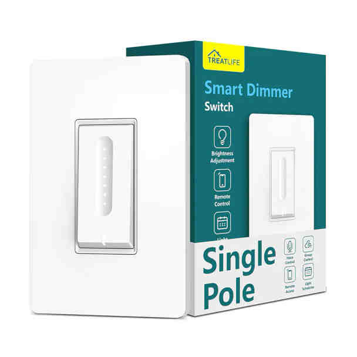

Treatlife DS01C Dimmer

[Amazon Link](https://a.co/d/0erbdRtn)

## Notes

The Treatlife DS01C Dimmer is single pole dimmer. This device comes with a Tuya WB3S
chip and there are now two methods to make this device compatible with ESPHome:

1. **Use [Cloudcutter](https://github.com/tuya-cloudcutter/tuya-cloudcutter) to flash the device.**
2. **Swap out the chip with a compatible one.**

### Using Cloudcutter

[Cloudcutter](https://github.com/tuya-cloudcutter/tuya-cloudcutter) is a tool designed to simplify the process of
flashing Tuya-based devices. It allows you to bypass the need for physically opening the device and swapping out chips.
By leveraging the cloud APIs, Cloudcutter enables you to flash the firmware remotely, making it a convenient and less
intrusive option. Follow the instructions on the
[Cloudcutter GitHub repository](https://github.com/tuya-cloudcutter/tuya-cloudcutter) to use this method for flashing
your DS02F device.

### Swap chip

The main board has the appropriate footprint for an ESP-12F. Further instructions can be found
[in the Home Assistant community][1]. When desoldering the WB3S chip, take care if you use a heat gun near the black
foam light guards around the speed LEDs and main switch LED. When overheated, the foam shrinks to less than half its
original size. With a little patience, it is instead possible to peel the foam and adhesive off the PCB, set them to
the side, and replace them after swapping out the WB3S.

[1]: https://community.home-assistant.io/t/treatlife-dual-outlet-indoor-dimmer-plug-wb3s-to-esp-12-transplant/256798
The Tuya MCU UART runs at a baud rate of 9600.
## GPIO Pinout

### BK72XX-Based Pinout

| Pin | Function |
| --- | -------- |
| RX1 | Tuya Rx  |
| TX1 | Tuya Tx  |


## Basic Configuration

```yaml
esphome:
  name: ds01c

# BK72XX-Based Board
bk72xx:
  board: wb3s

# Enable logging
logger:

# Enable Home Assistant API
api:

ota:

wifi:
  ssid: "ssid"
  password: "PASSWORD"

  # Enable fallback hotspot (captive portal) in case wifi connection fails
  ap:
    ssid: "DS02F Fallback Hotspot"
    password: "ul57sDUAqbcl"

captive_portal:

uart:
  rx_pin: RX1
  tx_pin: TX1
  baud_rate: 9600

tuya:

light:
  - platform: "tuya"
    name: Lights
    dimmer_datapoint: 2
    switch_datapoint: 1
    min_value: 100
    max_value: 1000

select:
  - platform: "tuya"
    id: "dimmer_mode"
    name: "Dimming Mode"
    enum_datapoint: 4
    options:
      0: LED # Index 0
      1: Incandescent # Index 1
      2: Halogen # Index 2