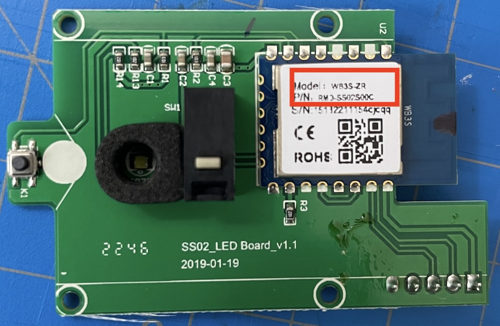
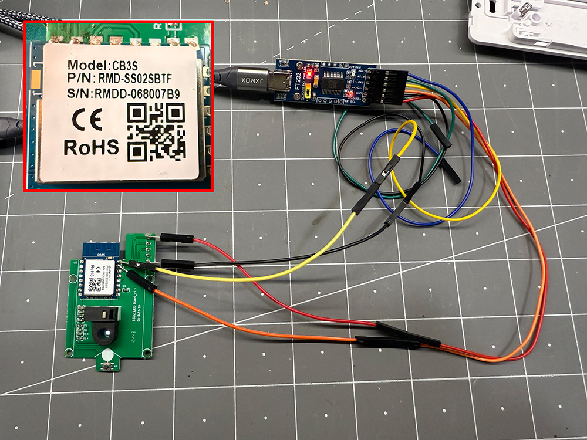

[Amazon Link](https://amzn.to/3NhW7EX)

## Notes

* Based on [Treatlife esp01_1m 2/3-Way Wall-Switch](/devices/Treatlife-Wall-Switch)
* Bought here: [Amazon](https://amzn.to/42jq8fY)
* **Note:** These devices are sold with different Beken chips. Inspect your board before flashing!
  * The version of the LED board is v1.1 dated 2019-01-19 in both cases
  * Some versions feature the BK7231S board (`WB3S` label on the chip)
  * Some versions feature the BK7231N board (`CB3S` label on the chip)
  * The LED pins are different for the two boards (see the configuration below)
* Requires disassembly and soldering to flash, see instructions here: <https://youtu.be/-a5hV1y5aIU?t=85>

The 2 way switch does not have a power sense pin. To solve this issue, and allow the smart switch to be smart, this code turns the White LED on when the light is off and, led off when the light is on. This allows the LEDs pin state to be used as a power sense, to determine whether to turn the relay on or off.

Additional notes on flashing via USB with the `esphome` CLI:

* Connect the UART bridge with the board connected to it, to the computer
* Run `esphome upload <configfile>`
* Press and hold the reset button on the board, then select port
* Release the reset button
* If you see errors like `read failed: [Errno 6] Device not configured`, try releasing the button 1-2 seconds later

If flashing with the `esphome` tool does not work, you can try the `ltchiptool` python utility

* Install `ltchiptool`: `pip install ltchiptool`
* (Optional) Retrieve the original firmware: `ltchiptool flash read  beken-72xx ./treatlife-2way.bin`
* Compile the esphome firmware: `esphome compile treatlife-2way.yaml` (use the file name of your yaml)
* Upload the esphome firmware:
  * Run `ltchiptool flash write ./.esphome/build/treatlifeswitch/.pioenvs/treatlifeswitch/esphome_2024.12.2_generic-bk7231t-qfn32-tuya_bk7231t_lt1.7.0.uf2` (your firmware location and name may be different)
  * Briefly disconnect power to the board and reconnect it (using the reset button of the board will disconnect the command above)

## Beken Board Versions

### WB3S Board



### CB3S Board and Flashing Setup



## GPIO Pinout

| Function                              | WB3S Pins | CB3S Pins |
|---------------------------------------|-----------|-----------|
| White LED (Power Sensor)              | P9        | P8        |
| Status LED                            | P8        | P7        |
| Relay 1                               | P24       | P24       |
| Button 1                              | P6        | P6        |

## Basic Configuration

```yaml
substitutions:
  device_name: treatlifeswitch #change
  friendly_name: "Treatlife Light Switch" #change
  icon: "mdi:light-switch"

bk72xx:
  board: generic-bk7231t-qfn32-tuya # WB3S board Ref: https://docs.libretiny.eu/boards/generic-bk7231t-qfn32-tuya/
  # board: cb3s # CB3S board Ref: https://docs.libretiny.eu/boards/cb3s/
esphome:
  name: ${device_name}

wifi:
  ssid: !secret wifi_ssid
  password: !secret wifi_password
  fast_connect: true
  ap:
    ssid: ${device_name}
    password: !secret esphome_ap_password

logger:

api:
  encryption:
    key: !secret api_encryption_key

ota:
  password: !secret esphome_ota_password

output:
  - platform: gpio
    id: switch_output
    pin: P24

  - platform: gpio
    id: white_led_output
    pin:
      number: P9 # WB3S board
      # number: P8 # CB3S board

light:
  - platform: binary
    id: ${device_name}
    name: ${friendly_name}
    output: switch_output
    on_turn_on:
      - light.turn_on: white_led
    on_turn_off:
      - light.turn_off: white_led

  - platform: binary
    id: white_led
    output: white_led_output

binary_sensor:
  - platform: gpio
    id: ${device_name}_button
    name: ${friendly_name} Button
    pin:
      number: P6
    on_press:
      - light.toggle: ${device_name}

status_led:
  # Red LED
  pin:
    number: P8 # WB3S board
    # number: P7 # CB3S board
    inverted: yes
```

## Home Assistant light entity (Converts it from a switch to a Light Entity)

```yaml
light:
  - platform: switch
    name: "Treatlife Light Switch"
    entity_id: switch.treatlifeswitch # Change
```
