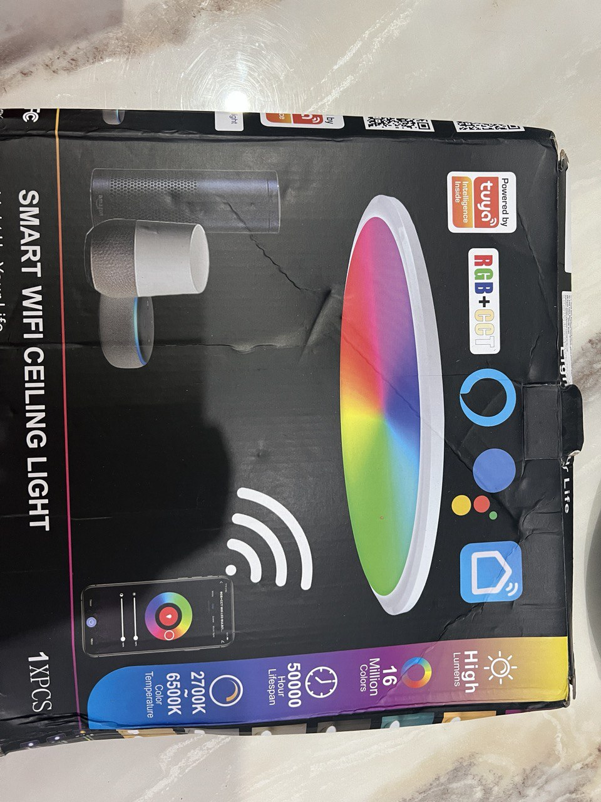
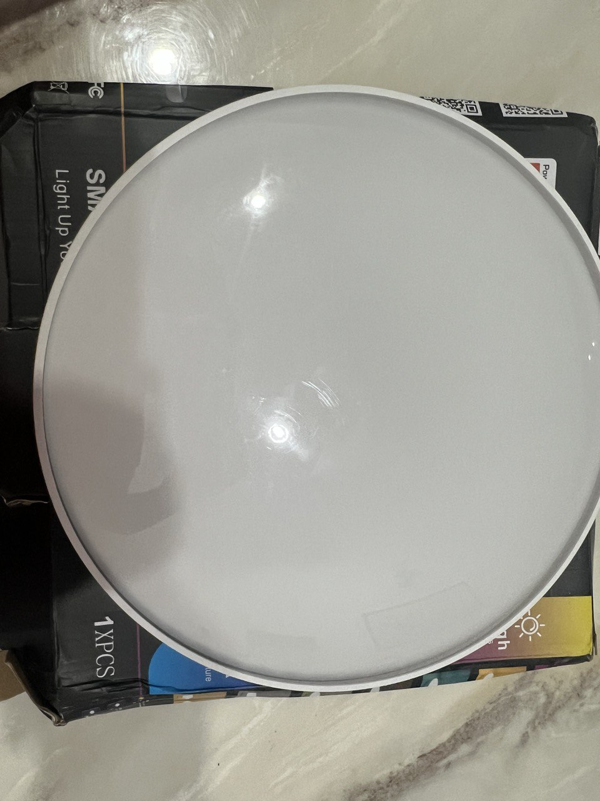
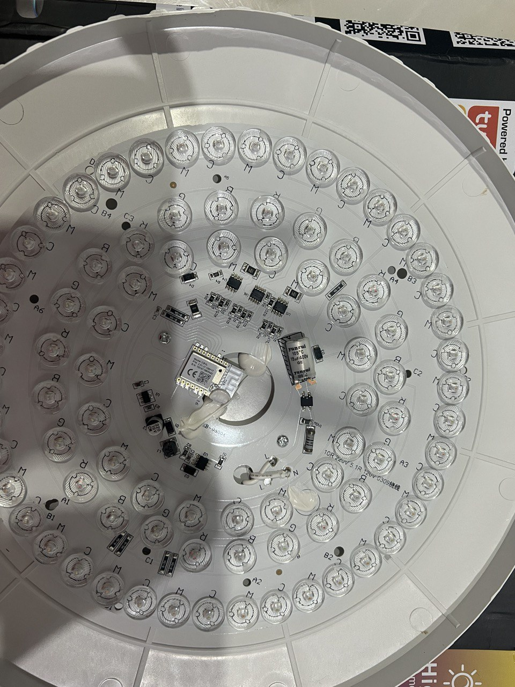
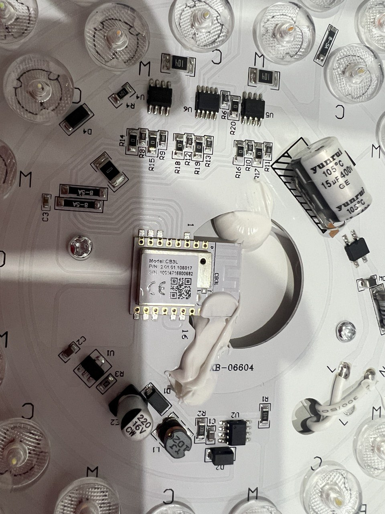
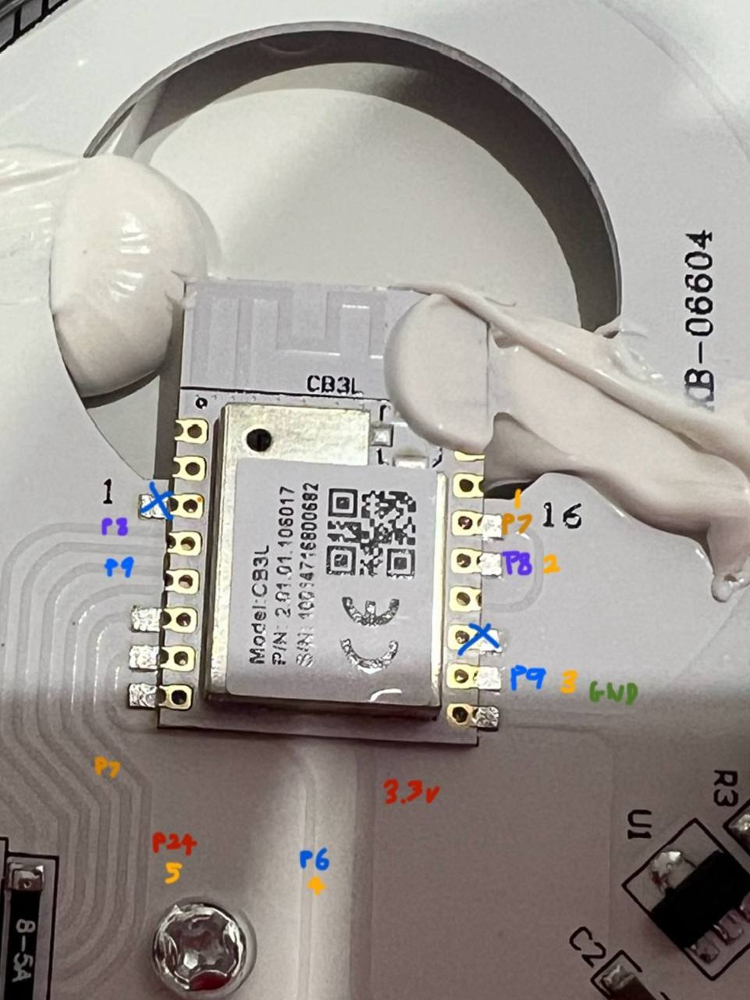

- Has CB3L (BK7231N) chip.

## GPIO Pinout

| Pin    | Function           |
| ------ | ------------------ |
| GPIO7 | PWM 1         |
| GPIO8  | PWM 2            |
| GPIO9  | PWM 3            |
| GPIO6  | PWM 4  |
| GPIO24  | PWM 5 |

## PCB



## Basic Configuration

```yaml
esphome:
  name: ceiling-light-beken
  friendly_name: ceiling-light-beken

bk72xx:
  board: cb3l

# Enable logging
logger:

# Enable Home Assistant API
api:

ota:
  - platform: esphome

wifi:
  ssid: !secret wifi_ssid
  password: !secret wifi_password

  # Enable fallback hotspot (captive portal) in case wifi connection fails
  ap:
    ssid: "Ceiling-Light-Beken"
    password: !secret ap_password

captive_portal:

web_server:
  port: 80

# Output pins
output:
- platform: libretiny_pwm
  id: red_color
  pin: P7
  inverted: False
- platform: libretiny_pwm
  id: green_color
  pin: P8
  inverted: False
- platform: libretiny_pwm
  id: blue_color
  pin: P9
  inverted: False
- platform: libretiny_pwm
  id: cold_white
  pin: P6
  inverted: False
  # max_power: 50%
- platform: libretiny_pwm
  id: warm_white
  pin: P24
  inverted: False
  # max_power: 50%

#light device
light:
  - platform: rgbww
    name: "Ceiling Light"
    id: "ceiling"
    red: red_color
    green: green_color
    blue: blue_color
    cold_white: cold_white
    warm_white: warm_white
    cold_white_color_temperature: 6536 K
    warm_white_color_temperature: 2000 K
    color_interlock: true
    restore_mode: RESTORE_DEFAULT_ON
```
