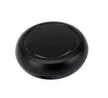

## General Notes

There's detailed teardown info at [Elektroda](https://www.elektroda.com/rtvforum/topic4012905.html).



## GPIO Pinout

| Pin | Function      |
| --- | ------------- |
| P7  | IR Transmitter|
| P8  | IR Receiver   |
| P9  | Button        |
| P24 | LED           |

## Flashing

I used ``ltchiptool`` to backup the original firmware and flash an esphome uf2 binary to it.
The pads are all nicely labeled.

## Configuration

```yaml
bk72xx:
  board: generic-bk7231n-qfn32-tuya

output:
  - platform: libretiny_pwm
    id: led
    pin: 24

light:
  - platform: monochromatic
    name: LED
    output: led

binary_sensor:
  - platform: gpio
    id: btn
    pin:
      number: 9
      mode: input_pullup
      inverted: true

remote_transmitter:
  pin: 7
  carrier_duty_percent: 50%

remote_receiver:
  pin:
    number: 8
    inverted: true
    mode:
      input: true
      pullup: true
  tolerance: 55%
```
