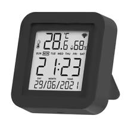

## General Notes

There are a few similar models of this device, some without the IR function, such as the TH06.
Some have different date formats and 24 hour time.
There's detailed teardown info at [Elektroda](https://www.elektroda.com/rtvforum/topic4035679.html).



## GPIO Pinout

| Pin | Function      |
| --- | ------------- |
| P6  | Button        |
| P8  | LED           |
| P26 | IR Transmitter|

An IR receiver on pin 8 is mentioned in a few places, but it's definitely connected to the LED.
I tried other pins, but nothing receives and I don't see any mention of that being a capability in any seller descriptions.
You can ignore the tuya component warning about the status pin.
The wifi status works over the Tuya protocol, so I assume the setting just points to the LED because that's the stock use for it.

## Flashing

The S09 that I got has a CB3S module.  Others have a WB3S, but they're very similar.

I used ``ltchiptool`` to backup the original firmware and flash an esphome uf2 binary to it.

## Configuration

```yaml
bk72xx:
  board: cb3s

uart:
  tx_pin: TX1
  rx_pin: RX1
  baud_rate: 9600

time:
  - platform: sntp
    id: sntptime

tuya:
  time_id: sntptime

sensor:
  - platform: tuya
    name: Temperature
    sensor_datapoint: 101
    unit_of_measurement: °C
    accuracy_decimals: 1
    device_class: temperature
    filters:
      multiply: 0.1
  - platform: tuya
    name: Humidity
    sensor_datapoint: 102
    unit_of_measurement: "%"
    device_class: humidity

output:
  - platform: libretiny_pwm
    id: led
    pin: 8
  
light:
  - platform: monochromatic
    name: LED
    output: led

binary_sensor:
  - platform: gpio
    id: btn
    pin:
      number: 6
      mode: input_pullup
      inverted: true

remote_transmitter:
  pin: 26
  carrier_duty_percent: 50%
```
