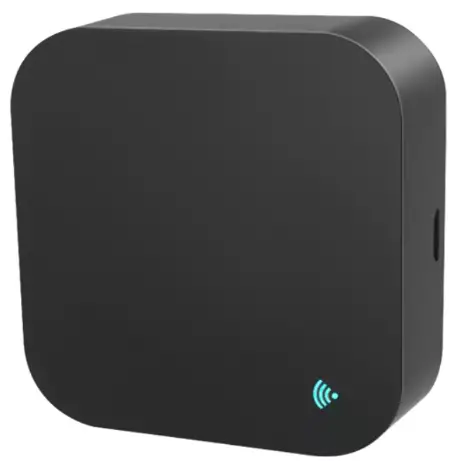

## General Notes

There's detailed teardown info at [Elektroda](https://www.elektroda.com/rtvforum/topic3983995.html).

This model includes RF besides IR.
You can use the external component [Tuya RF](https://github.com/olivluca/tuya_rf) to integrate RF capabilities,
but still note that you will need to write the RF codes into your ESPHome device (there is no `remote.learn_command`).



## GPIO Pinout

| Pin | Function      |
| --- | ------------- |
| P7  | IR Transmitter|
| P8  | IR Receiver   |
| P9  | LED           |
| P23 | Button        |

## Flashing

I used ``tuya-cloudcutter``, allowing for disassembly-free flashing, to flash an ESPHome kickstart image.
From there, you can just build your own image and upgrade to the latest version.

## Configuration

```yaml
substitutions:
  friendly_name: Tuya S11 IR RF
  device_name: tuya-s11-ir-rf

esphome:
  name: ${device_name}
  friendly_name: ${friendly_name}
  project:
    name: Tuya.S11
    version: dev

external_components:
  - source: github://olivluca/tuya_rf
    components:
      - tuya_rf

bk72xx:
  board: cbu

# Enable logging
logger:

# Enable Home Assistant API
api:
  encryption:
    key: !secret api_encryption_key

ota:
  - platform: esphome
    password: !secret ota_password

wifi:
  ssid: !secret wifi_ssid
  password: !secret wifi_password

  # Enable fallback hotspot (captive portal) in case wifi connection fails
  ap:
    ssid: ${device_name}

captive_portal:

sensor:
  - platform: wifi_signal # Reports the WiFi signal strength/RSSI in dB
    name: "WiFi Signal dB"
    id: wifi_signal_db
    update_interval: 60s
    entity_category: "diagnostic"

  - platform: uptime
    name: Uptime
    id: sensor_uptime
    update_interval: 300s
    entity_category: diagnostic

  - platform: internal_temperature
    name: "Internal Temperature"

switch:
  - platform: template
    name: RF Receiver
    id: rf_receiver_switch
    optimistic: true
    restore_mode: ALWAYS_OFF
    web_server:
      sorting_weight: 1010
    on_turn_on:
      - tuya_rf.turn_on_receiver
    on_turn_off:
      - tuya_rf.turn_off_receiver

binary_sensor:
- platform: gpio
  pin: P23
  name: Button
  icon: mdi:button-pointer

status_led:
  pin: P9

remote_receiver:
  dump: all
  pin:
    number: P8
    inverted: true
    mode: INPUT_PULLUP

remote_transmitter:
  id: ir
  pin: P7
  carrier_duty_percent: 50%

tuya_rf:
  id: rf
  receiver_disabled: true
  dump: raw

button:
  - platform: restart
    name: "Restart"
    id: restart_button
```

You can add RF buttons for the codes you learn later:

```yaml
button:
  - platform: template
    name: "MID - Blinds"
    web_server:
      sorting_weight: 20
    on_press:
      - remote_transmitter.transmit_raw:
          transmitter_id: rf
          repeat:
            times: 2
            wait_time: 0s
          code:
            [ 7997, -4311, 1811, -375, 718, -719, 343, -375, 719, -389, 711, -374, 712, -375, 687, -750, 344, -749, 312, -750, 344, -749, 344, -750, 343, -719, 375, -718, 375, -343, 719, -718, 375, -719, 374, -375, 687, -407, 687, -374, 719, -375, 687, -406, 687, -2905, 375, -344, 749, -344, 718, -375, 719, -374, 688, -406, 687, -749, 344, -375, 720, -717, 343, -375, 719, -749, 375, -344, 718, -719, 375, -343, 750, -687, 406, -344, 718, -719 ]
```
