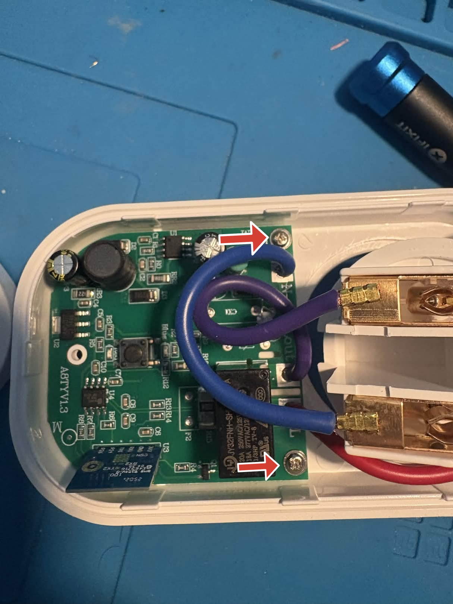
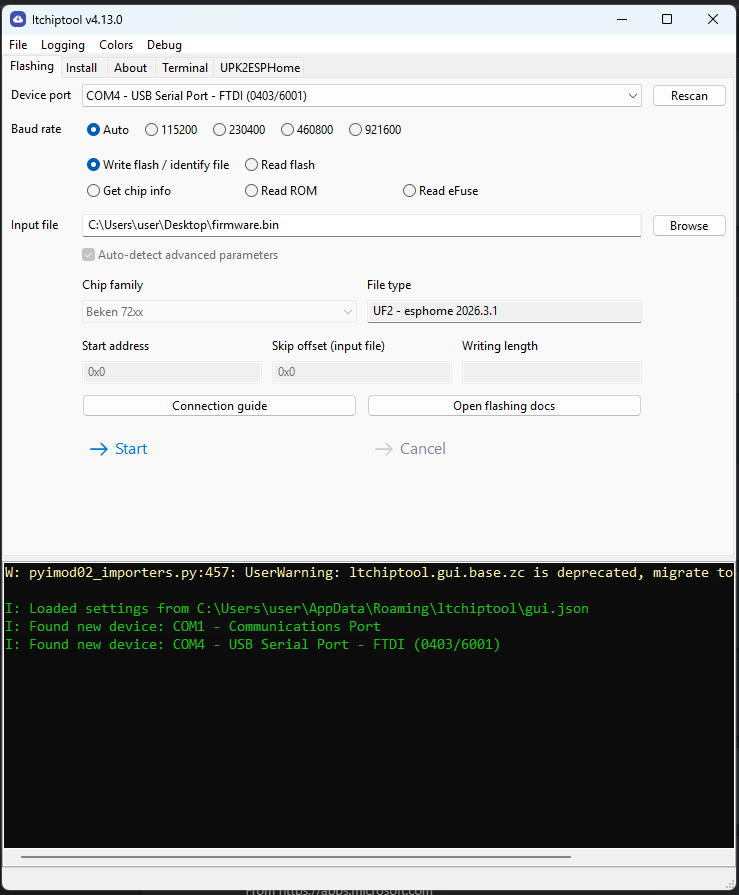
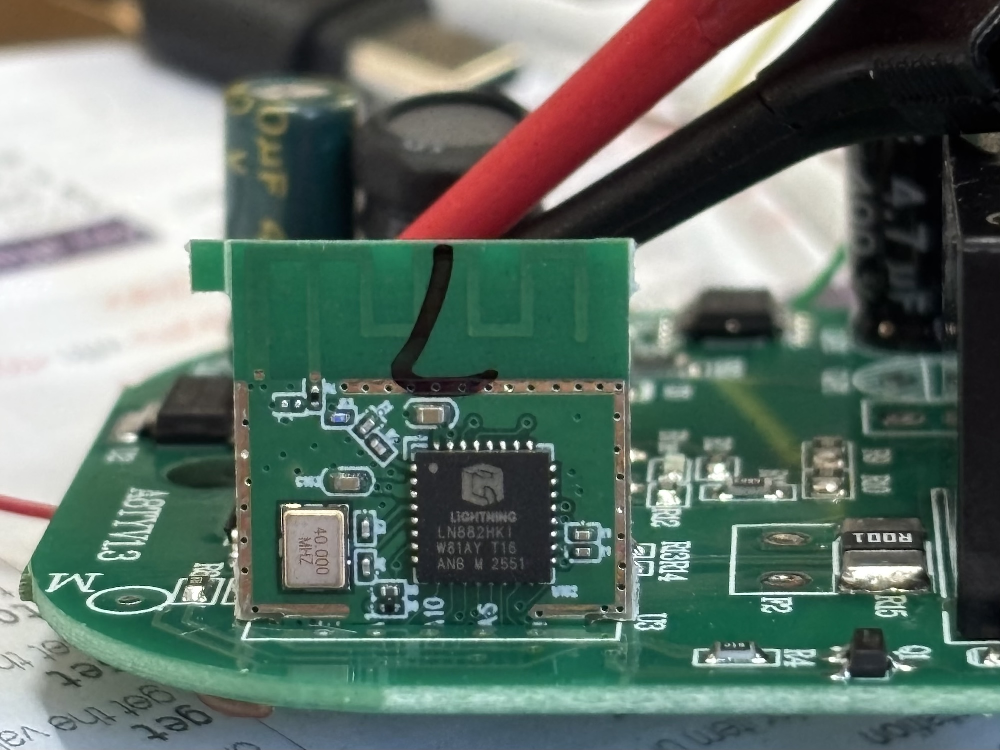
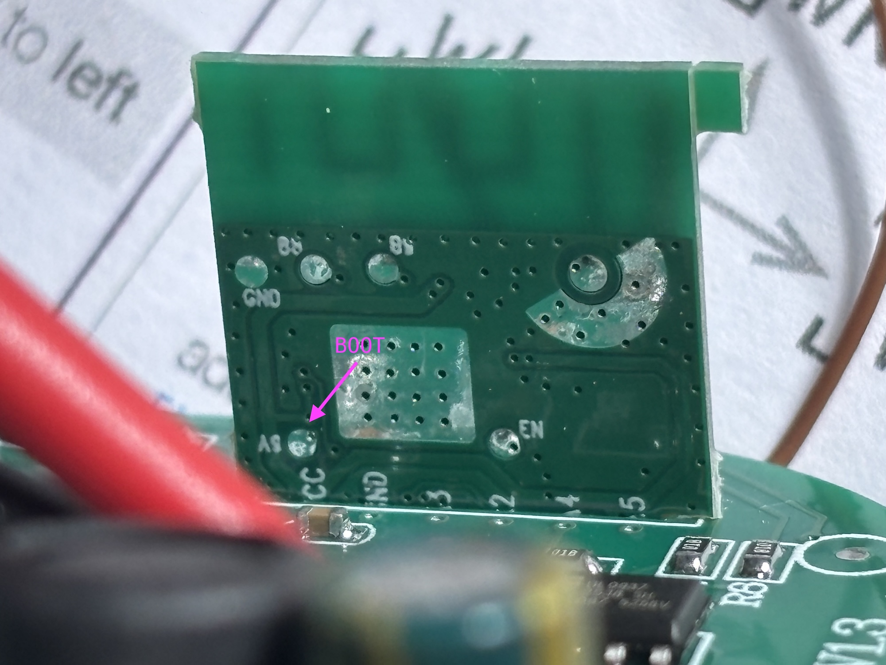

## General Notes

While a specific model number was not specified on the exterior, `a8tyv1.3` is written on the board inside.
These plugs are available in various models, with or without energy monitoring and USB ports.

The 16A smart plug with energy monitor is _not_ flashable using tuya-cloudcutter. The main module version shown in the
Smart Life app is V1.1.23, which is on the known patched firmware list.

Some disassembly and soldering is required in order to flash the device via UART.

Two Wi-Fi module variants have been observed on this main PCB: a CB2S / BK72xx variant and a WB02A / LN882H variant.
Check which module is installed before choosing the ESPHome platform and GPIO mapping.

## Product Images


## Disassembly and Flashing

There are three external Phillips screws that must be removed to open the device (see image above).
Additionally, two internal screws secure the board to the plastic casing and must also be removed.



The Wi-Fi module pins are exposed on the underside of the board and are clearly labeled. These are correct for both
variants; the main PCB seems to be identical up to part assembly options.

### CB2S / BK72xx variant


Connect the pins to a UART TTL adapter, then hold the CEN pin to GND for a few seconds while
flashing the ESPHome firmware using `ltchiptool`.



### WB02A / LN882H variant



Connect the pins to a USB-to-UART adapter. The `PA09`/BOOT pin needs to be continuously pulled down to GND while flashing.
The `PA09` pin is accessible via a test pad on the back of the module (see picture). The device consumes about 100mA
(@ 3.3V) while booted normally and about 70mA when in download mode. When flashing is done, release `PA09` and reset
using `CEN`. More details in the [LibreTiny docs](https://docs.libretiny.eu/boards/wb02a/).

If the module reports a blank/all-`FF` Tuya OTP MAC, use the `on_boot` MAC workaround shown in the WB02A configuration
below to assign a stable MAC based on the ESPHome node name.



## GPIO Pinout

| CB2S | WB02A | Function        |
| ---- | ----- | --------------- |
| P6   | PA07  | CF1 pin         |
| P7   | PA06  | CF pin          |
| P8   | PA10  | Blue LED        |
| P10  | PA03  | Switch button   |
| P24  | PA04  | SEL pin         |
| P26  | PA05  | Relay + Red LED |

## Basic configuration - CB2S / BK72xx variant

```yaml file=config.yaml
```

## Basic configuration - WB02A / LN882H variant

```yaml file=config-wb02a.yaml
```

### Additional notes

This guide was based on the [WHDZO3 guide](/devices/tuya-smart-plug-20a-whdz03/) and adapted to this board.
