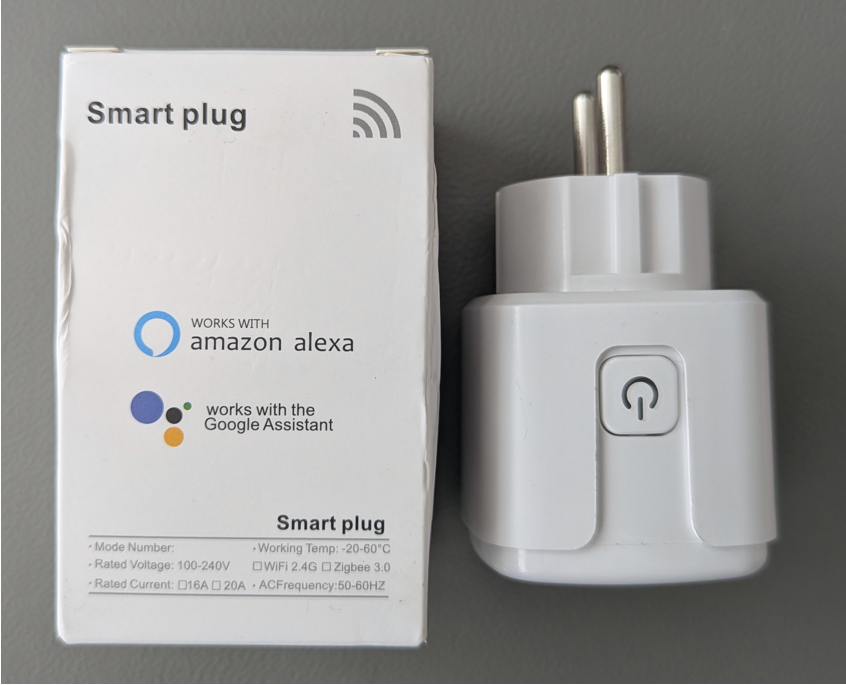
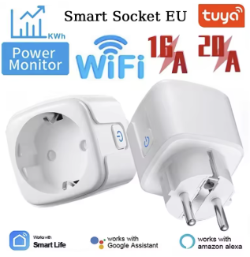
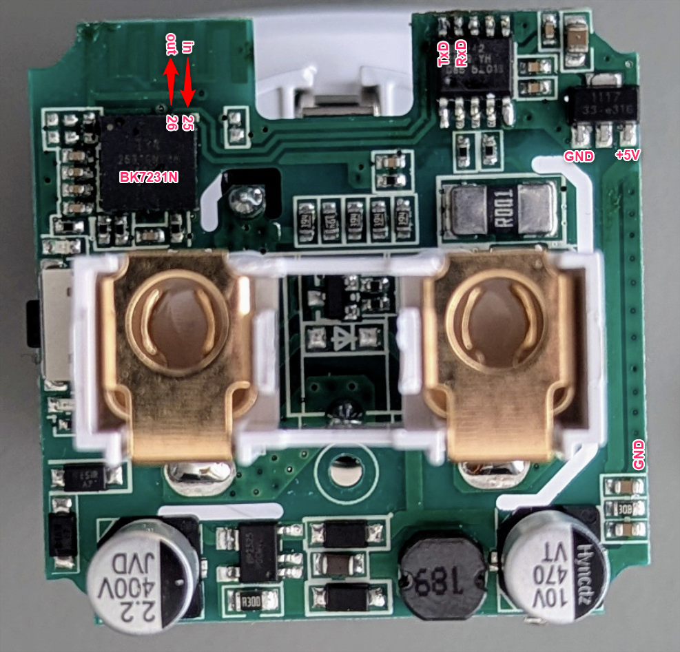

The smart plug is using the Tuya T34 module design incorporating a BK7231N chip
[T34 Datasheet](https://developer.tuya.com/en/docs/iot/t34-module-datasheet?id=Ka0l4h5zvg6j8)

The power monitoring chip is the BL0942, which is not so often seen in Tuya products.
It is connected using the UART feature to UART1.

[BL0942 Datasheet](https://www.belling.com.cn/media/file_object/bel_product/BL0942/datasheet/BL0942_V1.06_en.pdf)

[BL0942 Application](https://support.tuya.com/en/help/_detail/Kd2fly62orx3p)

[BL0942 ESPHome](https://esphome.io/components/sensor/bl0942/)

The BL0942 is a sophisticated, calibration-free integrated circuit (IC) for energy measurement
from Shanghai Belling Corp.
It is used in single-phase electricity meters, smart plugs and smart home devices to enable accurate
measurements of voltage, current and power via a UART/SPI interface, offering a cost-effective solution
for energy monitoring.



## GPIO Pinout

| Pin | Function          |
| --- | ----------------- |
| P25 | BL0942(10) TX     |
| P26 | BL0942(9)  RX     |
| P14 | Relay & red LED   |
| P26 | Button (Inverted) |
| P24 | Blue LED          |

## Programming

Based on available documentation (links above) the T34 chip can be programmed using ESPHome tools

- pin 25 as UART_RXD
- pin 26 as UART_TXD

It is easier to use the corresponding BL0942 pins to connect the programmers RX & TX pins.
Programmer TX must be connected to pin 10 and RX must beconnected to pin 9.
Connect a 5V DC source to the voltage regulator. Start programming and then cycle power of the 5V source to enter the bootloader.

It is important to **limit the download speed to 19200 baud** (--upload_speed 19200) otherwise the programming terminates.

## ESPHome Hardware definitions

```yaml
esphome:
  comment: "Tuya Smart Socket EU 20A with Power Monitor"
  name: tuya-smartplug

bk72xx:
  board: generic-bk7231n-qfn32-tuya # actually a T34 Tuya module
  
# Relay output
output:
  - platform: gpio
    pin: P14
    id: relay_1
  - platform: gpio
    pin:
      number: P24
      inverted: false
    id: led_output

light:
  - platform: binary
    name: "Status LED"  # blue LED
    id: status_light
    output: led_output

# Local button on PCB
binary_sensor:
  - platform: gpio
    id: button_1        # illuminated button
    pin:
      number: P26
      mode: INPUT_PULLUP
      inverted: true  

uart:
  id: bl0942_uart  # UART1 is used to read the data from the BL0942
  tx_pin: TX1
  rx_pin: RX1
  baud_rate: 4800    

# Belling BL0942 Energy Monitor
sensor:
  - platform: bl0942
    uart_id: bl0942_uart
    line_frequency: 50Hz
    voltage:
      name: 'Voltage'
    current:
      name: 'Current'
    power:
      name: 'Power'
    energy:
      name: 'Energy'
    frequency:
      name: "Frequency"

```

## ESPHome working example config

```yaml
# Programming speed must be reduced otherwise the
# switch will will exit the flashing routine
# Use:
# esphome run tuya_plug.yaml --upload_speed 19200

esphome:
  comment: "Tuya Smart Socket EU 20A with Power Monitor"
  name: tuya-smartplug
  name_add_mac_suffix: true

bk72xx:
  board: generic-bk7231n-qfn32-tuya # actually a T34 Tuya module

logger:
    level: NONE

wifi:
  # In case a secrets.yaml file is available in the root folder
  # with the following content:
  # secrets.yaml
  # wifi_ssid: "SSID"
  # wifi_password: "PASSWORD"
  
  #ssid: !secret wifi_ssid
  #password: !secret wifi_password
  
  ap:
    ssid: "TuyaPlug"
  
captive_portal:

api: 

ota:
  platform: esphome
  
web_server:
  version: 3
  port: 80  
  
# Relay output
output:
  - platform: gpio
    pin: P14
    id: relay_1
  - platform: gpio
    pin:
      number: P24
      inverted: false
    id: led_output

light:
  - platform: binary
    name: "Status LED"  # blue LED
    id: status_light
    output: led_output

# Local button on PCB
binary_sensor:
  - platform: gpio
    id: button_1        # illuminated button
    pin:
      number: P26
      mode: INPUT_PULLUP
      inverted: true  
    filters:
      - delayed_on: 50ms
    on_press:
      - switch.toggle: relay_switch  # manual control for relay
      
# Switch to control the relay from the UI
switch:
  - platform: output
    name: "Relay"
    id: relay_switch
    output: relay_1
    
uart:
  id: bl0942_uart  # UART1 is used to read the data from the BL0942
  tx_pin: TX1
  rx_pin: RX1
  baud_rate: 4800    

# Belling BL0942 Energy Monitor
sensor:
  - platform: bl0942
    uart_id: bl0942_uart
    line_frequency: 50Hz
    voltage:
      name: 'Voltage'
    current:
      name: 'Current'
    power:
      name: 'Power'
    energy:
      name: 'Energy'
    frequency:
      name: "Frequency"
      
  - platform: wifi_signal
    name: "TuyaPlug WiFi Signal"
    id: wifi_signal_sensor
    update_interval: 60s        
```
