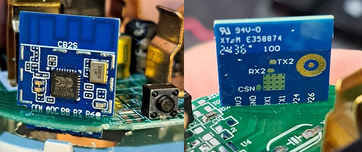
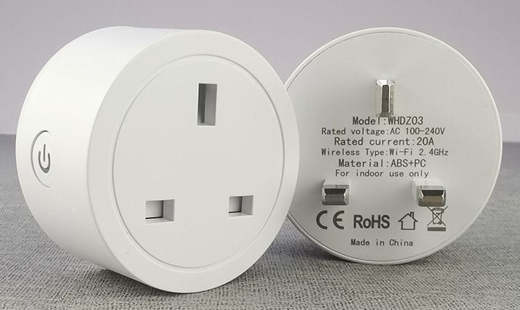
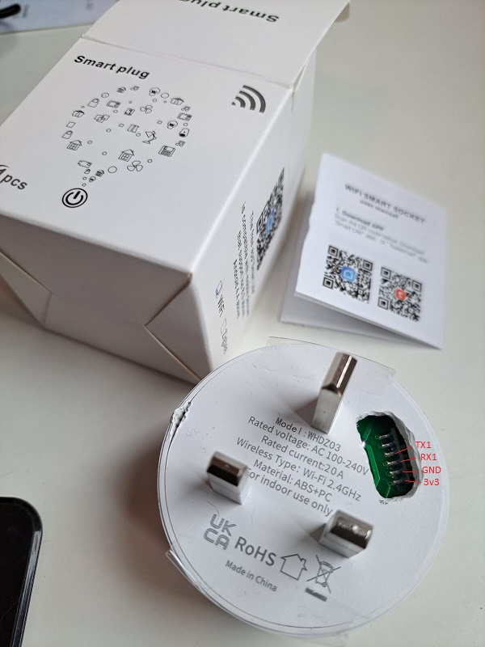

## General Notes

These plugs with/without energy monitoring are sold under many brands on Aliexpress / taobao / pinduoduo, and are available in both 16A or 20A.

The 20A smart plug with energy monitor is *not* flashable using tuya-cloudcutter. The main module version on smart life app is V1.1.23, which is on the known patched firmware list.

The socket is not glued but factory pressed. I do not recommend using a screwdriver to pry it open, I did and I left some damage on the side (see picture). It may be better to try opening by pushing a tool through the earth pin to apply force, holding the outer shell. After opening we can see that it is using a CB2S wifi module with the BK7231N chip.



It is not possible to separate the PCB from the case without unsoldering the main socket pins. Therefore I chose to use a rotary tool to make a hole in the external casing. This provides us with access the 3v3 GND RX1 TX1 pins without soldering. I compiled the below configuration on esphome, saved the uf2 binary, and flashed it using ltchiptool with default settings, holding everything in place by hand while flashing the firmware. Press the physical button on the PCB for around 5-10 seconds to flash.

## Product Images




## GPIO Pinout

| Pin | Function      |
| --- | ------------- |
| P6  | CF1 pin       |
| P7  | CF pin        |
| P8  | Blue LED      |
| P11 | Switch button |
| P24 | SEL pin       |
| P26 | Relay         |

## Basic configuration

```yml
# Basic Config
substitutions:
  friendly_name: Socket 20A
  device_name: socket-20a

esphome:
  name: ${device_name}
  friendly_name: ${friendly_name}

bk72xx:
  board: cb2s

# Enable logging
logger:

# Enable Home Assistant API
api:
  encryption:
    key: !secret api_encryption_key

ota:
  - platform: esphome
    password: !secret ota_password

wifi:
  ssid: !secret wifi_ssid
  password: !secret wifi_password

  # Enable fallback hotspot (captive portal) in case wifi connection fails
  ap:
    ssid: ${friendly_name} Fallback Hotspot
    password: ""

captive_portal:

#optional
web_server:
  port: 80

text_sensor:
  - platform: libretiny
    version:
      name: LibreTiny Version

output:
  - platform: gpio
    id: button_led
    pin: P8
    inverted: true

binary_sensor:
  - platform: gpio
    id: binary_switch
    pin:
      number: P11
      inverted: true
      mode: INPUT_PULLUP
    on_press:
      then:
        - switch.toggle: relay

switch:
  - platform: gpio
    name: ${friendly_name} Relay Switch
    id: relay
    restore_mode: "RESTORE_DEFAULT_OFF"
    pin: P26
    on_turn_on:
      then:
        - output.turn_on: button_led
    on_turn_off:
      then:
        - output.turn_off: button_led

sensor:
  - platform: hlw8012
    model: BL0937
    cf_pin:
      number: P7
      inverted: true
    cf1_pin:
      number: P6
      inverted: true
    sel_pin:
      number: P24
      inverted: true
    current:
      name: ${friendly_name} Current
      filters:
        - multiply: 0.5
    voltage:
      name: ${friendly_name} Voltage
    power:
      name: ${friendly_name} Power
    energy:
      name: ${friendly_name} Energy
    voltage_divider: 800
    current_resistor: 0.001 ohm
    update_interval: 1s
    change_mode_every: 1
```
