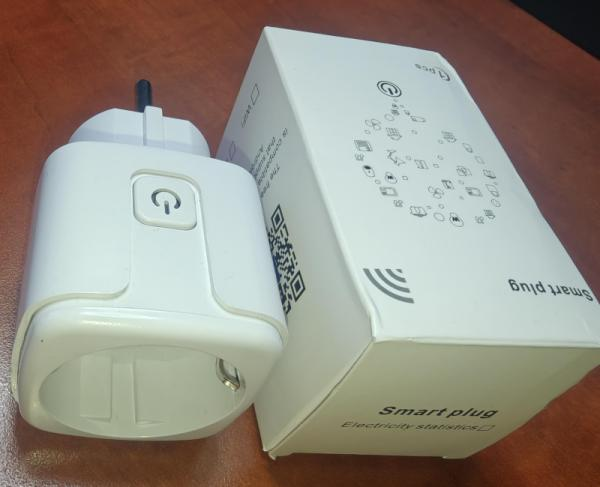
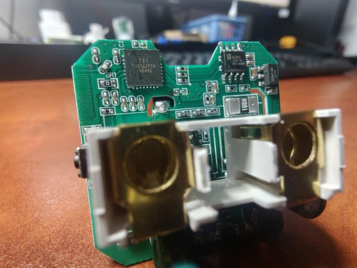
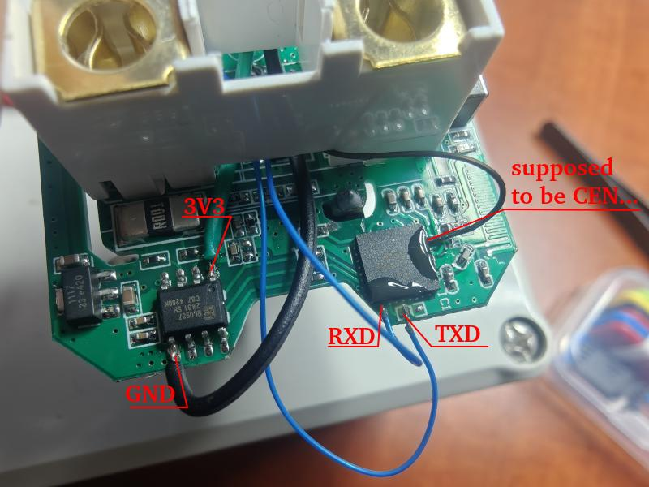

Bought on Aliexpress, looking similar to [Athom Smart Plug](Athom-Smart-Plug-PG01V3-EU16A) but internals turned out much different: this one is using [Tuya T34 Module](https://developer.tuya.com/en/docs/iot/t34-module-datasheet?id=Ka0l4h5zvg6j8) chip which was already discussed on [Elektroda Forum](https://www.elektroda.com/rtvforum/topic4036975.html).  
It is in fact a BK7231N MCU in QFN32 package (aka. LGA36, which is 36 pin if we count in the 4 bottom heatpads).

The power monitoring chip is [BL0937](https://developer.tuya.com/en/docs/iot-device-dev/Electricity-statistics?id=Kaunfo4am6icc) which is known from other Tuya designs and does not require further introduction.



## Programming

Based on available documentation (links above) we know the T34 chip can be programmed using OpenBeken tools using

- pin 25 as UART_RXD
- pin 26 as UART_TXD
- I also used pin 7 to trigger reset which I beleived to be CEN - it looks I was wrong and CEN is on pin 9 but for some reason my method worked as well (probably due to brown-out reset from shorting pin 7...)

No need to desolder the chip from PCB but need to solder tiny "kynar" wires to appropriate pins, which only one is easily available and two needs to be carefully soldered to the side of the chip, without shorting other pins.



Of course you also need USB-to-serial converter, and 3v3 supply (I'm using power out on my USB-to-serial converter)
Reflash using [ltchiptool](https://docs.libretiny.eu/docs/flashing/tools/ltchiptool/) or directly with `esphome upload <your-config.yaml>` console command.

Note: Need to reset the chip to enter programming, ie. by shorting CEN to GND for a moment!

## GPIO Pinout

| Pin   | Function          |
| ----- | ----------------- |
| P06   | BL0937 cf_pin     |
| P07   | BL0937 cf1_pin    |
| P08   | BL0937 sel_pin    |
| P24   | Relay & LED2      |
| P26   | Button  (Inverted)|
| P28   | LED (Inverted)    |

## Basic ESPHome config

Note this is only the device-specific part shown here - make sure to extend with your ESPHome-specific settings (such as wifi, passwords, OTA, etc...)

```yaml
esphome:
  comment: "Tuya Smart Socket EU 20A with Power Monitor"

bk72xx:
  board: generic-bk7231n-qfn32-tuya # actually a T34 Tuya module

status_led:
  pin:
    number: P28
    inverted: true

# Local button on PCB
binary_sensor:
  - platform: gpio
    id: button_1
    pin:
      number: P26
      mode:
        input: True
        pullup: True
      inverted: True
    icon: 'mdi:radiobox-blank'
    filters:
      - delayed_on: 50ms

# Relay output
output:
  - platform: gpio
    pin: P24
    id: relay_1

# Energy meter BL0937
sensor:
  # https://esphome.io/components/sensor/hlw8012.html
  - platform: hlw8012
    model: BL0937
    cf_pin:
      number: P06
      inverted: true
    cf1_pin:
      number: P07
      inverted: true
    sel_pin:
      number: P08
      inverted: true
    current:
      name: "Current"
    voltage:
      name: "Voltage"
    power:
      name: "Power"
    energy:
      name: "Energy"
    # current_resistor: 0.001ohm
    voltage_divider: 760
    initial_mode: CURRENT
    update_interval: 15s
    change_mode_every: 4
```
