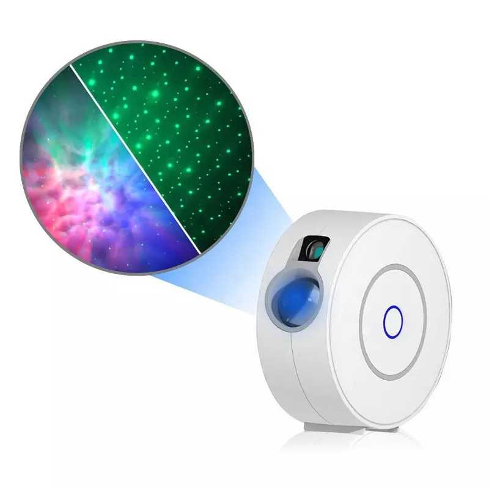

## Notes

Credit for all the work goes to [M4GNV5](https://www.elektroda.com/rtvforum/topic3973047.html), I've just made a few minor changes to suit my preferences.

## Basic Configuration

```yaml
substitutions:
  name: galaxy
  friendly_name: "Star Projector"
  
esphome:
  name: ${name}
  name_add_mac_suffix: false
  friendly_name: ${friendly_name}

bk72xx:
  board: wb3s

wifi:
  ssid: !secret wifi_ssid
  password: !secret wifi_password
  domain: !secret domain
  power_save_mode: none
  ap:
    ssid: "ESPHome SSP"
    password: !secret wifi_fallback_password

api:
  encryption:
    key: !secret api_key

web_server:
  port: 80
    
ota:

logger:

captive_portal:

text_sensor:
  - platform: wifi_info
    ip_address:
      name: "ESP IP Address"
    ssid:
      name: "ESP Connected SSID"
    mac_address:
      name: "ESP Mac Wifi Address"

sensor:
  - platform: uptime
    name: "Uptime"
    unit_of_measurement: minutes
    filters:
      - lambda: return x / 60.0;

  - platform: wifi_signal
    name: "Signal"
    update_interval: 60s
    
light:
  - platform: rgb
    name: "Light"
    id: rgb_light
    restore_mode: ALWAYS_OFF
    red: red
    green: green
    blue: blue
    effects:
      - random:
          transition_length: 2.5s
          update_interval: 3s
      - random:
          name: Random Slow
          transition_length: 10s
          update_interval: 5s
      - flicker:
          alpha: 95%
          intensity: 2.5%
      - strobe:
      - pulse:
          transition_length: 30s
          min_brightness: 5%
          max_brightness: 100%

  - platform: monochromatic
    name: "Laser"
    icon: mdi:laser-pointer
    id: laser
    output: laser_pwm
    restore_mode: ALWAYS_OFF

  # Button LED (UP/Down position, no brightness control)
  - platform: status_led
    name: "Button Status LED"
    id: button_led0
    output: button_led0_gpio
    restore_mode: ALWAYS_OFF
    internal: true

  - platform: monochromatic
    name: "Button LED1"
    id: button_led1
    output: button_led1_pwm
    restore_mode: ALWAYS_OFF

fan:
  platform: speed
  name: "Motor"
  icon: mdi:rotate-right
  id: motor
  output: motor_pwm
  restore_mode: ALWAYS_OFF

# The template switch representing the device is currently active (laser/light
# or motor is ON).
switch:
  - platform: template
    name: "Main Switch"
    id: switch_main
    lambda: "return (id(motor).state || id(laser).current_values.is_on() || id(rgb_light).current_values.is_on());"

    # Turn on using the white scene
    turn_on_action:
      - select.set_index:
          id: select_scene
          index: 3

    # Completely turn off the laser, light, motor and button LED
    turn_off_action:
      - fan.turn_off: motor
      - light.turn_off: laser
      - light.turn_off: rgb_light
      - light.turn_off: button_led0
      - script.stop: script_turn_off_timer

output:
  - platform: libretiny_pwm
    id: red
    pin: P9
    inverted: true

  - platform: libretiny_pwm
    id: green
    pin: P24
    inverted: true

  - platform: libretiny_pwm
    id: blue
    pin: P26
    inverted: true

  - platform: libretiny_pwm
    id: laser_pwm
    pin: P8
    inverted: true

  - platform: libretiny_pwm
    id: motor_pwm
    pin: P6
    min_power: 15%

  - platform: gpio
    id: button_led0_gpio
    pin: P1
    inverted: true

  - platform: libretiny_pwm
    id: button_led1_pwm
    pin: P7
    inverted: true

binary_sensor:
  - platform: gpio
    pin:
      number: P14
      mode: INPUT_PULLDOWN_16
      inverted: true
    name: "Button"

    # Change the scene on short press/click
    on_click:
      then:
        # Do not switch the scene when all the components (switch_main) are
        # turned off. Allow the scene switching only when the switch_main is
        # on. When the switch is off, just turn it on.
        - if:
            condition:
              - switch.is_on: switch_main
            then:
              - select.next: select_scene
            else:
              - switch.turn_on: switch_main

    # Turn off after a button long press
    on_multi_click:
      - timing:
          - on for at least 1s
        then:
          - switch.turn_off: switch_main

# Turn off the light, laser and motor automatically after a specified delay
script:
  - id: script_turn_off_timer
    mode: restart
    then:
      - delay: 1h
      - switch.turn_off: switch_main

select:
  platform: template
  name: "Scene"
  id: select_scene
  options:
    - "Scene - Red"
    - "Scene - Blue"
    - "Scene - Green"
    - "Scene - White"
    - "Scene - Dimmed"
  initial_option: "Scene - White"
  optimistic: true
  on_value:
    then:
      # Always reset the timer script
      - script.stop: script_turn_off_timer
      - script.execute: script_turn_off_timer

      # Make sure the button LED is ON
      - light.turn_on:
          id: button_led0

      # [INDEX=0]: Scene - Red
      - if:
          condition:
            lambda: "return (id(select_scene).active_index() == 0);"
          then:
            - light.turn_on:
                id: rgb_light
                brightness: 50%
                red: 80%
                green: 0%
                blue: 50%
            - light.turn_on:
                id: laser
                brightness: 60%
            - fan.turn_on:
                id: motor
                speed: 40

      # [INDEX=1]: Scene - Blue
      - if:
          condition:
            lambda: "return (id(select_scene).active_index() == 1);"
          then:
            - light.turn_on:
                id: rgb_light
                brightness: 50%
                red: 50%
                green: 0%
                blue: 100%
            - light.turn_on:
                id: laser
                brightness: 60%
            - fan.turn_on:
                id: motor
                speed: 40

      # [INDEX=2]: Scene - Green
      - if:
          condition:
            lambda: "return (id(select_scene).active_index() == 2);"
          then:
            - light.turn_on:
                id: rgb_light
                brightness: 50%
                red: 0%
                green: 60%
                blue: 30%
            - light.turn_on:
                id: laser
                brightness: 60%
            - fan.turn_on:
                id: motor
                speed: 40

      # [INDEX=3]: Scene - White
      - if:
          condition:
            lambda: "return (id(select_scene).active_index() == 3);"
          then:
            - light.turn_on:
                id: rgb_light
                brightness: 100%
                red: 100%
                green: 100%
                blue: 100%
            - light.turn_on:
                id: laser
                brightness: 100%
            - fan.turn_on:
                id: motor
                speed: 50

      # [INDEX=4]: Scene - Dimmed
      - if:
          condition:
            lambda: "return (id(select_scene).active_index() == 4);"
          then:
            - light.turn_on:
                id: rgb_light
                brightness: 30%
                red: 5%
                green: 5%
                blue: 5%
            - light.turn_on:
                id: laser
                brightness: 30%
            - fan.turn_on:
                id: motor
                speed: 10
```
