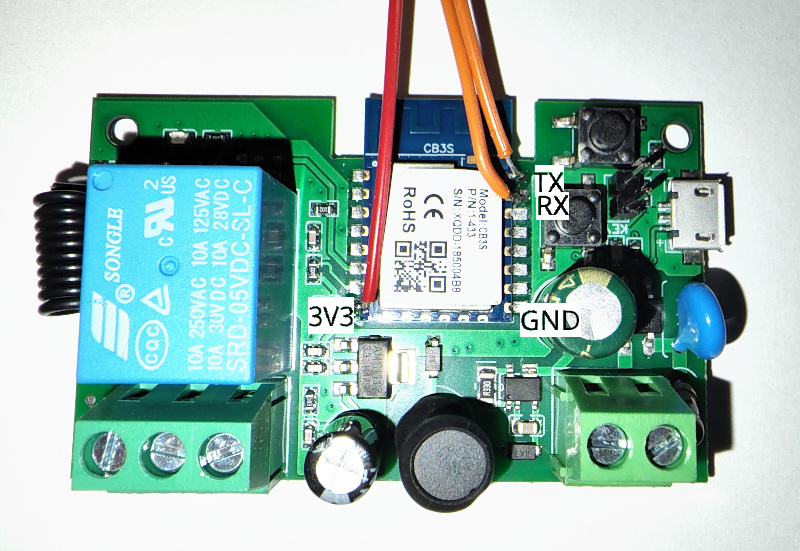
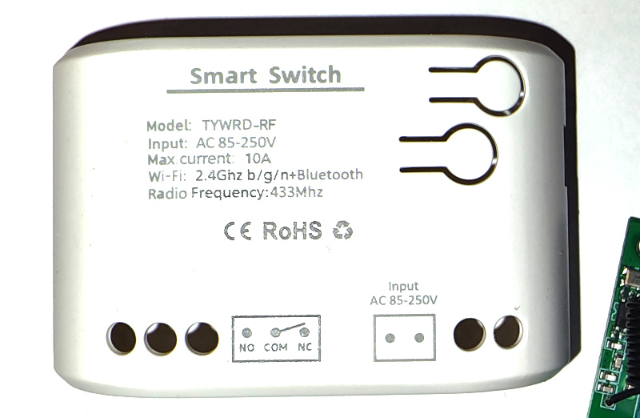

# TYWRD-RF WiFi Smart Garage Door Opener Switch

Smart switch with rf receiver, one relay. CB3S microcontroller.
Input Voltage: AC85-250V or Micro-USB DC5V

## Product Image





## GPIO Pinout

| Pin    | Function                           |
| ------ | ---------------------------------- |
| P6     | Button 1                           |
| P14    | Button 2                           |
| P24    | Relay                              |
| P26    | RF Receiver                        |

## Basic Configuration

```yaml
esphome:
  name: tywrd-rf

bk72xx:
  board: cb3s

wifi:
  ssid: !secret wifi_ssid
  password: !secret wifi_password
  ap:

logger:

api:

ota:

remote_receiver:
  pin: P26
  dump: rc_switch
  tolerance: 50%
  filter: 250us
  idle: 4ms

binary_sensor:
  - platform: gpio
    pin:
      number: P6
      inverted: true
    name: "Button 1"
    on_press:
    - button.press: garagedoor
  - platform: gpio
    pin:
      number: P14
      inverted: true
    name: "Button 2"
  - platform: remote_receiver
    name: "RF1"
    rc_switch_raw:
      code: '011111010000001101110011'
    on_press:
    - button.press: garagedoor

output:
  - platform: gpio
    pin: P24
    id: relay

button:
  - platform: output
    name: "Garagedoor"
    id: garagedoor
    output: relay
    duration: 500ms
```
