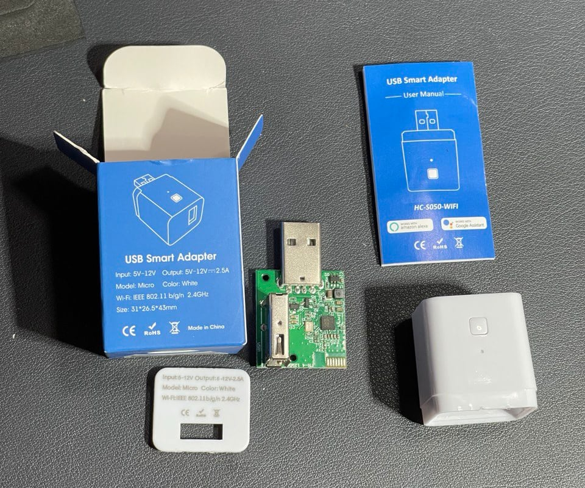
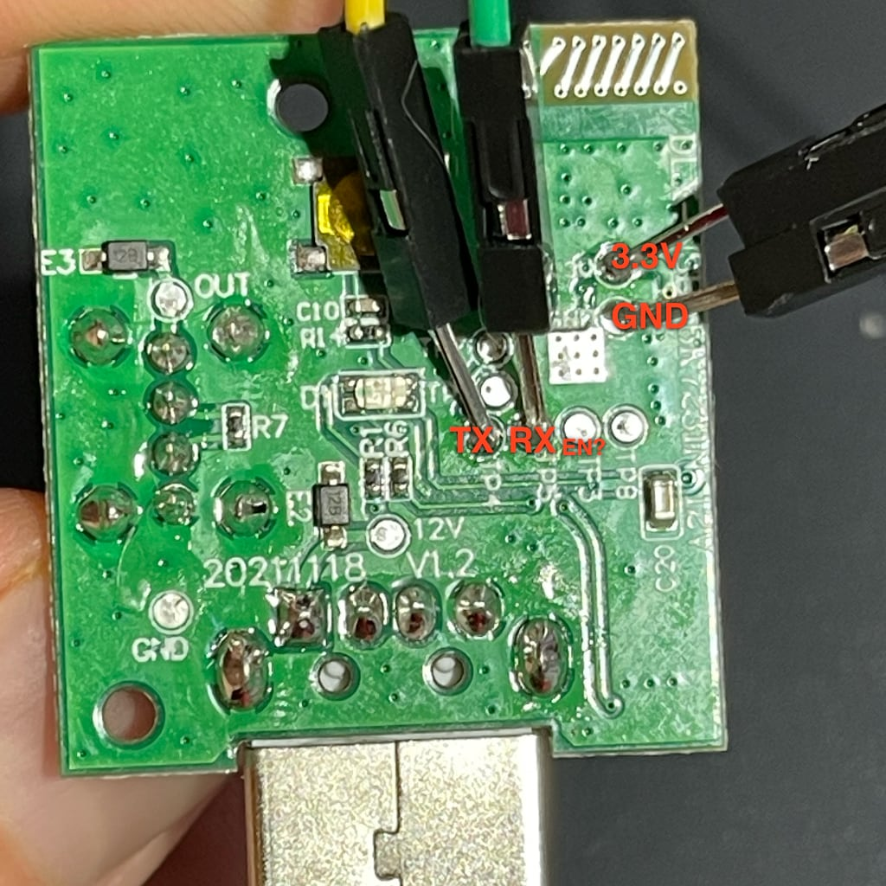

## General Notes



The Tuya HC-S050-WIFI is cheap USB "relay" that can hold up to 12v (by specs).

## GPIO Pinout

| Pin | Function      |
| --- | ------------- |
| P6  | LED           |
| P7  | Relay         |
| P8  | Button        |

## Flashing

Flash using ESP Web install and select any option. Lately we replace it with bk controller:



| Pin  | Function      |
| ---- | ------------- |
| GND  | - 3.3V        |
| 3.3V | + 3.3V        |
| TP4  | TX            |
| TP5  | RX            |
| TP3  | possible EN   |

## Configuration for ESP-IDF

```yaml
substitutions:
  manufacturer: Tuya
  model: HC-S050-WIFI

esphome:
  name: usb-relay-adapter
  friendly_name: USB Adapter
  area: Entrance
  comment: bk72xx, usb, HC-S050-WIFI

bk72xx:
  board: generic-bk7231n-qfn32-tuya

logger:
  baud_rate: 0
  level: INFO

# << -- don't forget to put here API, OTA, WIFI sections -- >>

switch:
  - platform: gpio
    id: relay
    name: "Relay"
    pin: P7
    restore_mode: RESTORE_DEFAULT_OFF

light:
  - platform: status_led
    name: "Status LED"
    disabled_by_default: true
    entity_category: diagnostic
    pin:
      number: P6
      inverted: true

binary_sensor:
  - platform: gpio
    id: btn
    pin:
      number: P8
      inverted: true
      mode:
        input: true
        pullup: true
    name: Side button
    on_release:
      then:
        - switch.toggle: relay
```
