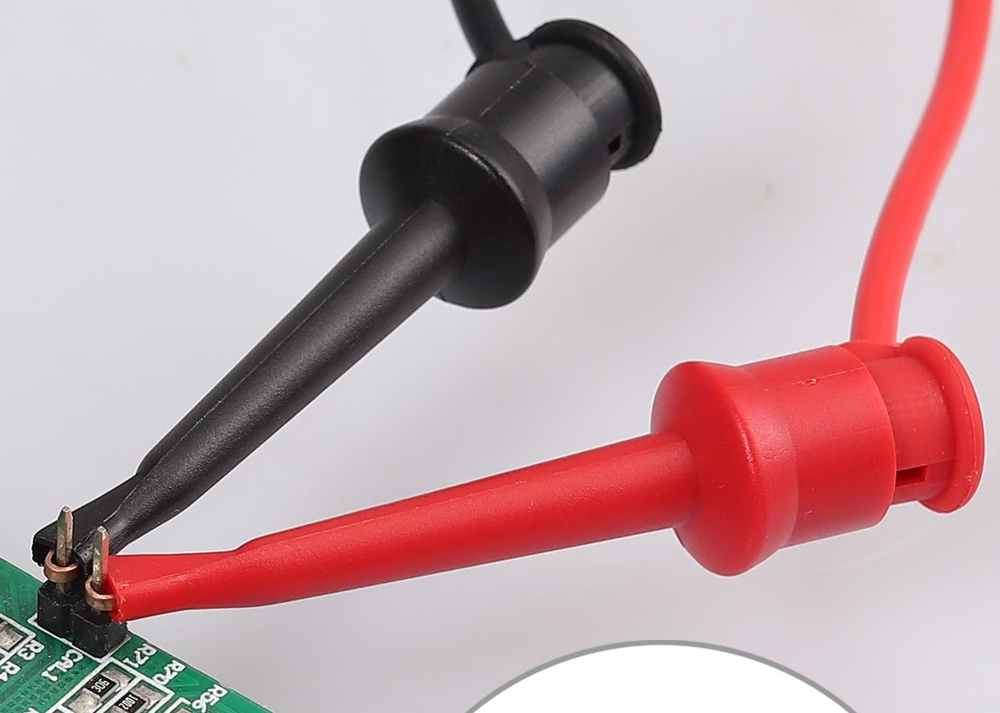

This is a LED controller that can work with single color, CCT, RGB, RGBW and RGBWW led strips. Its sold on aliexpress by a few diferent sellers there are also a few varients with screw terminals that may or may not work.([exact one I got](https://www.aliexpress.com/item/1005003081976104.html?spm=a2g0o.order_list.order_list_main.41.3d091802QzgWWc)) It can be controlled via a rf remote or wifi. The controller is based on a Tuya CB3L(BK7231N) and a Tuya mcu. This means that the leds are not directly controlled by the BK7231N which you can flash with ESPHome. There are also varients with a Tuya CB3S but this controller is identical except for a few more gpio pins. This controller supports bluethooth but it is not yet implemented into ESPHome.

## Setup

There are 2 ways of flashing ESPHome on to this controller.

- [Tuya Cloudcutter](https://github.com/tuya-cloudcutter/tuya-cloudcutter) (No disassembly required, follow guide on their github page.)
- Manual flashing (Disassembly required, soldering required depending on your tools and skillset.)

## Pinout


| Pin | Function                                                                      |
| --- | ----------------------------------------------------------------------------- |
| GND | Ground connection of the controller.                                          |
| 3V3 | 3.3V input to power the controller.                                           |
| RX1 | Transmit pin connected to the Tuya MCU, also used for programming.            |
| TX1 | Recieve pin connected to the Tuya MCU also used for programming.              |
| RST | The reset pin, connect momentaraly to ground to reset(reboot) the controller. |

## Manual Flashing guide

1. Get a UF2 file from the ESPHome Home Assistant addon. first create a new device(Just select ESP32 The yaml file below changes the controller to bk72xx) then copy the yaml file coresponding with your led strip in the edit window and lastly click install(Top Right) and manual download the file as a UF2 package. **IMPORTANT: Change the api encription key with a random genarated key from [here](https://esphome.io/components/api.html#configuration-variables), change the ota password if you want to use ota and change the ap password if you want to have a fallback ap.**
2. Get a USB to serial converter that can work with 3.3V. Example:

3. Set the jumper to 3.3V if you have one (image is set to 5V).
4. Connect the the pins of the converter to the controller as follows. (see pinout)
   - GND -> GND
   - VCC -> 3.3V
   - TX -> RX
   - RX -> TX
   - DTR -> RST(optional)
   This can be done by soldering wires to the controller, using a spring loaded tool like a test probe hook
   
   
   here
   
   or (what i use (verry expensive)) PCBite SP10 probes from the top.
   
   You can manualy tap the RST pin with a jumper wire if you use probes.
5. Connect the serial converter to a computer.
6. Download and launch [Itciptool](https://github.com/libretiny-eu/ltchiptool)
7. Select the flasshing tab.
8. Select the correct device port.
9. Load the UF2 file you downloaded in step 1 as input file.
10. Tick the Auto-detect advanced parameters box.
11. Click start. (If blue text apears in the black box at the bottom make sure everithing is connected properly and if you did not connect the RST pin you have to connect the RST pin to GND for a second while GND and 3V3 are stil connected. You can just touch a wire to the pins by hand.)
12. Now it should write the program and connect to your wifi network. If not, connect to the hotspot it created and setup your wifi manualy.
13. **To make sure the controller will function correctly pres the button on the controller to cycle the output mode to the correct type of ledstrip you have connected. It's not dangerous to set the mode wrong, but if not configured correct the controller will not function as expected!!! See the manual you got with the controller or the image below to change the mode.** 

## YAML configurations for the different output modes

### Single Color

```yaml

esphome:
  name: WB5 LED Controller
  friendly_name: WB5 LED Controller

bk72xx:
  board: generic-bk7231n-qfn32-tuya


# Make sure logging is not using the serial port
logger:
  baud_rate: 0

# serial connection to Tuya MCU
uart:
  rx_pin: RX1
  tx_pin: TX1
  baud_rate: 9600

# Register the Tuya MCU connection
tuya:

# Enable Home Assistant API
api:
  encryption:
    key: "GET-A-KEY-HERE-https://esphome.io/components/api.html#configuration-variables"

ota:
  password: "CHANGE-THIS-PASSWORD-OR-REMOVE-OTA"

wifi: #if you dont have secrets setup change the values with your wifi name and password
  ssid: !secret wifi_ssid
  password: !secret wifi_password

  # Enable fallback hotspot (captive portal) in case wifi connection fails
  ap:
    ssid: "WB5 LED Controller Fallback Hotspot"
    password: "CHANGE-THIS-PASSWORD-OR-DISABLE-AP-FALLBACK"

# Enable Web server
web_server:
  port: 80

captive_portal:

light:
  - platform: "tuya" # dont forget to set the correct mode whit the button on the controller
    name: "WB5 LED Controller"
    color_interlock: true # infinite loop isue when false (false is default)
    gamma_correct: 1 # has built in gamma correct wil cause issuses when changed
    default_transition_length: 0s # has built in transitions
    switch_datapoint: 20

    # for brightness
    dimmer_datapoint: 22
    min_value: 0
    max_value: 1000 # Max value is 1000 (default is 255)

    # for Correlated Color Temperature(CCT) or white channels
    #color_temperature_datapoint: 23
    #color_temperature_invert: true #set to true if connected as stated on the controller
    #color_temperature_max_value: 1000 # Max value is 1000 (default is 255)
    #cold_white_color_temperature: 6000 K # Change depending on LED strip
    #warm_white_color_temperature: 2700 K # Change depending on LED strip

    # for RGB channels
    #color_datapoint: 24
    #color_type: hsv

```

### CCT

```yaml

esphome:
  name: WB5 LED Controller
  friendly_name: WB5 LED Controller

bk72xx:
  board: generic-bk7231n-qfn32-tuya


# Make sure logging is not using the serial port
logger:
  baud_rate: 0

# serial connection to Tuya MCU
uart:
  rx_pin: RX1
  tx_pin: TX1
  baud_rate: 9600

# Register the Tuya MCU connection
tuya:

# Enable Home Assistant API
api:
  encryption:
    key: "GET-A-KEY-HERE-https://esphome.io/components/api.html#configuration-variables"

ota:
  password: "CHANGE-THIS-PASSWORD-OR-REMOVE-OTA"

wifi: #if you dont have secrets setup change the values with your wifi name and password
  ssid: !secret wifi_ssid
  password: !secret wifi_password

  # Enable fallback hotspot (captive portal) in case wifi connection fails
  ap:
    ssid: "WB5 LED Controller Fallback Hotspot"
    password: "CHANGE-THIS-PASSWORD-OR-DISABLE-AP-FALLBACK"

# Enable Web server
web_server:
  port: 80

captive_portal:

light:
  - platform: "tuya" # dont forget to set the correct mode whit the button on the controller
    name: "WB5 LED Controller"
    color_interlock: true # infinite loop isue when false (false is default)
    gamma_correct: 1 # has built in gamma correct wil cause issuses when changed
    default_transition_length: 0s # has built in transitions
    switch_datapoint: 20

    # for brightness
    dimmer_datapoint: 22
    min_value: 0
    max_value: 1000 # Max value is 1000 (default is 255)

    # for Correlated Color Temperature(CCT) or white channels
    color_temperature_datapoint: 23
    color_temperature_invert: true #set to true if connected as stated on the controller
    color_temperature_max_value: 1000 # Max value is 1000 (default is 255)
    cold_white_color_temperature: 6000 K # Change depending on LED strip
    warm_white_color_temperature: 2700 K # Change depending on LED strip

    # for RGB channels
    #color_datapoint: 24
    #color_type: hsv

```

### RGB

```yaml

esphome:
  name: WB5 LED Controller
  friendly_name: WB5 LED Controller

bk72xx:
  board: generic-bk7231n-qfn32-tuya


# Make sure logging is not using the serial port
logger:
  baud_rate: 0

# serial connection to Tuya MCU
uart:
  rx_pin: RX1
  tx_pin: TX1
  baud_rate: 9600

# Register the Tuya MCU connection
tuya:

# Enable Home Assistant API
api:
  encryption:
    key: "GET-A-KEY-HERE-https://esphome.io/components/api.html#configuration-variables"

ota:
  password: "CHANGE-THIS-PASSWORD-OR-REMOVE-OTA"

wifi: #if you dont have secrets setup change the values with your wifi name and password
  ssid: !secret wifi_ssid
  password: !secret wifi_password

  # Enable fallback hotspot (captive portal) in case wifi connection fails
  ap:
    ssid: "WB5 LED Controller Fallback Hotspot"
    password: "CHANGE-THIS-PASSWORD-OR-DISABLE-AP-FALLBACK"

# Enable Web server
web_server:
  port: 80

captive_portal:

light:
  - platform: "tuya" # dont forget to set the correct mode whit the button on the controller
    name: "WB5 LED Controller"
    color_interlock: true # infinite loop isue when false (false is default)
    gamma_correct: 1 # has built in gamma correct wil cause issuses when changed
    default_transition_length: 0s # has built in transitions
    switch_datapoint: 20

    # for brightness
    #dimmer_datapoint: 22
    #min_value: 0
    #max_value: 1000 # Max value is 1000 (default is 255)

    # for Correlated Color Temperature(CCT) or white channels
    #color_temperature_datapoint: 23
    #color_temperature_invert: true #set to true if connected as stated on the controller
    #color_temperature_max_value: 1000 # Max value is 1000 (default is 255)
    #cold_white_color_temperature: 6000 K # Change depending on LED strip
    #warm_white_color_temperature: 2700 K # Change depending on LED strip

    # for RGB channels
    color_datapoint: 24
    color_type: hsv

```

### RGBW

```yaml

esphome:
  name: WB5 LED Controller
  friendly_name: WB5 LED Controller

bk72xx:
  board: generic-bk7231n-qfn32-tuya


# Make sure logging is not using the serial port
logger:
  baud_rate: 0

# serial connection to Tuya MCU
uart:
  rx_pin: RX1
  tx_pin: TX1
  baud_rate: 9600

# Register the Tuya MCU connection
tuya:

# Enable Home Assistant API
api:
  encryption:
    key: "GET-A-KEY-HERE-https://esphome.io/components/api.html#configuration-variables"

ota:
  password: "CHANGE-THIS-PASSWORD-OR-REMOVE-OTA"

wifi: #if you dont have secrets setup change the values with your wifi name and password
  ssid: !secret wifi_ssid
  password: !secret wifi_password

  # Enable fallback hotspot (captive portal) in case wifi connection fails
  ap:
    ssid: "WB5 LED Controller Fallback Hotspot"
    password: "CHANGE-THIS-PASSWORD-OR-DISABLE-AP-FALLBACK"

# Enable Web server
web_server:
  port: 80

captive_portal:

light:
  - platform: "tuya" # dont forget to set the correct mode whit the button on the controller
    name: "WB5 LED Controller"
    color_interlock: true # infinite loop isue when false (false is default)
    gamma_correct: 1 # has built in gamma correct wil cause issuses when changed
    default_transition_length: 0s # has built in transitions
    switch_datapoint: 20

    # for brightness
    dimmer_datapoint: 22
    min_value: 0
    max_value: 1000 # Max value is 1000 (default is 255)

    # for Correlated Color Temperature(CCT) or white channels
    #color_temperature_datapoint: 23
    #color_temperature_invert: true #set to true if connected as stated on the controller
    #color_temperature_max_value: 1000 # Max value is 1000 (default is 255)
    #cold_white_color_temperature: 6000 K # Change depending on LED strip
    #warm_white_color_temperature: 2700 K # Change depending on LED strip

    # for RGB channels
    color_datapoint: 24
    color_type: hsv

```

### RGBWW

```yaml

esphome:
  name: WB5 LED Controller
  friendly_name: WB5 LED Controller

bk72xx:
  board: generic-bk7231n-qfn32-tuya


# Make sure logging is not using the serial port
logger:
  baud_rate: 0

# serial connection to Tuya MCU
uart:
  rx_pin: RX1
  tx_pin: TX1
  baud_rate: 9600

# Register the Tuya MCU connection
tuya:

# Enable Home Assistant API
api:
  encryption:
    key: "GET-A-KEY-HERE-https://esphome.io/components/api.html#configuration-variables"

ota:
  password: "CHANGE-THIS-PASSWORD-OR-REMOVE-OTA"

wifi: #if you dont have secrets setup change the values with your wifi name and password
  ssid: !secret wifi_ssid
  password: !secret wifi_password

  # Enable fallback hotspot (captive portal) in case wifi connection fails
  ap:
    ssid: "WB5 LED Controller Fallback Hotspot"
    password: "CHANGE-THIS-PASSWORD-OR-DISABLE-AP-FALLBACK"

# Enable Web server
web_server:
  port: 80

captive_portal:

light:
  - platform: "tuya" # dont forget to set the correct mode whit the button on the controller
    name: "WB5 LED Controller"
    color_interlock: true # infinite loop isue when false (false is default)
    gamma_correct: 1 # has built in gamma correct wil cause issuses when changed
    default_transition_length: 0s # has built in transitions
    switch_datapoint: 20

    # for brightness
    dimmer_datapoint: 22
    min_value: 0
    max_value: 1000 # Max value is 1000 (default is 255)

    # for Correlated Color Temperature(CCT) or white channels
    color_temperature_datapoint: 23
    color_temperature_invert: true #set to true if connected as stated on the controller
    color_temperature_max_value: 1000 # Max value is 1000 (default is 255)
    cold_white_color_temperature: 6000 K # Change depending on LED strip
    warm_white_color_temperature: 2700 K # Change depending on LED strip

    # for RGB channels
    color_datapoint: 24
    color_type: hsv

```
