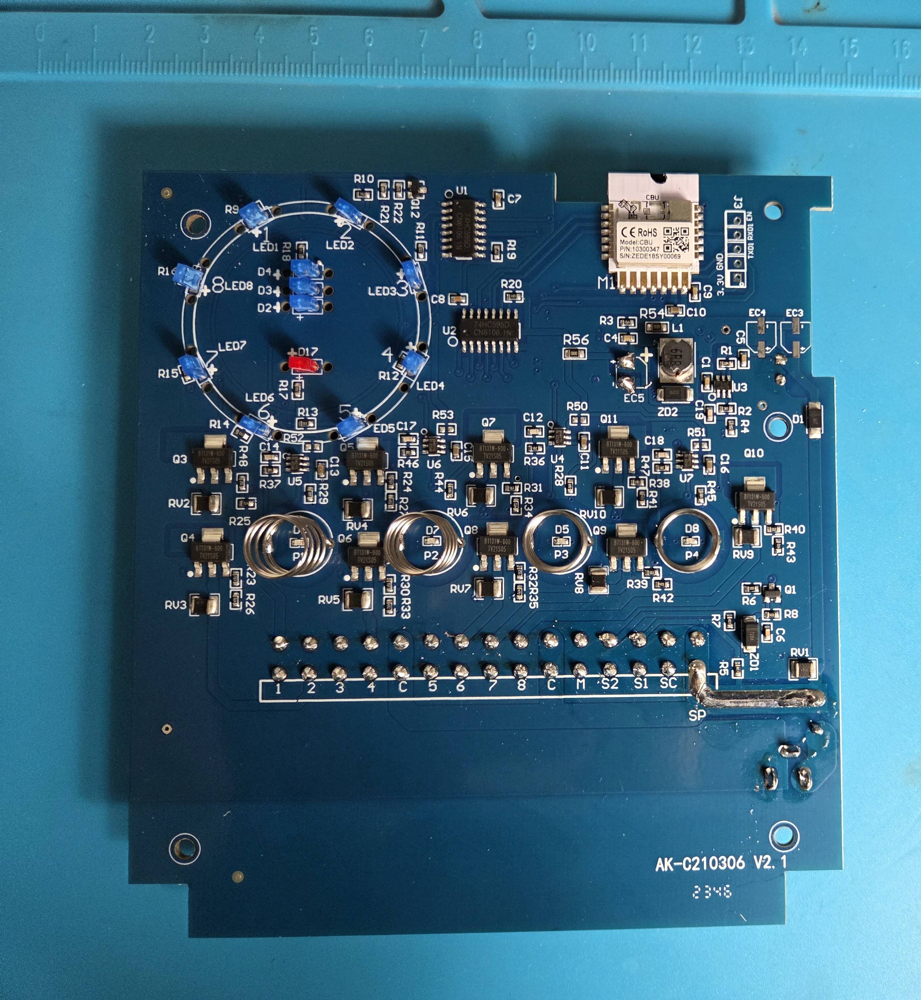
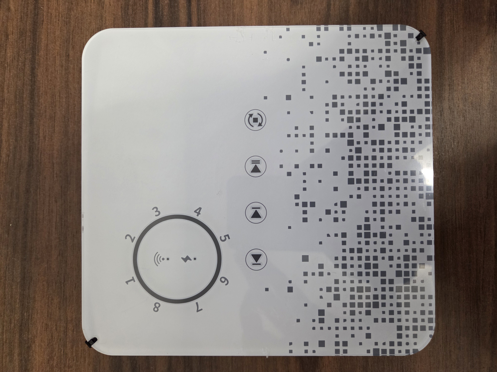

---  
title: Tuya WIFI Sprinkler Controller
date-published:  2025-12-01  
type: misc
standard: global
board: bk72xx
difficulty: 4
made-for-esphome: false
---

## Installation

You have to disamble the front panel and solder two cable to the RX1 and TX1 pins.
I suggest to flash the device based on this video.

[Flash tutorial](https://www.youtube.com/watch?v=t0o8nMbqOSA)

Here you can find the pinout of the CBU Module.

[CBU Module](https://developer.tuya.com/en/docs/iot/cbu-module-datasheet?id=Ka07pykl5dk4u)






## Basic Configuration

```yaml
esphome:
  name: sprinkler
  friendly_name: Sprinkler
  on_boot: 
    then:
      - output.turn_off: led_1
      - output.turn_off: led_2
      - output.turn_off: led_3
      - output.turn_off: led_4
      - output.turn_off: led_5
      - output.turn_off: led_6
      - output.turn_off: led_7
      - output.turn_off: led_8
      - switch.turn_off: valve_1
      - switch.turn_off: valve_2
      - switch.turn_off: valve_3
      - switch.turn_off: valve_4
      - switch.turn_off: valve_5
      - switch.turn_off: valve_6
      - switch.turn_off: valve_7
      - switch.turn_off: valve_8

bk72xx:
  board: cbu

# Enable logging
logger:

# Enable Home Assistant API
api:
  encryption:
    key: "Mob5eHf0m1nXNY/9erDUW0wQsncc4IeKnwMcXEq8h2s="

ota:
  - platform: esphome
    password: "59a91c2546d464d6531496dce347870b"

wifi:
  ssid: !secret wifi_ssid
  password: !secret wifi_password

  # Enable fallback hotspot (captive portal) in case wifi connection fails
  ap:
    ssid: "Sprinkler Fallback Hotspot"
    password: "XN2ab9SsxRuW"

captive_portal:
    

status_led:
  pin:
    number: P28
    inverted: true

sn74hc595:
  - id: led_sn74hc595
    data_pin: P9
    clock_pin: P15
    latch_pin: P17

  - id: valve_sn74hc595
    data_pin: P16
    clock_pin: P22
    latch_pin: P20


binary_sensor:    
  - platform: gpio
    pin: 
      number: P14
      inverted: false
    name: "Rain sensor"
    id: rain_sensor
    filters:
      - delayed_on: 1000ms

  - platform: gpio
    pin: 
      number: P7
      inverted: true
    id: touch_sensor_1
    internal: true
    on_press: 
      then:
        - sprinkler.previous_valve: lawn_sprinkler_ctrlr

  - platform: gpio
    pin: 
      number: P6
      inverted: true
    id: touch_sensor_2
    internal: true
    on_press: 
      then:
        - sprinkler.next_valve: lawn_sprinkler_ctrlr

  - platform: gpio
    pin: 
      number: P8
      inverted: true
    id: touch_sensor_3
    internal: true
    on_press: 
      then:
        - sprinkler.resume_or_start_full_cycle: lawn_sprinkler_ctrlr

  - platform: gpio
    pin: 
      number: P26
      inverted: true
    id: touch_sensor_4
    internal: true
    on_press: 
      then:
        - sprinkler.shutdown: lawn_sprinkler_ctrlr

output:
  - platform: gpio
    id: led_1
    pin:
      sn74hc595: led_sn74hc595
      number: 0
      inverted: true

  - platform: gpio
    id: led_2
    pin:
      sn74hc595: led_sn74hc595
      number: 1
      inverted: true

  - platform: gpio
    id: led_3
    pin:
      sn74hc595: led_sn74hc595
      number: 2
      inverted: true

  - platform: gpio
    id: led_4
    pin:
      sn74hc595: led_sn74hc595
      number: 3
      inverted: true

  - platform: gpio
    id: led_5
    pin:
      sn74hc595: led_sn74hc595
      number: 4
      inverted: true
  
  - platform: gpio
    id: led_6
    pin:
      sn74hc595: led_sn74hc595
      number: 5
      inverted: true

  - platform: gpio
    id: led_7
    pin:
      sn74hc595: led_sn74hc595
      number: 6
      inverted: true

  - platform: gpio
    id: led_8
    pin:
      sn74hc595: led_sn74hc595
      number: 7
      inverted: true


switch:
  - platform: gpio
    id: valve_1
    pin:
      sn74hc595: valve_sn74hc595
      number: 0
      inverted: false
    on_turn_on: 
      then:
        - output.turn_on: led_1
    on_turn_off: 
      then:
        - output.turn_off: led_1
      
  - platform: gpio
    id: valve_2
    pin:
      sn74hc595: valve_sn74hc595
      number: 1
      inverted: false
    on_turn_on: 
      then:
        - output.turn_on: led_2
    on_turn_off: 
      then:
        - output.turn_off: led_2

  - platform: gpio
    id: valve_3
    pin:
      sn74hc595: valve_sn74hc595
      number: 2
      inverted: false
    on_turn_on: 
      then:
        - output.turn_on: led_3
    on_turn_off: 
      then:
        - output.turn_off: led_3

  - platform: gpio
    id: valve_4
    pin:
      sn74hc595: valve_sn74hc595
      number: 3
      inverted: false
    on_turn_on: 
      then:
        - output.turn_on: led_4
    on_turn_off: 
      then:
        - output.turn_off: led_4

  - platform: gpio
    id: valve_5
    pin:
      sn74hc595: valve_sn74hc595
      number: 4
      inverted: false
    on_turn_on: 
      then:
        - output.turn_on: led_5
    on_turn_off: 
      then:
        - output.turn_off: led_5
  
  - platform: gpio
    id: valve_6
    pin:
      sn74hc595: valve_sn74hc595
      number: 5
      inverted: false
    on_turn_on: 
      then:
        - output.turn_on: led_6
    on_turn_off: 
      then:
        - output.turn_off: led_6

  - platform: gpio
    id: valve_7
    pin:
      sn74hc595: valve_sn74hc595
      number: 6
      inverted: false
    on_turn_on: 
      then:
        - output.turn_on: led_7
    on_turn_off: 
      then:
        - output.turn_off: led_7

  - platform: gpio
    id: valve_8
    pin:
      sn74hc595: valve_sn74hc595
      number: 7
      inverted: false
    on_turn_on: 
      then:
        - output.turn_on: led_8
    on_turn_off: 
      then:
        - output.turn_off: led_8

button:
  - platform: template
    name: "Queue valve 1"
    on_press:
      - sprinkler.queue_valve:
          id: lawn_sprinkler_ctrlr
          valve_number: 0
      - sprinkler.start_from_queue:
          id: lawn_sprinkler_ctrlr
  - platform: template
    name: "Queue valve 2"
    on_press:
      - sprinkler.queue_valve:
          id: lawn_sprinkler_ctrlr
          valve_number: 1
      - sprinkler.start_from_queue:
          id: lawn_sprinkler_ctrlr
  - platform: template
    name: "Queue valve 3"
    on_press:
      - sprinkler.queue_valve:
          id: lawn_sprinkler_ctrlr
          valve_number: 2
      - sprinkler.start_from_queue:
          id: lawn_sprinkler_ctrlr
  - platform: template
    name: "Queue valve 4"
    on_press:
      - sprinkler.queue_valve:
          id: lawn_sprinkler_ctrlr
          valve_number: 3
      - sprinkler.start_from_queue:
          id: lawn_sprinkler_ctrlr
  - platform: template
    name: "Queue valve 5"
    on_press:
      - sprinkler.queue_valve:
          id: lawn_sprinkler_ctrlr
          valve_number: 4
      - sprinkler.start_from_queue:
          id: lawn_sprinkler_ctrlr
  - platform: template
    name: "Queue valve 6"
    on_press:
      - sprinkler.queue_valve:
          id: lawn_sprinkler_ctrlr
          valve_number: 5
      - sprinkler.start_from_queue:
          id: lawn_sprinkler_ctrlr
  - platform: template
    name: "Queue valve 7"
    on_press:
      - sprinkler.queue_valve:
          id: lawn_sprinkler_ctrlr
          valve_number: 6
      - sprinkler.start_from_queue:
          id: lawn_sprinkler_ctrlr
  - platform: template
    name: "Queue valve 8"
    on_press:
      - sprinkler.queue_valve:
          id: lawn_sprinkler_ctrlr
          valve_number: 7
      - sprinkler.start_from_queue:
          id: lawn_sprinkler_ctrlr
  - platform: template
    name: "Clear queue"
    on_press:
      - sprinkler.clear_queued_valves:
          id: lawn_sprinkler_ctrlr


sprinkler:
  - id: lawn_sprinkler_ctrlr
    main_switch: "Sprinklers"
    auto_advance_switch: "Sprinklers auto advance"
    valve_overlap: 5s
    valves:
      - valve_switch: "Valve 1"
        enable_switch: "Enable Valve 1"
        run_duration_number: "Valve 1 Run Duration"
        valve_switch_id: valve_1
      - valve_switch: "Valve 2"
        enable_switch: "Enable Valve 2"
        run_duration_number: "Valve 2 Run Duration"
        valve_switch_id: valve_2
      - valve_switch: "Valve 3"
        enable_switch: "Enable Valve 3"
        run_duration_number: "Valve 3 Run Duration"
        valve_switch_id: valve_3
      - valve_switch: "Valve 4"
        enable_switch: "Enable Valve 4"
        run_duration_number: "Valve 4 Run Duration"
        valve_switch_id: valve_4
      - valve_switch: "Valve 5"
        enable_switch: "Enable Valve 5"
        run_duration_number: "Valve 5 Run Duration"
        valve_switch_id: valve_5
      - valve_switch: "Valve 6"
        enable_switch: "Enable Valve 6"
        run_duration_number: "Valve 6 Run Duration"
        valve_switch_id: valve_6
      - valve_switch: "Valve 7"
        enable_switch: "Enable Valve 7"
        run_duration_number: "Valve 7 Run Duration"
        valve_switch_id: valve_7
      - valve_switch: "Valve 8"
        enable_switch: "Enable Valve 8"
        run_duration_number: "Valve 8 Run Duration"
        valve_switch_id: valve_8

```
