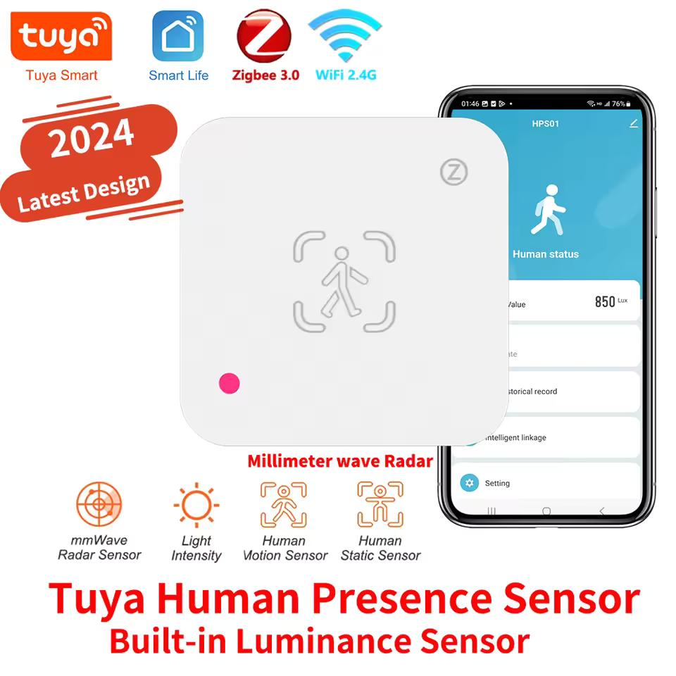
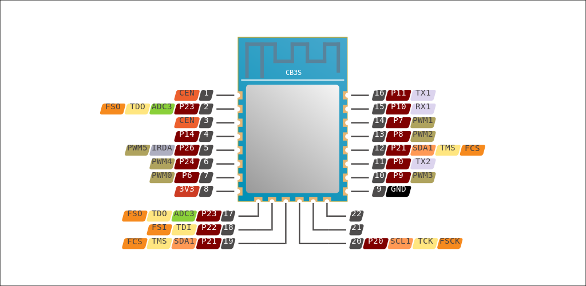

## Description

The Tuya `ZY-HPS01` is a generic tuya human presence sensor available cheaply from AliExpress. On it is a CB3S BK7231N module for wireless communications, and an Airtouch AT5820 5.8GHz radar module from MoreSense acting as the Tuya MCU.

There appears to be a second, less common and almost identical variant of the `ZY-HPS01` - the `ZY-ZHPS01`. This appears to be almost functionally identical, apart from a slight change in the configuration of the illuminance sensor as detailed below. It has almost the exact same hardware.

Every bit of IO on this device is attached to the Tuya MCU module and goes through the UART channel. Therefore, the LED right next to the illuminance sensor cannot be controlled and will light up and interfere with readings when the pairing button is pressed. None of the sensor values will work while the red LED is powered on. This will only happen if the button is held down to enter pairing mode. It is best to just not touch the pairing button at all.

## Flashing

This device does not seem to be vulnerable to `tuya-cloudcutter` or `tuya-convert`. Therefore it must be flashed manually.

This device can be flashed without soldering, although I do recommend soldering some 2.54mm headers onto it next to the USB port for an easier experience.

You should flash it using `ltchiptool`. Once you have started `ltchiptool` and it is actively trying to connect, you should briefly bridge either one of the `CEN` pins to ground and then release.



## ZY-HPS01 Configuration

```yaml
esphome:
  name: ZY-HPS01 Human presence sensor
  friendly_name: Human presence sensor

bk72xx:
  board: cb3s

uart:
  - baud_rate: 9600
    tx_pin: 11
    rx_pin: 10
tuya:

sensor:
  - platform: tuya
    name: "Light Intensity"
    id: light_intensity
    sensor_datapoint: 103
    unit_of_measurement: "lux"
    icon: "mdi:brightness-5"
    state_class: "measurement"

number:
  - platform: "tuya"
    name: "Far Detection"
    number_datapoint: 109
    min_value: 0
    max_value: 600
    step: 1
    mode: slider
    unit_of_measurement: "cm"
    icon: "mdi:signal-distance-variant"
  - platform: "tuya"
    name: "Presence Delay"
    number_datapoint: 104
    min_value: 1
    max_value: 255
    step: 1
    mode: slider
    unit_of_measurement: "s"
    icon: "mdi:timer"
  - platform: "tuya"
    name: "Sensitivity"
    number_datapoint: 105
    min_value: 0
    max_value: 10
    step: 1
    mode: slider
    icon: "mdi:ray-vertex"
  - platform: "tuya"
    name: "Micro Sensitivity"
    number_datapoint: 107
    min_value: 0
    max_value: 10
    step: 1
    mode: slider
    icon: "mdi:ray-vertex"
  - platform: "tuya"
    name: "Min Range"
    number_datapoint: 110
    min_value: 0
    max_value: 600
    step: 1
    mode: slider
    unit_of_measurement: "cm"
    icon: "mdi:signal-distance-variant"
  - platform: "tuya"
    name: "Micro Max Range"
    number_datapoint: 111
    min_value: 0
    max_value: 600
    step: 1
    mode: slider
    unit_of_measurement: "cm"
    icon: "mdi:signal-distance-variant"
  - platform: "tuya"
    name: "Micro Min Range"
    number_datapoint: 112
    min_value: 0
    max_value: 600
    step: 1
    mode: slider
    unit_of_measurement: "cm"
    icon: "mdi:signal-distance-variant"
binary_sensor:
  - platform: "tuya"
    name: "Presence State"
    sensor_datapoint: 101
    device_class: occupancy
    filters:
      - invert:

```

## ZY-ZHPS01 Configuration

This variant will work by simply changing the illuminance sensor datapoint ID in the other configuration from 103 to 11.

```yaml
sensor:
  - platform: tuya
    name: "Light Intensity"
    id: light_intensity
    sensor_datapoint: 11 # Used to be 103
    unit_of_measurement: "lux"
    icon: "mdi:brightness-5"
    device_class: "illuminance"
    state_class: "measurement"
```
