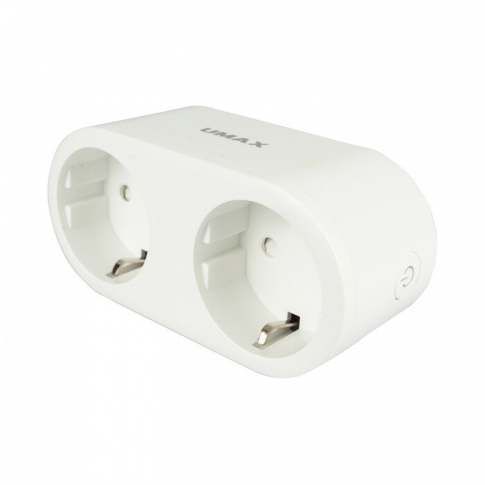

Tuya inside. pinouts for measurement and rations for dividers uncertain :(

Leds for active sockets are not controlled separatelly, only through the switch.

## GPIO Pinout

| Pin    | Function            |
| ------ | ------------------- |
| GPIO0  | Button2i            |
| GPIO4  | HLWBL CF       ???  |
| GPIO5  | HLWBL CF1      ???  |
| GPIO12 | HLWBL SELi     ???  |
| GPIO13 | Status LEDi         |
| GPIO14 | Relay1              |
| GPIO15 | Relay2              |
| GPIO16 | Button1i            |

## Basic Configuration

```yaml
esphome:
  name: umax
  platform: ESP8266
  board: esp8285

wifi:
  ssid: "ssid"
  password: "password"

  # Enable fallback hotspot (captive portal) in case wifi connection fails
  ap:
    ssid: "Umax Fallback Hotspot"
    password: ""

captive_portal:

# Enable logging
logger:
  level: INFO
# Enable Home Assistant API
api:

ota:

time:
  - platform: homeassistant
    id: homeassistant_time

substitutions:
  plug_name: umax
  # Higher value gives lower watt readout, pure guessing here
  #current_res: "0.00520"
  current_res: "0.05"
  # Lower value gives lower voltage readout, pure guessing here
  #voltage_div: "750"
  voltage_div: "720"

# Enable Web server
web_server:
  port: 80

sensor:
  - platform: wifi_signal
    name: "${plug_name} - WiFi Signal"
    update_interval: 60s

  - platform: uptime
    name: "${plug_name} - Uptime"
    icon: mdi:clock-outline
    update_interval: 60s

  - platform: hlw8012
    sel_pin:
      number: GPIO12
      inverted: True
    cf_pin: GPIO04
    cf1_pin: GPIO05
    current_resistor: ${current_res}
    voltage_divider: ${voltage_div}

    current:
      name: "${plug_name} - Ampere"
      unit_of_measurement: A
      accuracy_decimals: 3
      icon: mdi:flash-outline

    voltage:
      name: "${plug_name} - Volt"
      unit_of_measurement: V
      accuracy_decimals: 1
      icon: mdi:flash-outline

    power:
      name: "${plug_name} - Watt"
      unit_of_measurement: W
      id: "${plug_name}_Wattage"
      icon: mdi:flash-outline

    change_mode_every: 4
    update_interval: 3s

  - platform: total_daily_energy
    name: "${plug_name} - daily"
    power_id: "${plug_name}_Wattage"
    filters:
        # Multiplication factor from W to kW is 0.001
        - multiply: 0.001
    unit_of_measurement: kWh
    icon: mdi:clock-alert

text_sensor:
  - platform: version
    name: "${plug_name} - ESPHome Version"

status_led:
  pin:
    number: GPIO13
    inverted: True

binary_sensor:
  - platform: gpio
    id: button1
    internal: true
    pin:
      number: GPIO16
      mode: INPUT_PULLUP
      inverted: true
    #on_state:
    on_press:
      - switch.toggle: relay1

  - platform: gpio
    id: button2
    internal: true
    pin:
      number: GPIO00
      mode: INPUT_PULLUP
      inverted: true
    #on_state:
    on_press:
      - switch.toggle: relay2

#output:
#  - platform: gpio
#    pin: GPIO01
#    inverted: true
#    id: led1

#  - platform: gpio
#    pin: GPIO02
#    inverted: true
#    id: led2

switch:
  - platform: gpio
    pin: GPIO14
    id: relay1
    restore_mode: RESTORE_DEFAULT_OFF
    name: '${plug_name} - Switch1'
    icon: mdi:power-socket-eu
#    on_turn_on:
#      - output.turn_on: led1
#    on_turn_off:
#      - output.turn_off: led1

  - platform: gpio
    pin: GPIO15
    id: relay2
    restore_mode: RESTORE_DEFAULT_OFF
    name: '${plug_name} - Switch2'
    icon: mdi:power-socket-eu
#    on_turn_on:
#      - output.turn_on: led2
#    on_turn_off:
#      - output.turn_off: led2
```
