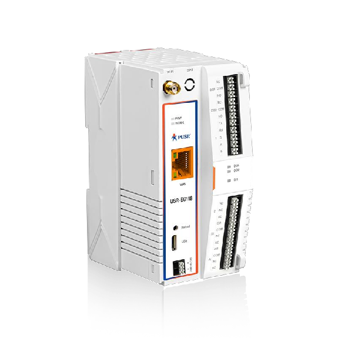
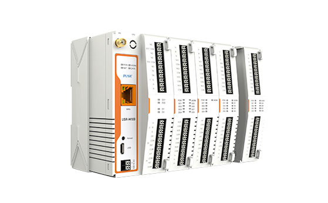

## Product Images

**USR-EG118**


**Similar USR-M100 module with connected IO modules**


## Product description

This devices sold as 'Arduino Open Source IoT Gateway' can be easy flashed to ESPHome.  
Thanks to the expansion slot, the base module can easily be expanded with multiple IO modules.  
It uses a ESP32-WROVER-IE-N4R8 as it's main processor.  

### External interfaces

The module has the following external interfaces:

- 9-36V DC Power Supply input
- External WiFi/Bluetooth antenna
- Ethernet (IP101 chip)
- Combined RS232/485 port
- 1x Digital input
- 2x Digital relay output (Controlled by SN74HC595 chip)
- 1x Analog input(4~20mA)

### IO expansion modules

IO modules can be connected to the main module via a connector on the side.  
This connector supplies power to the IO modules, one UART pin for configuration, and RS485/Modbus for the actual IO control.

On the UART TX pin, the following 12 configuration bytes need te be send (@9600 baud):  
1. Always 0xDB  
2. This device address, usually 0x00 for the main module.  
3. Next device address, usually 0x01 for the first IO expansion module.  
4-7. Baudrate as 32 bit value, officially supported values:  
    - 4800: [0x00, 0x00, 0x12, 0xC0]  
    - 9600: [0x00, 0x00, 0x25, 0x80]  
    - 115200: [0x00, 0x01, 0xC2, 0x00]  
    - 230400: [0x00, 0x03, 0x84, 0x00]  

8. Data bits, always 8  
9. Stop bits, usually 1  
10. Parity, 0: None, 1: Odd, 2: Even  
11-12. CRC16/MODBUS  

Each IO module increments bytes 2 and 3, calculates the CRC16, and sends its data to the next module.  
The IO modules can be controlled with the [ESPHome Modbus Controller Component](https://esphome.io/components/modbus_controller/).  
Follow the [IO module manual](https://www.pusr.com/support/download/User-Manual-USR-IO0080-8000-0440-4040-0404-Manual.html) for correct modbus registers and settings.

### Watchdog timer

A SGM820B supervisory IC is present that resets the ESP32 in case of undervoltage and also features a watchdog timer.
It requires a regular input pulse from the ESP32 to prevent a reset from being performed.  
Without a signal, the watchdog timer will perform a reset after approximately 70-80 seconds.  
Since the watchdog trigger pin is shared with the UART0 RX pin, it is important to disable UART logging and don't leave the USB cable disconnected.

### Flashing

A USB cable is supplied from the factory to flash the firmware. This is not an ordinary USB cable, but a USB to UART adapter.  
To flash firmware, the 'reload' button must be pressed during power-on.  
After releasing the button, you have approximately 70 seconds to start the firmware update before the watchdog timer triggers a reset.  
If the programming cable is connected, the watchdog timer is triggered by RX data and not by the ESP32.
Therefore it is important to disconnect the cable after programming.

### GPIO Pinout

| Pin    | Interface            | Function     |
| ------ | -------------------- | ------------ |
| GPIO3  | Watchdog + work led  | WDT Trigger  |
| GPIO18 | Ethernet             | RMII_MDIO    |
| GPIO23 | Ethernet             | RMII_MDC     |
| GPIO0  | Ethernet             | RMII_REF_CLK |
| GPIO19 | Ethernet             | RMII_TXD0    |
| GPIO22 | Ethernet             | RMII_TXD1    |
| GPIO25 | Ethernet             | RMII_RX0     |
| GPIO26 | Ethernet             | RMII_RX1     |
| GPIO21 | Ethernet             | RMII_TXEN    |
| GPIO27 | Ethernet             | RMII_CRS_DV  |
| GPIO5  | Ethernet             | PHY_RESET    |
| GPIO32 | RS485/232            | TXD          |
| GPIO33 | RS485/232            | RXD          |
| GPIO12 | RS485/232            | RS485 DE/RE  |
| GPIO13 | IO expansion - RS485 | TXD          |
| GPIO34 | IO expansion - RS485 | RXD          |
| GPIO14 | IO expansion - RS485 | RS485 DE/RE  |
| GPIO1  | IO expansion - UART  | TXD          |
| GPIO4  | SN74HC595 - Relays   | DATA         |
| GPIO15 | SN74HC595 - Relays   | CLOCK        |
| GPIO2  | SN74HC595 - Relays   | LATCH        |
| GPIO35 | Analog input         | AI           |
| GPIO39 | Digital input        | DI           |
| GPIO36 | Reload button        | DI           |

## Example Configuration

```yaml
esp32:
  variant: esp32
  framework:
    type: esp-idf

psram:
  mode: quad
  speed: 80MHz
  ignore_not_found: false

logger:
  baud_rate: 0

api:

ethernet:
  type: IP101
  mdc_pin: GPIO23
  mdio_pin: GPIO18
  clk:
    pin: GPIO0
    mode: CLK_EXT_IN
  phy_addr: 1
  power_pin: GPIO5

output:
  - platform: gpio
    pin: GPIO3
    id: WDT_Trigger

uart:
  - id: PUSR_expansion_config
    tx_pin: GPIO1
    baud_rate: 9600

  - id: PUSR_expansion_rs485
    tx_pin: GPIO13
    rx_pin: GPIO34
    flow_control_pin: GPIO14
    baud_rate: 115200

  - id: PUSR_external_rs485
    tx_pin: GPIO32
    rx_pin: GPIO33
    flow_control_pin: GPIO12
    baud_rate: 115200

interval:
  - interval: 2000ms
    then:
      - output.turn_on: WDT_Trigger
      - delay: 1000ms
      - output.turn_off: WDT_Trigger

  - interval: 3000ms
    then:
      - uart.write: 
          id: PUSR_expansion_config
          data: [0xDB, 0x00, 0x01, 0x00, 0x01, 0xC2, 0x00, 0x08, 0x01, 0x00, 0x3C, 0xD5]

modbus:
  - uart_id: PUSR_expansion_rs485
    id: PUSR_expansion_modbus
    send_wait_time: 10ms
    turnaround_time: 5ms

  - uart_id: PUSR_external_rs485
    id: PUSR_external_modbus

modbus_controller:
  - id: PUSR_IO_Module_1
    address: 1
    modbus_id: PUSR_expansion_rs485
    update_interval: 500ms

sn74hc595:
  - id: 'sn74hc595_hub'
    data_pin: GPIO4
    clock_pin: GPIO15
    latch_pin: GPIO2
    sr_count: 1

switch:
  - platform: gpio
    name: "DO1"
    pin:
      sn74hc595: sn74hc595_hub
      number: 1
  - platform: gpio
    name: "DO2"
    pin:
      sn74hc595: sn74hc595_hub
      number: 2

  - platform: modbus_controller
    modbus_controller_id: PUSR_IO_Module_1
    register_type: coil
    address: 0
    name: "DO1.1"

binary_sensor:
  - platform: gpio
    pin: GPIO39
    name: "DI1"
  - platform: gpio
    pin:
        number: GPIO36
        inverted: true
    name: "Reload"

sensor:
  - platform: adc
    pin: GPIO35
    name: "AI1"
```
