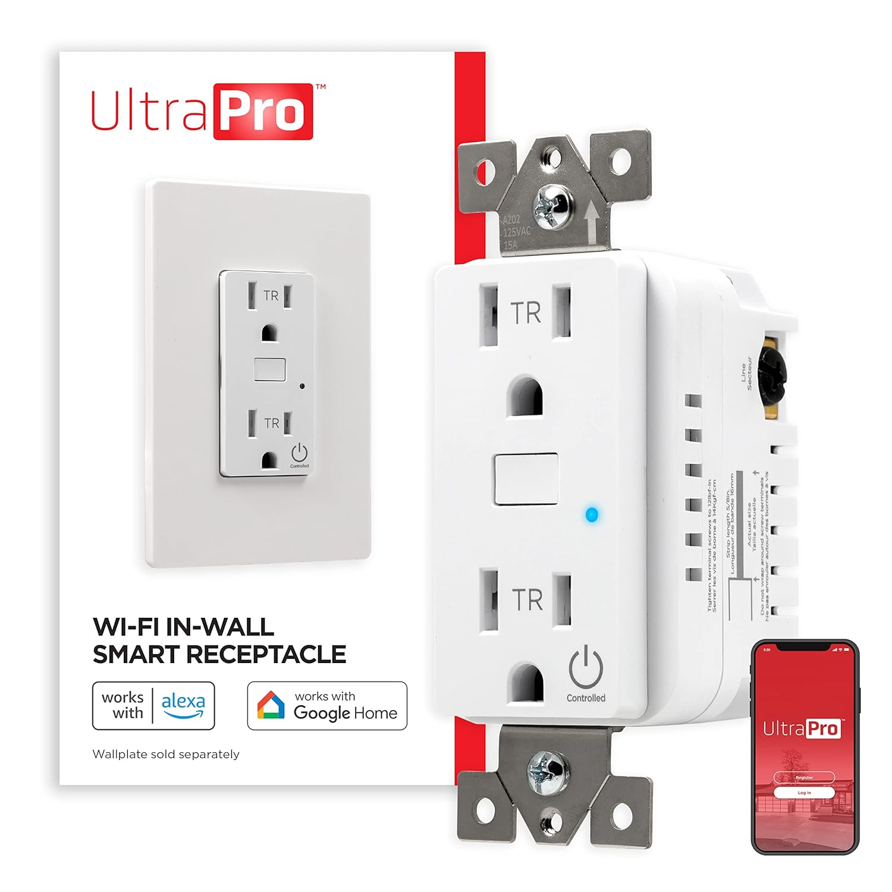
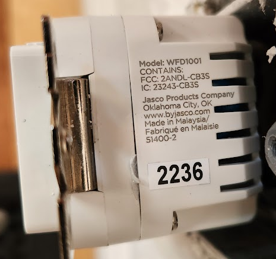

## GPIO Pinout

| Pin | Alternate Pin Name | Function     | Active |
| --- | ------------------ | ------------ | ------ |
| P23 | ADC3               | Button       | Low    |
| P24 | PWM4               | Status Led   | High   |
| P26 | PWM5               | Relay        | High   |

## Tuya Cloudcutter

The board is easily flashed without disassembly using
[tuya-cloudcutter](https://github.com/tuya-cloudcutter/tuya-cloudcutter).

## Basic Configuration

The button will toggle the relay and LED.  Holding the button for more
than 5 seconds will reset the wifi password and revert the device to
the captive portal.

```yaml
# You should only need to modify the substitutions.
substitutions:
  device_name: master-bedroom-left-outlet
  friendly_name: Master Bedroom Left Outlet

# Nothing below should need modification
esphome:
  name: ${device_name}
  friendly_name: ${friendly_name}

bk72xx:
  board: cb3s

logger:
api:
captive_portal:
ota:
  - platform: esphome

wifi: # Get the SSID and password from the captive portal.
  ap:

output:
  - platform: libretiny_pwm
    id: output_blue_led
    pin: PWM4
switch:
  - platform: gpio
    pin: PWM5
    id: relay
    name: None
    restore_mode: RESTORE_DEFAULT_OFF
    device_class: switch
    on_turn_on:
      then:
        - light.turn_on: blue_led
    on_turn_off:
      then:
        - light.turn_off: blue_led
button:
  - platform: restart
    id: do_restart
    name: "Restart"
  - platform: factory_reset
    id: do_factory_reset
    name: "Factory Reset to AP mode"
binary_sensor:
  - platform: gpio
    pin:
      number: P23
      inverted: True # The button is active low.
      mode: INPUT_PULLUP
    id: input_button
    on_press:
      then:
        - switch.toggle: relay
        - while:
            condition:
              - binary_sensor.is_on: input_button
            then:
              - light.toggle: blue_led
              - delay: 250ms
    on_release:
      then:
        - if:
            condition:
              - switch.is_on: relay
            then:
              - light.turn_on: blue_led
            else:
              - light.turn_off: blue_led
    on_click:
      - min_length: 5s
        max_length: 100s
        then:
          - repeat:
              count: 6
              then:
                - light.toggle: blue_led
                - delay: 100ms
          - button.press: do_factory_reset
light:
  - platform: status_led
    id: blue_led
    name: Blue LED
    output: output_blue_led
    disabled_by_default: True
    restore_mode: RESTORE_DEFAULT_OFF
```
