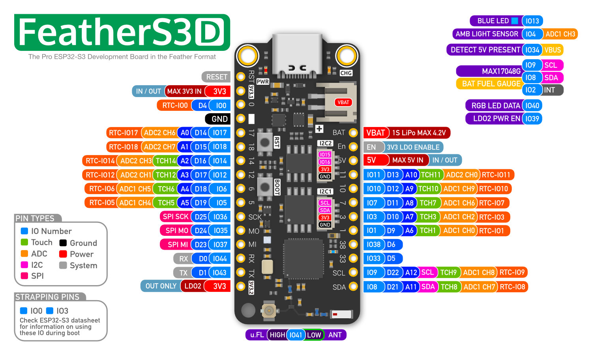

## Product description

This is an ESP32-S3 based Feather board with multiple components:

- 16MB QSPI Flash
- 8MB of extra QSPI PSRAM
- 2 LDOs, LDO2 is user controlled & auto-shuts down in deep-sleep
- 2x STEMMA QT connectors, 1 on LDO1 and 1 on LDO2
- LiPo Battery Charging + JST PH connector
- I2C Battery Fuel Gauge
- 1 Ambient light sensor
- 1 Low power RGB LED
- 1 onboard WiFi antenna + 1 u.FL connector
- Ultra Low Deep Sleep Current

More information:

- Product page: https://esp32s3.com/feathers3d.html

## GPIO Pinout



## Basic Config

```yaml
substitutions:
  device_name: "feathers3d"

esphome:
  name: ${device_name}

esp32:
  variant: esp32s3
  flash_size: 16MB # FeatherS3[D] has a 16MB flash

psram:
  mode: quad
  speed: 80MHz

logger:
  hardware_uart: USB_CDC

external_components:
  - source: github://Option-Zero/esphome-components
    components: [max17048]

i2c:
  # I2C1 bus, always on
  - id: i2c1
    sda: GPIO8
    scl: GPIO9
    scan: true
    frequency: 400kHz
  # LDO2 must be turned on for using this I2C bus
  # Have in mind LDO2 is always turned off during deep sleep
  - id: i2c2
    sda: GPIO16
    scl: GPIO15
    scan: true
    frequency: 400kHz

switch:
  # LDO2 - Powers i2c2 bus (BME280)
  - platform: gpio
    id: ldo2_switch
    pin: GPIO39
    name: "LDO2"
    restore_mode: ALWAYS_ON # You can set the state of the LDO2 at boot time

output:
  - id: led_blue
    platform: gpio
    pin: GPIO13

light:
  # RGB light, powered by LDO2
  - id: led_rgb
    platform: esp32_rmt_led_strip
    rgb_order: GRB
    chipset: ws2812
    pin: GPIO40
    num_leds: 1
    name: "NeoPixel Light"
  # Blue LED
  - platform: binary
    id: led_blue
    output: led_blue

sensor:
  # Battery voltage, level, discharge rate
  - platform: max17048
    id: max17048_sensor
    i2c_id: i2c1
    address: 0x36
    battery_voltage:
      name: "Battery Voltage"
      id: battery_voltage
    battery_level:
      name: "Battery Level"
      id: battery_level
    rate:
      name: "Battery Discharge Rate"
      id: battery_discharge_rate

  - platform: adc
    pin: GPIO4
    id: ambient_light
```

## Extended config to optimize CPU, Memory and Flash usage – ESP-IDF Framework only

This config is for ESP-IDF framework, as we use specific SDK Config options.

- It sets a CPU frequency to 240 MHz
- It allocates memory on `malloc` calls from both internal and PSRAM memory
- It allows [Mbed TLS](https://github.com/Mbed-TLS/mbedtls) to allocate memory in PSRAM
- It increases the `nvs` partition at the cost of reducing the `app0`/`app1` partitions. It gives more space to store persisted variables.

```yaml
substitutions:
  device_name: "feathers3d"

esphome:
  name: ${device_name}

esp32:
  variant: esp32s3
  # FeatherS3[D] has a 16MB flash on a 240 MHz CPU
  cpu_frequency: 240MHz
  flash_size: 16MB
  # By default, esphome 2025.8.4 generates a partition file that maximizes app0 and app1 partitions
  # and keep nvs partition (used to save global variables) to 446 kB.
  # The partition file, included below, allocate more space to nvs
  # nvs is the partition used by the "preferences" components used to save persisted variables across reboots
  partitions: partitions-16MB-nvs-extended.csv
  framework:
    type: esp-idf
    sdkconfig_options:
      # Enable PSRAM allocation for malloc, so ArduinoJson can allocate big objects in PSRAM
      CONFIG_SPIRAM_USE_MALLOC: y
      # By default, mbedtls only use internal memory.
      # CONFIG_MBEDTLS_DEFAULT_MEM_ALLOC=y tell mbedtls to use malloc.
      # It will therefore be able to allocate memory in PSRAM is CONFIG_SPIRAM_USE_MALLOC is enabled
      CONFIG_MBEDTLS_DEFAULT_MEM_ALLOC: y

psram:
  mode: quad
  speed: 80MHz

logger:
  hardware_uart: USB_CDC

external_components:
  - source: github://Option-Zero/esphome-components
    components: [max17048]

i2c:
  # I2C1 bus, always on
  - id: i2c1
    sda: GPIO8
    scl: GPIO9
    scan: true
    frequency: 400kHz
  # LDO2 must be turned on for using this I2C bus
  # Have in mind LDO2 is always turned off during deep sleep
  - id: i2c2
    sda: GPIO16
    scl: GPIO15
    scan: true
    frequency: 400kHz

switch:
  # LDO2 - Powers i2c2 bus (BME280)
  - platform: gpio
    id: ldo2_switch
    pin: GPIO39
    name: "LDO2"
    restore_mode: ALWAYS_ON # You can set the state of the LDO2 at boot time

output:
  - id: led_blue
    platform: gpio
    pin: GPIO13

light:
  # RGB light, powered by LDO2
  - id: led_rgb
    platform: esp32_rmt_led_strip
    rgb_order: GRB
    chipset: ws2812
    pin: GPIO40
    num_leds: 1
    name: "NeoPixel Light"
  # Blue LED
  - platform: binary
    id: led_blue
    output: led_blue

sensor:
  # Battery voltage, level, discharge rate
  - platform: max17048
    id: max17048_sensor
    i2c_id: i2c1
    address: 0x36
    battery_voltage:
      name: "Battery Voltage"
      id: battery_voltage
    battery_level:
      name: "Battery Level"
      id: battery_level
    rate:
      name: "Battery Discharge Rate"
      id: battery_discharge_rate

  - platform: adc
    pin: GPIO4
    id: ambient_light
```

### Partition file

Into a file named `partitions-16MB-nvs-extended.csv` next to your ESPHome YAML config, write this content:

```csv
otadata,  data,   ota, ,   0x2000,
phy_init, data,   phy, ,   0x1000,
app0,      app, ota_0, , 0x2F0000,
app1,      app, ota_1, , 0x2F0000,
nvs,      data,   nvs, , 0x400000,
```

This table allocates 2.94 MB for the application and 4 MB for the nvs partition (used to store global variables).
It fits for a 16 MB flash. It is possible to reduce the size of the `app0` and `app1` and increase the `nvs` partition.

| Partition | Size (hex) | Size (bytes)   | Size (MB) |
| --------- | ---------- | -------------- | --------- |
| otadata   | 0x2000     | 8,192          | 0.008     |
| phy_init  | 0x1000     | 4,096          | 0.004     |
| app0      | 0x2F0000   | 3,080,192      | 2.94      |
| app1      | 0x2F0000   | 3,080,192      | 2.94      |
| nvs       | 0x400000   | 4,194,304      | 4.0       |
| **Total** |            | **16,366,976** | **15.6**  |
