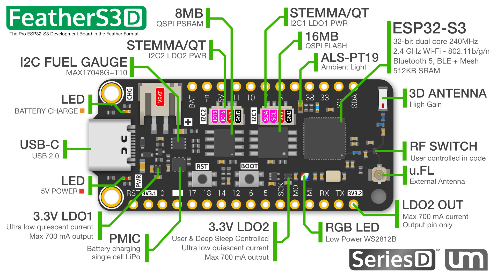

## Product description

This is an ESP32-S3 based Feather board with multiple components:

- 16MB QSPI Flash
- 8MB of extra QSPI PSRAM
- 2 LDOs, LDO2 is user controlled & auto-shuts down in deep-sleep
- 2x STEMMA QT connectors, 1 on LDO1 and 1 on LDO2
- LiPo Battery Charging + JST PH connector
- I2C Battery Fuel Gauge
- 1 Ambient light sensor
- 1 Low power RGB LED
- 1 onboard WiFi antenna + 1 u.FL connector
- Ultra Low Deep Sleep Current

More information:

- Product page: https://esp32s3.com/feathers3d.html

## GPIO Pinout


## Basic Config

```yaml
substitutions:
  device_name: "feathers3d"

esphome:
  name: ${device_name}

esp32:
  variant: esp32s3
  flash_size: 16MB # FeatherS3[D] has a 16MB flash

psram:
  mode: quad
  speed: 80MHz

logger:
  hardware_uart: USB_CDC

external_components:
  - source: github://Option-Zero/esphome-components
    components: [max17048]

i2c:
  # I2C1 bus, always on
  - id: i2c1
    sda: GPIO8
    scl: GPIO9
    scan: true
    frequency: 400kHz
  # LDO2 must be turned on for using this I2C bus
  # Have in mind LDO2 is always turned off during deep sleep
  - id: i2c2
    sda: GPIO16
    scl: GPIO15
    scan: true
    frequency: 400kHz

switch:
  # LDO2 - Powers i2c2 bus (BME280)
  - platform: gpio
    id: ldo2_switch
    pin: GPIO39
    name: "LDO2"
    restore_mode: ALWAYS_ON # You can set the state of the LDO2 at boot time

output:
  - id: led_blue
    platform: gpio
    pin: GPIO13

light:
  # RGB light, powered by LDO2
  - id: led_rgb
    platform: esp32_rmt_led_strip
    rgb_order: GRB
    chipset: ws2812
    pin: GPIO40
    num_leds: 1
    name: "NeoPixel Light"
  # Blue LED
  - platform: binary
    id: led_blue
    output: led_blue

sensor:
  # Battery voltage, level, discharge rate
  - platform: max17048
    id: max17048_sensor
    i2c_id: i2c1
    address: 0x36
    battery_voltage:
      name: "Battery Voltage"
      id: battery_voltage
    battery_level:
      name: "Battery Level"
      id: battery_level
    rate:
      name: "Battery Discharge Rate"
      id: battery_discharge_rate

  - platform: adc
    pin: GPIO4
    id: ambient_light
```
