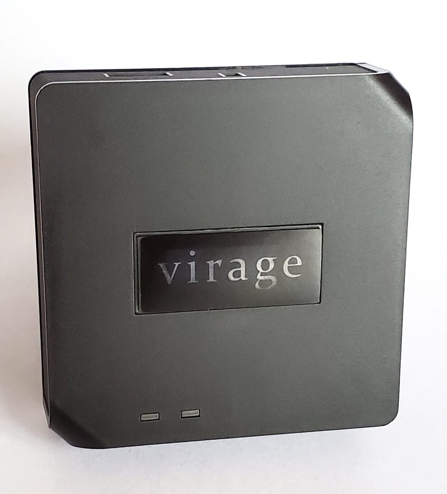

[Virage Laboratories](https://www.viragelabs.com)

[VB-001 433 MHz to WiFi Bridge](https://www.viragelabs.com/product/viragebridge/)

## General Notes

The VirageBridge 433 MHz to WiFi Bridge (based on a Sonoff RF Bridge) runs a customized version of Tasmota optimized for receiving signals from sensors such as door contacts and motion sensors.

It ships with a USB power supply and cord, and is optimized for Home Assistant, Domoticz and OpenHab. You can easily upload an ESPHome binary using the Firmware Upgrade function in the built-in web interface.

## GPIO Pinout (Per top to bottom when installed)

| Pin    | Function  |
| ------ | --------- |
| GPIO0  | Button 1  |
| GPIO1  | Serial Tx |
| GPIO3  | Serial Rx |
| GPIO13 | LED 1     |
