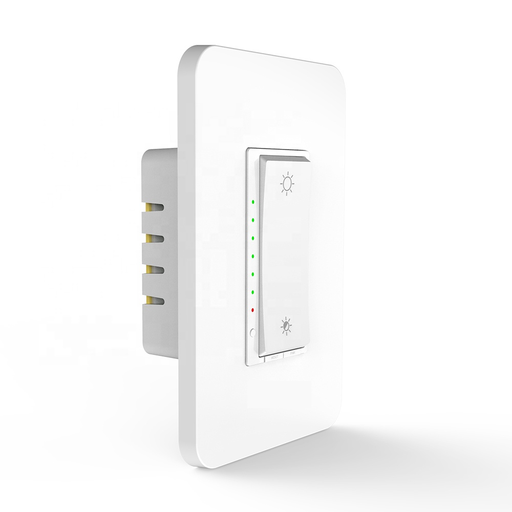

[Virage Laboratories](https://www.viragelabs.com)

[KS-7012 Dimmer](https://www.viragelabs.com/product/viragedimmer/)

## General Notes

This 120V dimmer switch comes with a customized Tasmota pre-installed.

There is a touch switch to turn the light on and off, and a rocker switch to control the brightness.  It has two DIP switches to optimize performance with a variety of types and brands of LED and incandescent lights.

It is optimized for Home Assistant, Domoticz and OpenHab but you can easily flash an ESPHome binary using the Firmware Upgrade function in the built-in web interface. 

## GPIO Pinout (Per top to bottom when installed)

| Pin    | Function                                  |
| ------ | ----------------------------------------- |
| GPIO1  | Tuya Tx                                   |
| GPIO3  | Tuya Rx                                   |
