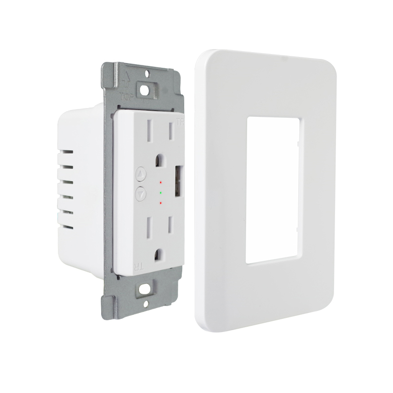

[Virage Laboratories](https://www.viragelabs.com)

[KS-604S Outlet](https://www.viragelabs.com/product/virageplug/)

## General Notes

This 120V wall outlet comes with a customized Tasmota pre-installed, and has two independently switchable 120V outlets and a switchable USB outlet.

It is optimized for Home Assistant, Domoticz and OpenHab but you can easily flash an ESPHome binary using the Firmware Upgrade function in the built-in web interface. 

## GPIO Pinout (Per top to bottom when installed)

| Pin    | Function                                  |
| ------ | ----------------------------------------- |
| GPIO0  | LEDLink                                   |
| GPIO3  | Button 1                                  |
| GPIO4  | LED 1 (inverted)                          |
| GPIO5  | Button 2                                  |
| GPIO12 | Relay 2                                   |
| GPIO13 | Relay 1                                   |
| GPIO14 | LED 2 (inverted)                          |
| GPIO15 | Relay 3                                   |
