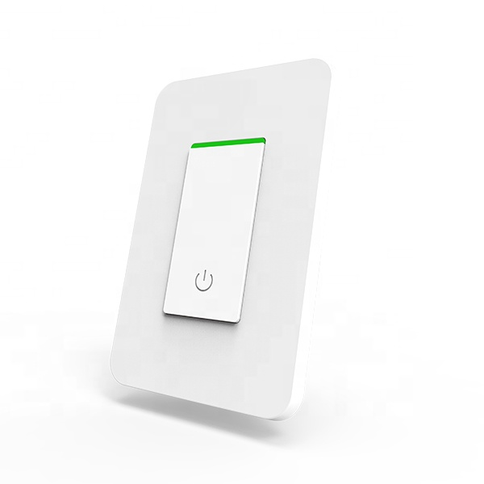

[Virage Laboratories](https://www.viragelabs.com)

[KS-602H Switch](https://www.viragelabs.com/product/virageswitch/)

## General Notes

This 2-pole wall switch comes with a customized Tasmota pre-installed. It is optimized for Home Assistant, Domoticz and OpenHab but you can easily flash an ESPHome binary using the Firmware Upgrade function in the built-in web interface.

## GPIO Pinout (Per top to bottom when installed)

| Pin    | Function |
| ------ | -------- |
| GPIO0  | Button 1 |
| GPIO12 | Relay 1  |
| GPIO13 | LED 1    |
