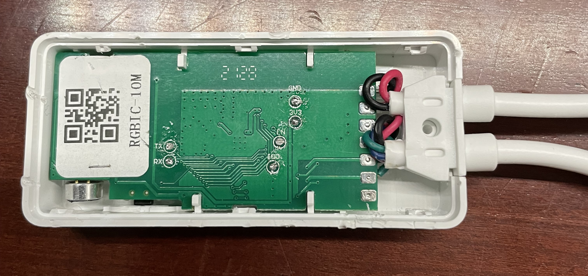
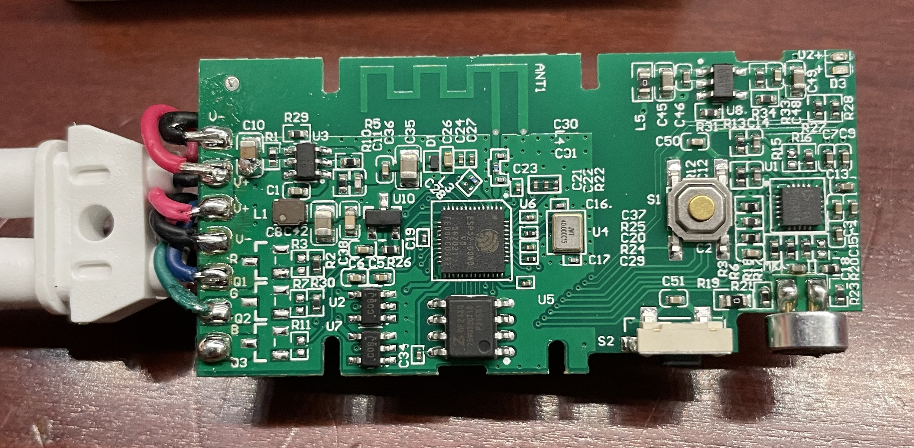

## General Notes

The [WYZE Light Strip Pro](https://www.wyze.com/products/wyze-lightstrip-pro) features 2 individually controllable WS2812b light strips (2 16ft strips)

Originally when I flashed the device I had converted a tasmota configuration, at this time I am unable to find the original.



To flash you need to open the contoller to access the pins on the pcb



The board uses V+, V-, R/Q1, and G/Q2 for the connectors. B/Q3 is unpopulated and might be connected to the ESP, I did not test this.

## GPIO Pinout

| Pin    | Function      |
| ------ | ------------- |
| GPIO2  | Side Button   |
| GPIO19 | Top Button    |
| GPIO25 | Light 1       |
| GPIO26 | Light 2       |

## Basic Configuration

```yaml
esphome:
  name: ${devicename}

esp32:
  board: esp32dev
  framework:
    type: arduino
    version: recommended

wifi:
  ssid: !secret wifi_ssid
  password: !secret wifi_password
  ap:
    ssid: "strip_light"
    password: "ap_password"

binary_sensor:
  - platform: gpio
    pin: GPIO2
    name: "${friendly_name} side button"
  - platform: gpio
    pin: GPIO19
    name: "${friendly_name} top button"

light:
  - platform: fastled_clockless
    chipset: WS2812B
    pin: GPIO25
    num_leds: 50
    rgb_order: BRG
    name: "${friendly_name} light1"
    effects:
      - random:
      - pulse:
      - strobe:
      - flicker:
      - addressable_rainbow:
      - addressable_color_wipe:
      - addressable_scan:
      - addressable_twinkle:
      - addressable_random_twinkle:
      - addressable_fireworks:
      - addressable_flicker:
  - platform: fastled_clockless
    chipset: WS2812B
    pin: GPIO26
    num_leds: 50
    rgb_order: BRG
    name: "${friendly_name} light2"
    effects:
      - random:
      - pulse:
      - strobe:
      - flicker:
      - addressable_rainbow:
      - addressable_color_wipe:
      - addressable_scan:
      - addressable_twinkle:
      - addressable_random_twinkle:
      - addressable_fireworks:
      - addressable_flicker:
```
