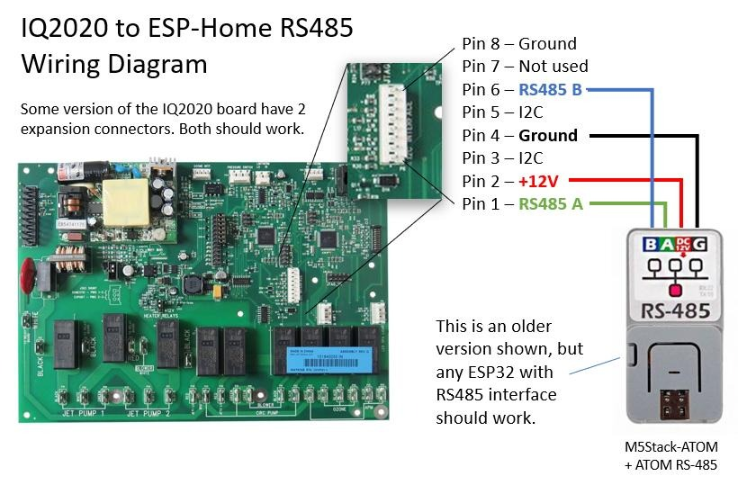

## General Notes

The Watkins IQ2020 controller is used in Hot Spring, Tiger River, Limelight spas. This control board has an expansion connector with 12v, ground and RS485 interface pins and works perfectly with ESP32 devices that have a RS495 interface. A recommanded ESP32 devices and accessories are:

- [ATOM Lite ESP32 IoT Development Kit](https://shop.m5stack.com/products/atom-lite-esp32-development-kit)
- [ATOM Tail485 - RS485 Converter for ATOM](https://shop.m5stack.com/products/atom-tail485)
- [5 Colors 1Pin 2.54mm Female to Male Breadboard Jumper Wire](https://www.amazon.com/XLX-Breadboard-Soldering-Brushless-Double-end/dp/B07S839W8V/ref=sr_1_3)

However, other options may work. Flash the ESP32 with the [IQ2020 integration](https://github.com/Ylianst/ESP-IQ2020) and connect it to the controller using the following pins:



A more detailed [video on how to get this setup is here](https://youtu.be/egX6bspzuqo). The ESP32 integration offers many options including emulation of the music module, see the project on GitHub to details on this.

## Basic Config

```yaml
esphome:
  name: hot-tub
  friendly_name: Hot Tub
  comment: "Luxury Spa"

esp32:
  board: m5stack-atom

external_components:
  - source: github://ylianst/esp-iq2020

# Make sure tx/rx pins are correct for your device.
# GPIO26/32 is ok for M5Stack-ATOM + Tail485, look in GitHub devices link for your device.
uart:
  id: SpaConnection
  tx_pin: GPIO26
  rx_pin: GPIO32
  baud_rate: 38400

iq2020:
   uart_id: SpaConnection
   polling_rate: 65
   port: 1234

select:
number:
text:

# If using celsius units on the hot tub remote, replace _f_ with _c_ in the three entries below.
# Feel free to remove any sensor that are not relevent for your hot tub.
sensor:
  - platform: iq2020
    current_f_temperature:
      name: Current Temperature
    target_f_temperature:
      name: Target Temperature
    outlet_f_temperature:
      name: Heater Outlet
    heater_total_runtime:
      name: Heater Runtime
    jets1_total_runtime:
      name: Jets 1 Runtime
    lifetime_runtime:
      name: Lifetime Runtime
    jets2_total_runtime:
      name: Jets 2 Runtime
    lights_total_runtime:
      name: Lights Runtime
    circulation_pump_total_runtime:
      name: Circulation Pump Runtime
#    jet1_low_total_runtime:
#      name: Jets 1 Low Runtime
    jet2_low_total_runtime:
      name: Jets 2 Low Runtime
    power_on_counter:
      name: Power On Counter
    pcb_f_temperature:
      name: Controller Temperature

switch:
  - platform: iq2020
    name: Lights
    id: lights_switch
    icon: "mdi:lightbulb"
    datapoint: 0
  - platform: iq2020
    name: Spa Lock
    id: spa_lock_switch
    icon: "mdi:lock"
    datapoint: 1
  - platform: iq2020
    name: Temperature Lock
    id: temp_lock_switch
    icon: "mdi:lock"
    datapoint: 2
  - platform: iq2020
    name: Clean Cycle
    id: clean_cycle_switch
    icon: "mdi:vacuum"
    datapoint: 3
  - platform: iq2020
    name: Summer Timer
    id: summer_timer_switch
    icon: "mdi:sun-clock"
    datapoint: 4

fan:
  - platform: iq2020
    name: Jets 1
    id: jets1
    icon: "mdi:turbine"
    datapoint: 0
    speeds: 1
  - platform: iq2020
    name: Jets 2
    id: jets2
    icon: "mdi:turbine"
    datapoint: 1
    speeds: 2

# Set "celsius" to "true" if using celsius units.
climate:
  - platform: iq2020
    name: Temperature
    celsius: false

text_sensor:
  - platform: iq2020
    versionstr:
      name: Version
```
