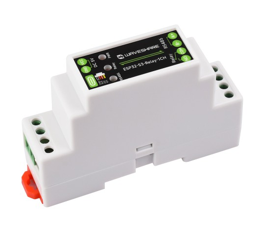
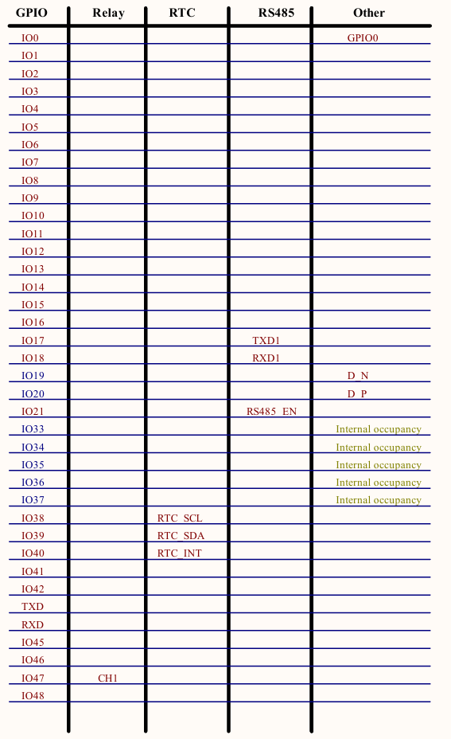

## Product description

Industrial 1-Channel ESP32-S3 WiFi Relay Module, Supports Wi-Fi / Bluetooth, Onboard RS485 interface, With Multiple Isolation Protection Circuits, Industrial-Grade Rail-Mount Case

Features

    Based on ESP32-S3 microcontroller with Xtensa 32-bit LX7 dual-core processor, capable of running at 240 MHz
    Integrated 2.4GHz Wi-Fi and Bluetooth 5 (LE) dual-mode wireless communication, with superior RF performance
    High quality relay, contact rating: ≤10A 250VAC/30VDC
    Onboard isolated RS485 interface, for connecting to various RS485 Modbus industrial modules or sensors
    Onboard RTC chip, supports scheduled tasks
    Onboard USB Type-C port for power supply, firmware downloading and debugging
    Onboard power supply screw terminal, supports 5V power supply only
    Onboard optocoupler isolation to prevent interference from external high-voltage circuit
    Onboard digital isolation to prevent interference from external signal
    Onboard unibody power supply isolation, providing stable isolated voltage, no extra power supply is required for the isolated terminal
    Onboard RS485 TX/RX indicators for monitoring the operating status of the module
    Rail-mounted protective case, easy to install, safe to use


More information:

- Product page: [https://www.waveshare.com/esp32-s3-relay-1ch.htm](https://www.waveshare.com/esp32-s3-relay-1ch.htm)
- Wiki: [https://www.waveshare.com/wiki/ESP32-S3-Relay-1CH](https://www.waveshare.com/wiki/ESP32-S3-Relay-1CH)

## GPIO Pinout



## Basic Config

```yaml
# Variables
substitutions:
  device_name: "waveshare-001"
  device_comment: "WaveShare ESP32-S3-Relay-1CH device"
  device_friendly: "Waveshare001"

# ESPHome initialisation
esphome:
  name: ${device_name}
  friendly_name: ${device_friendly}
  min_version: 2025.5.0
  comment: ${device_comment}
  name_add_mac_suffix: false

esp32:
  board: esp32-s3-devkitc-1
  framework:
    type: esp-idf

# Enable logging
logger:

# Enable Home Assistant API
api:
  encryption:
    key: !secret api_encryption_key

ota:
  - platform: esphome
    password: !secret ota_password

# Wifi configuration 
wifi:
  ssid: "SSID" # Your SSID here
  password: "password" # Your password here

  # Enable fallback hotspot (captive portal) in case wifi connection fails
  ap:
    ssid: "Waveshare002 Fallback Hotspot"
    password: "12345678"

captive_portal:
    
# Enable Web server
web_server:
  port: 80

# Relay
switch:
  - platform: gpio
    pin: GPIO47
    id: relay1
    name: Relay 1

#IC2
i2c:
  sda: GPIO39
  scl: GPIO38
  scan: false
  frequency: 100kHz
  id: i2cbus

# Time
time:
  - platform: homeassistant
    id: homeassistant_time
    on_time_sync:
      then:
        # Update the RTC when the synchronization was successful
        pcf85063.write_time:
  - platform: pcf85063
    id: pcf85063_time

# Sensors
binary_sensor:
  # Status
  - platform: status
    name: "Status"
  # Boot button
  - platform: gpio
    name: "Boot Button"
    pin:
      number: 0
      ignore_strapping_warning: true
      mode:
        input: true
      inverted: true
    disabled_by_default: true
    on_press:
      then:
        - button.press: restart_button
  # Digital Inputs
  - platform: gpio
    id: di1
    name: "DI1"
    pin:
      number: GPIO1
      mode: INPUT_PULLUP
      inverted: true
    filters:
      - delayed_on_off: 10ms
  - platform: gpio
    id: di2
    name: "DI2"
    pin:
      number: GPIO2
      mode: INPUT_PULLUP
      inverted: true
    filters:
      - delayed_on_off: 10ms

# RS485 / Modbus
uart:
  - id: modbus_uart
    tx_pin: GPIO17
    rx_pin: GPIO18
    baud_rate: 9600
    stop_bits: 1 #default to 8E1
    data_bits: 8 #default to 8E1
    parity: EVEN #default to 8E1

# Software buttons
button:
  # Reboot
  - platform: restart
    name: "Restart"
    id: restart_button
    entity_category: config
  # Factory reset
  - platform: factory_reset
    name: "Factory Reset"
    id: reset
    entity_category: config
```
