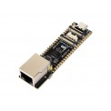

Model reference: ESP32-P4-Eth

Manufacturer: [Waveshare](https://www.waveshare.com/)  
Product Page: [esp32-p4-eth](https://www.waveshare.com/esp32-p4-eth.htm)

## Product Description

This product is a multimedia development board based on ESP32-P4. It features rich Human-Machine interfaces, including MIPI-CSI (with integrated Image Signal Processor), MIPI-DSI, SPI, I2S, I2C, LED PWM, MCPWM, RMT, ADC, UART, TWAI, etc. Additionally, it supports USB OTG 2.0 HS, Ethernet port and onboard 40PIN GPIO header which is compatible with some Raspberry Pi Pico HATs, enabling a wider range of application adaptability.

### Key Features

- High-performance MCU with RISC-V 32-bit dual-core and single-core processors
- 128 KB HP ROM, 16 KB LP ROM, 768 KB HP L2MEM, 32 KB LP SRAM, 8 KB TCM
- Powerful image and voice processing capability. Provides image and voice processing interfaces including - JPEG codecs, Pixel Processing Accelerator (PPA), Image Signal Processor (ISP) and H.264 video encoder
- 32MB PSRAM in the chip's package, onboard 32MB Nor Flash
- Commonly used peripherals such as MIPI-CSI, MIPI-DSI, USB 2.0 OTG, Ethernet, SDIO 3.0 TF card slot, - microphone, speaker header, etc.
- Adapting 2*20 GPIO headers with 27 x remaining programmable GPIOs
- Security features: Secure Boot, Flash Encryption, cryptographic accelerators, and TRNG. Additionally, hardware access protection mechanisms help to enable Access Permission Management and Privilege Separation

## GPIO Pinout

### Ethernet (IP101 PHY)

| Function | GPIO |
|----------|------|
| MDC      | GPIO31 |
| MDIO     | GPIO52 |
| Power    | GPIO51 |
| CLK      | GPIO50 |

### i2c

| Function | GPIO  |
|----------|-------|
| sda      | GPIO7 |
| scl      | GPIO8 |

* frequency: 400kHz
* scan: True

### i2s Audio
| Function | GPIO  | Note |
|----------|-------|------|
| i2s_mclk_pin | GPIO13 | |
| i2s_bclk_pin | GPIO12 | |
| i2s_lrclk_pin | GPIO10 | Left/Right Clock |
| i2s_dout_pin | GPIO9 | |

* use_legacy: False

## Basic Configuration

Minimum configuration required for the Waveshare ESP32-P4-Eth:

```yaml
esphome:
  name: "esp32-p4-eth"

esp32:
  board: esp32-p4-evboard
  flash_size: 16MB
  framework:
    type: esp-idf

logger:
  hardware_uart: UART0

api:

ota:
  platform: esphome
```

## Ethernet Configuration

Configuration to use the onboard 100M Ethernet with IP101 PHY:

```yaml
ethernet:
  type: IP101
  mdc_pin: GPIO31
  mdio_pin: GPIO52
  power_pin: GPIO51
  clk: 
    mode: CLK_EXT_IN
    pin: GPIO50
  phy_addr: 1
  # Optional manual IP
#  manual_ip:
#    static_ip: 192.168.3.187
#    gateway: 192.168.3.1
#    subnet: 255.255.255.0
```

## Complete Example with 10.1 screen
```yaml
substitutions:
  device_description: "ESP32-P4-Eth 10.1 Smart screen"
  project_name: "WaveShare.ESP32_P4_10.1"
  project_version: "1.0.1"

  lightbulb: "\U000F0335"
  ceiling_light: "\U000F0769"
  lamp: "\U000F06B5"
  floor_lamp: "\U000F08DD"
  string_lights: "\U000F12BA"


esphome:
  name: esp32-p4
  friendly_name: Waveshare ESP32-P4 Eth
  on_boot:
    - priority: -200
      then:
        - switch.turn_on: speaker_enable
        - delay: 200ms
        - audio_dac.set_volume:
            id: es8311_dac
            volume: 85%
    - priority: 850
      then:
        - logger.log: Initializing display backlight
        - lambda: |-
            id(display_backlight_i2c).write_byte(0x95, 0x11);
            id(display_backlight_i2c).write_byte(0x95, 0x17);

esp32:
  board: esp32-p4-evboard
  variant: esp32p4
  flash_size: 16MB
  cpu_frequency: 360MHZ
  framework:
    type: esp-idf
    advanced:
      enable_idf_experimental_features: yes
    sdkconfig_options:
      CONFIG_CAMERA_OV5647: y      
#    sdkconfig_options:
#      CONFIG_CAMERA_CTRL_ISP_DVP_CAM_SUPPORTED: y
#      CONFIG_CAMERA_CTRL_ISP_CSI_CAM_SUPPORTED: y

# needed for mipi_dsi
psram:
  mode: hex
  speed: 200MHZ

external_components:
  # For the backlight
  - source: github://pr#9879
    components: [mipi_dsi]
    refresh: 1h

# Enable logging
logger:
  level: DEBUG
  hardware_uart: UART0

# Enable Home Assistant API
api:
  encryption:
    key: "<REPLACE KEY>"

ota:
  - platform: esphome
    password: "<REPLACE PASSWORD>"
# Example configuration entry
web_server:
  port: 80

ethernet:
  type: IP101
  mdc_pin: GPIO31
  mdio_pin: GPIO52
  power_pin: GPIO51
  clk: 
    mode: CLK_EXT_IN
    pin: GPIO50
  phy_addr: 1
  # Optional manual IP
#  manual_ip:
#    static_ip: 192.168.3.187
#    gateway: 192.168.3.1
#    subnet: 255.255.255.0

time:
  - platform: homeassistant
    id: time_comp
    on_time_sync:
      - script.execute: time_update
    on_time:
      - minutes: '*'
        seconds: 0
        then:
          - script.execute: time_update

script:
  - id: time_update
    then:
      - lvgl.indicator.update:
          id: minute_hand
          value: !lambda |-
            return id(time_comp).now().minute;
      - lvgl.indicator.update:
          id: hour_hand
          value: !lambda |-
            auto now = id(time_comp).now();
            return std::fmod(now.hour, 12) * 60 + now.minute;
      - lvgl.label.update:
          id: date_label
          text: !lambda |-
            static const char * const mon_names[] = {"JAN", "FEB", "MAR", "APR", "MAY", "JUN", "JUL", "AUG", "SEP", "OCT", "NOV", "DEC"};
            static char date_buf[8];
            auto now = id(time_comp).now();
            snprintf(date_buf, sizeof(date_buf), "%s %2d", mon_names[now.month-1], now.day_of_month);
            return date_buf;
      - lvgl.label.update:
          id: day_label
          text: !lambda |-
            static const char * const day_names[] = {"SUN", "MON", "TUE", "WED", "THU", "FRI", "SAT"};
            return day_names[id(time_comp).now().day_of_week - 1];  

esp_ldo:
  - channel: 3
    id: display_supply_ldo
    voltage: 2.5V

# Needed for gt911 touchscreen
i2c:
  sda: GPIO7
  scl: GPIO8
  frequency: 400kHz
  scan: True

i2c_device:
  - address: 0x45
    id: display_backlight_i2c

audio_dac:
  - platform: es8311
    id: es8311_dac
    bits_per_sample: 16bit
    address: 0x18
    sample_rate: 16000
    use_mclk: True
    use_microphone: False
    mic_gain: 42DB

microphone:
  - platform: i2s_audio
    id: i2s_microphone
    adc_type: external
    i2s_din_pin: GPIO11
    bits_per_channel: default

sensor:
  # https://esphome.io/components/sensor/sound_level/
  - platform: sound_level
    id: sound_level_id
    passive: True
    microphone:
      microphone: i2s_microphone
      channels: 1
    peak:
      name: "Peak Loudness"
    rms:
      name: "Average Loudness"

text_sensor:
  - platform: ethernet_info
    ip_address:
      name: "IP Address"
      id: ip_address
      entity_category: diagnostic
      on_value: 
        then:
          - lvgl.label.update:
              id: ip_address_label
              text:
                format: "%s"
                args: [ 'id(ip_address).get_state().c_str()' ]
      address_0:
        name: device IP Address 0
      address_1:
        name: device IP Address 1
      address_2:
        name: device IP Address 2
      address_3:
        name: device IP Address 3
      address_4:
        name: device IP Address 4
    mac_address:
      name: device Mac Ethernet Address
    dns_address:
      name: device DNS Address                

i2s_audio:
  - id: i2s_output
    i2s_mclk_pin: GPIO13
    i2s_bclk_pin: GPIO12
    # i2s_comm_fmt:
    # ASDOUT: GPIO11
    i2s_lrclk_pin: GPIO10 # Left/Right Clock
    # DSDIN: GPIO9
    use_legacy: False

speaker:
  - platform: i2s_audio
    id: i2s_speaker
    dac_type: external
    channel: mono
    i2s_audio_id: i2s_output
    audio_dac: es8311_dac
    i2s_dout_pin: GPIO9
    num_channels: 1
    buffer_duration: 300ms
    sample_rate: 16000
    bits_per_sample: 16bit
  - platform: mixer
    id: mixer_speaker_id
    output_speaker: i2s_speaker
    source_speakers:
      - id: announcement_spk_mixer_input
      - id: media_spk_mixer_input
  - platform: resampler
    id: media_spk_resampling_input
    output_speaker: media_spk_mixer_input
  - platform: resampler
    id: announcement_spk_resampling_input
    output_speaker: announcement_spk_mixer_input

media_player:
  - platform: speaker
    name: "Speaker Media Player"
    id: speaker_media_player_id
    buffer_size: 500000
    media_pipeline:
        speaker: media_spk_resampling_input
        num_channels: 1
    announcement_pipeline:
        speaker: announcement_spk_resampling_input
        num_channels: 1
    codec_support_enabled: true
    files:
      - id: alarm_sound
        file: hardknocklife.flac # Placed in the yaml directory. 
            #Should be encoded with a 48000 Hz sample rate, 
            # mono or stereo audio, 
            # and 16 bits per sample.

switch:
  - platform: gpio
    name: "Speaker Enable"
    id: speaker_enable
    internal: False
    pin: GPIO53
    restore_mode: ALWAYS_ON # RESTORE_DEFAULT_ON
  - platform: template
    name: "Mic detect"
    id: mic_detect
    optimistic: true
    restore_mode: ALWAYS_OFF
    on_turn_off:
      sound_level.stop: sound_level_id
    on_turn_on:
      sound_level.start: sound_level_id
  - platform: template
    name: "Ring Timer"
    id: timer_ringing
    optimistic: true
    restore_mode: ALWAYS_OFF
    on_turn_off:
        # Stop playing the alarm
        - media_player.stop:
            announcement: true
        - mixer_speaker.apply_ducking:  # Stop ducking the media stream over 2 seconds
            id: media_spk_mixer_input
            decibel_reduction: 0
            duration: 2.0s

    on_turn_on:
        # Duck media audio by 20 decibels instantly
        - mixer_speaker.apply_ducking:
            id: media_spk_mixer_input
            decibel_reduction: 20
            duration: 0.0s
        - while:
            condition:
                switch.is_on: timer_ringing
            then:
                # Play the alarm sound as an announcement
                - media_player.speaker.play_on_device_media_file:
                    media_file: alarm_sound
                    announcement: true
                # Wait until the alarm sound starts playing
                - wait_until:
                    media_player.is_announcing:
                # Wait until the alarm sound stops playing
                - wait_until:
                    not:
                      media_player.is_announcing:

# needs github://pr#9879 until merged to main
light:
  - platform: mipi_dsi
    id: backlight
    pwm_register: 0x96
    restore_mode: ALWAYS_ON    

display:
  - platform: mipi_dsi
    id: tenone_display
    model: WAVESHARE-P4-NANO-10.1
    rotation: 270
    show_test_card: true
#    update_interval: never


touchscreen:
  - platform: gt911
    id: tenone_touchscreen
    transform:
      swap_xy: true
      mirror_y: false
      mirror_x: true
    on_touch:
      - logger.log:
          format: Touch at (%d, %d)
          args: [touch.x, touch.y]
      - lambda: |-
          ESP_LOGI("cal", "x=%d, y=%d, x_raw=%d, y_raw=%0d",
              touch.x,
              touch.y,
              touch.x_raw,
              touch.y_raw
              );
lvgl:
    displays:
      - tenone_display
    on_idle:
      - timeout: 30s
        then:
          - logger.log: idle timeout
          - if:
              condition:
                lvgl.is_idle:
                  timeout: 5s
              then:
                - logger.log: LVGL is idle
      - timeout: 35s
        then:
          - logger.log: idle 15s timeout
          - light.turn_off: 
              id: backlight
              transition_length: 5s
          - lvgl.pause:
              show_snow: true      
    color_depth: 16
    buffer_size: 100%
    byte_order: little_endian
    style_definitions:
      - id: style_line
        line_color: 0x0000FF
        line_width: 8
        line_rounded: true
      - id: date_style
        text_font: roboto24
        align: center
        text_color: 0x333333
        bg_opa: cover
        radius: 4
        pad_all: 2
    pages:
      - id: main_page
        skip: false
        layout:
          type: flex
          flex_flow: column_wrap
        width: 100%
        bg_color: 0x000000
        bg_opa: cover
        pad_all: 5
        widgets:
          - button:
              height: 120
              checkable: true
              id: lv_button_1
              widgets:
                - label:
                    text_font: light40
                    align: top_left
                    text: $lightbulb
                    id: lv_button_1_icon
                - label:
                    align: bottom_left
                    text: "Office Light"
                    long_mode: dot
              on_click:
                light.toggle: backlight
              on_short_click:
                  - homeassistant.service:
                      service: switch.toggle
                      data:
                        entity_id: switch.office_lights
          - button:
              height: 120
              checkable: true
              id: lv_button_2
              widgets:
                - label:
                    text_font: light40
                    align: top_left
                    text: $lightbulb
                    id: lv_button_2_icon
                - label:
                    align: bottom_left
                    text: "Play Sound"
                    long_mode: dot
              on_click:
                switch.toggle: timer_ringing
              on_short_click:
                  - switch.toggle: timer_ringing
          - obj:
              widgets:
              - label:
                  id: ip_address_label
                  align: CENTER
                  text: 'Not connected'
                  text_color: ha_blue
                  y: +10
          - obj:
              width: 240
              widgets:
              - label:
                  align: CENTER
                  text: 'backlight'
                  text_color: ha_blue
                  y: +10              
              - slider:
                    id: dimmer_slider
                    align: CENTER
                    # x: 20
                    y: +10
                    width: 200
                    height: 30
                    pad_all: 8
                    min_value: 100
                    max_value: 255
                    on_value:
                      - light.turn_on: 
                          id: backlight
                          #transition_length: 0.5s
                          brightness: !lambda return int(x)/255.0;
          - obj:
              width: 230
              height: 230
              widgets:
              - meter:
                  height: 200
                  width: 200
                  align: center
                  #widgets:
                    
                        
                  bg_opa: TRANSP
                  text_color: 0xFFFFFF
                  scales:
                    - ticks:
                        width: 1
                        count: 61
                        length: 10
                        color: 0xFFFFFF
                      range_from: 0
                      range_to: 60
                      angle_range: 360
                      rotation: 270
                      indicators:
                        - line:
                            id: minute_hand
                            value: !lambda |-
                              return id(time_comp).now().minute;
                            width: 3
                            color: 0xE0E0E0
                            r_mod: -1

                    - 
                      angle_range: 330
                      rotation: 300
                      range_from: 1
                      range_to: 12
                      ticks:
                        width: 1
                        count: 12
                        length: 1
                        major:
                          stride: 1
                          width: 4
                          length: 8
                          color: 0xC0C0C0
                          label_gap: 6

                    - angle_range: 360
                      rotation: 270
                      range_from: 0
                      range_to: 720
                      indicators:
                        - line:
                            id: hour_hand
                            value: !lambda |-
                              auto now = id(time_comp).now();
                              return std::fmod(now.hour, 12) * 60 + now.minute;
                            width: 4
                            color: 0xA0A0A0
                            r_mod: -20               
              - label:
                  styles: date_style
                  id: day_label
                  #y: -20
                  text: !lambda |-
                    static const char * const day_names[] = {"SUN", "MON", "TUE", "WED", "THU", "FRI", "SAT"};
                    return day_names[id(time_comp).now().day_of_week-1];
              - label:
                  styles: date_style
                  id: date_label
                  #y: +20
                  text: !lambda |-
                    static const char * const mon_names[] = {"JAN", "FEB", "MAR", "APR", "MAY", "JUN", "JUL", "AUG", "SEP", "OCT", "NOV", "DEC"};
                    static char date_buf[8];
                    auto now = id(time_comp).now();
                    snprintf(date_buf, sizeof(date_buf), "%s %2d", mon_names[now.month-1], now.day_of_month);
                    return date_buf;
      - id: etusivu
        widgets:
          - obj:
              x: 30
              y: 350
              width: 450
              height: 200
              bg_color: 0x000000
              border_width: 2    
#-------------------------------------------
# Graphics and Fonts
#-------------------------------------------
font:
  - file: "gfonts://Roboto"
    id: roboto24
    size: 24
    bpp: 4
    extras:
      # https://cdnjs.cloudflare.com/ajax/libs/MaterialDesign-Webfont/7.4.47/fonts/materialdesignicons-webfont.ttf
      - file: "fonts/materialdesignicons-webfont.ttf" # http://materialdesignicons.com/cdn/7.4.47/
        glyphs:
          [
            "\U000F004B",
            "\U000F006E",
            "\U000F012C",
            "\U000F179B",
            "\U000F0748",
            "\U000F1A1B",
            "\U000F02DC",
            "\U000F0A02",
            "\U000F035F",
            "\U000F0156",
            "\U000F0C5F",
            "\U000f0084",
            "\U000f0091",
          ]

  - file: "fonts/materialdesignicons-webfont.ttf" # http://materialdesignicons.com/cdn/7.4.47/
    id: light40
    size: 40
    bpp: 4
    glyphs: [
        "\U000F0335", # mdi-lightbulb
        "\U000F0769", # mdi-ceiling-light
        "\U000F06B5", # mdi-lamp
        "\U000F08DD", # mdi-floor-lamp
        "\U000F12BA", # mdi-string-lights
      ]
color:
  # Create a Home Assistant blue color
  - id: ha_blue
    hex: 51c0f2


```


## Links

- [Product Page](https://www.waveshare.com/esp32-p4-eth.htm)
- [Wiki Documentation](https://www.waveshare.com/wiki/ESP32-P4-ETH)
- [Schematic](https://files.waveshare.com/wiki/ESP32-P4-ETH/ESP32-P4-ETH-datasheet.pdf)
