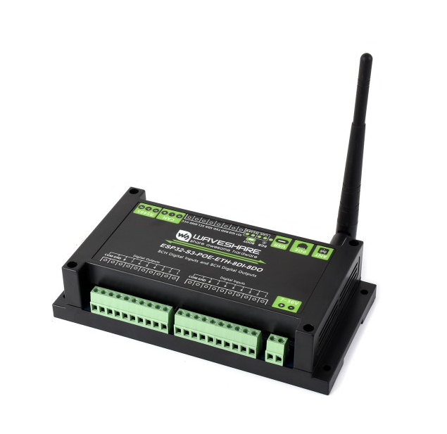

## Product description

This is a feature packed I/o board with an ESP32-S3-WROOM-1U-N16R8.

This has two varients, one with and one without POE support.

It has

- Powered by ESP32-S3 with dual-core Xtensa LX7 CPU up to 240 MHz
- Integrated 2.4 GHz Wi-Fi + Bluetooth LE with external antenna
- Ethernet port than can provide PoE power
- Isolated RS485 interface for Modbus sensors/modules
- Isolated CANbus interface
- 8 optocoupler isolated inputs
- 8 optocoupler isolated outputs
- External i2c header
- GPIO header for expansion (e.g. RS232, sensors)
- USB-C for power, firmware upload, and debugging. Can provide power to other devices with a jumper
- 7–36V wide-range input via screw terminal for industrial use
- Status indicators: buzzer, RGB LED, power, RS485 TX/RX
- ABS rail-mount enclosure for safe, easy installation

The board can be powered either via 7-36DC or via 5VDC (USB-C).
Outputs provide current sinking up to 500ma

More information:

- Product page (Non-POE varient not listed) :
  - [https://www.waveshare.com/esp32-s3-poe-eth-8di-8do.htm](https://www.waveshare.com/esp32-s3-poe-eth-8di-8do.htm)
- Wiki:
  - [ESP32-S3-ETH-8DI-8RO](https://www.waveshare.com/wiki/ESP32-S3-ETH-8DI-8RO)
  - [ESP32-S3-POE-ETH-8DI-8DO](https://www.waveshare.com/wiki/ESP32-S3-POE-ETH-8DI-8DO)

## Basic Config

This config has Wi-Fi enabled by default. You cannot use both WiFi and Ethernet at the same
time ([ESPHome Ethernet documentation](https://esphome.io/components/ethernet/)). In order to use
Ethernet,
uncomment the Ethernet block and comment the Wi-Fi blocks.

```yaml file=config.yaml
```
