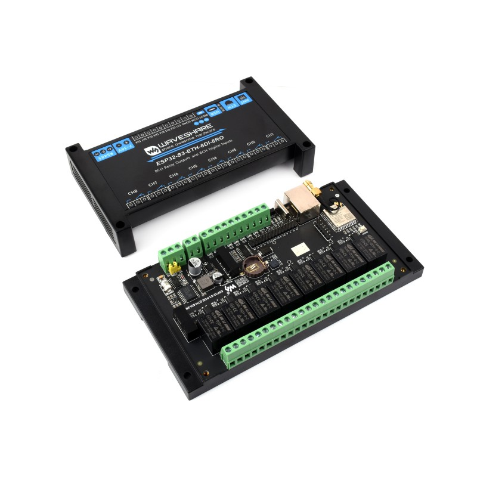
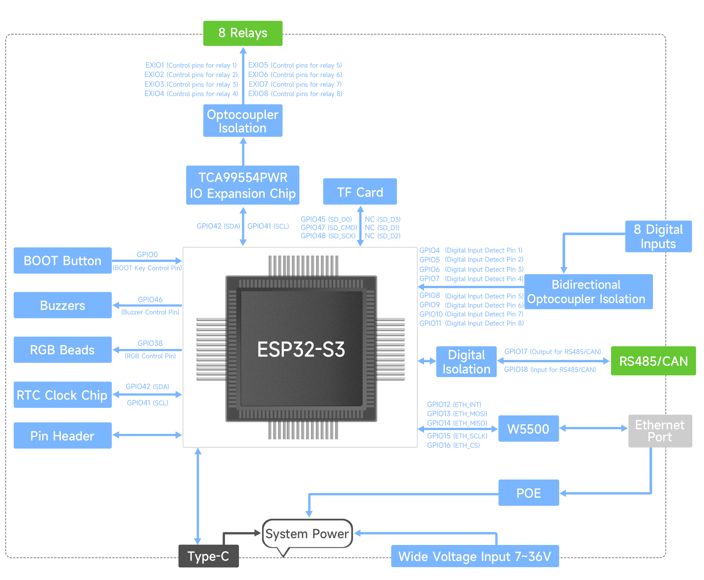

## Product description
This is a feature packed 8-relay board with an ESP32-S3-WROOM-1U-N16R8.
It also has:-
Powered by ESP32-S3 with dual-core Xtensa LX7 CPU up to 240 MHz
Integrated 2.4 GHz Wi-Fi + Bluetooth LE with strong RF performance
Isolated RS485 interface for Modbus sensors/modules
GPIO header for expansion (e.g. RS232, sensors)
USB-C for power, firmware upload, and debugging
7–36V wide-range input via screw terminal for industrial use
Optocoupler isolation protects MCU from high-voltage relay circuits
Digital signal isolation prevents external interference
Integrated power isolation—no extra supply needed for isolated terminals
Status indicators: buzzer, RGB LED, power, RS485 TX/RX
ABS rail-mount enclosure for safe, easy installation

Each relay has COM+NO+NC exposed. Rating ≤10A 250VAC/30VDC.
The board can be powered either via 7-36DC or via 5VDC (USB-C).

This board exists in a regular Ethernet version (ESP32-S3-ETH-8DI-8RO) and POE enabled
version (ESP32-S3-POE-ETH-8DI-8RO). The config below will work for both versions.

More information:
- Product page: https://www.waveshare.com/esp32-s3-eth-8di-8ro.htm
- Wiki: https://www.waveshare.com/wiki/ESP32-S3-ETH-8DI-8RO

## GPIO Pinout



## Basic Config

This config has Ethernet enabled by default. You cannot use both WiFi and Ethernet at the same
time ([link](https://esphome.io/components/ethernet.html#ethernet-component)). In order to use WiFi,
uncomment the WiFi block and comment the Ethernet blocks.

```yaml
substitutions:
  device_name: "waveshare001"
  device_comment: "WaveShare ESP32-S3-POE-ETH-8DI-8RO device"
  device_friendly: "WaveShare001"

esphome:
  name: ${device_name}
  friendly_name: ${device_friendly}
  min_version: 2025.5.0
  comment: $device_comment
  name_add_mac_suffix: false
  on_boot:
    then:
      - pcf85063.read_time

# Waveshare ESP32-S3-ETH-8DI-8RO uses ESP32-S3-WROOM-1U-N16R8
# -> 16 MB flash
# -> 8 MB psram
esp32:
  board: esp32s3box #esp32-s3-devkitc-1
  flash_size: 16MB   
  framework:
    type: arduino

psram:
  mode: octal
  speed: 80MHz

# Enable logging
logger:

# Enable Home Assistant API
api:
  encryption:
    key: !secret api_encryption_key
  actions:
    # Ability to command the buzzer from Home Assistant
    - action: rtttl_play
      variables:
        song_str: string
      then:
        - rtttl.play:
            rtttl: !lambda 'return song_str;'

# Allow Over-The-Air updates
ota:
- platform: esphome
  password: !secret ota_password

##wifi:
##  ssid: !secret wifi_ssid
##  password: !secret wifi_password
##  domain: !secret wifi_domain
##
##  # Enable AP when WiFi connection fails
##  ap:
##    ssid: ${device_name} AP
##   password: !secret wifi_hotspot_pass
##
## captive_portal:
##
## text_sensor:
##  - platform: wifi_info
##    ip_address:
##      name: "${device_name} - IP Address"
##    ssid:
##      name: "${device_name} - Wi-Fi SSID"
##    bssid:
##      name: "${device_name} - Wi-Fi BSSID"
##  - platform: version
##    name: "${device_name} - ESPHome Version"
##    hide_timestamp: true

# Ethernet configuration - mutually exclusive with WiFi!
ethernet:
  type: W5500
  clk_pin: GPIO15
  mosi_pin: GPIO13
  miso_pin: GPIO14
  cs_pin: GPIO16
  interrupt_pin: GPIO12
 #reset_pin: GPIOXX

text_sensor:
  - platform: ethernet_info
    ip_address:
      name: "${device_name} - IP Address"
      address_0:
        name: "${device_name} - IP Address 0"
      address_1:
        name: "${device_name} - IP Address 1"
      address_2:
        name: "${device_name} - IP Address 2"
      address_3:
        name: "${device_name} - IP Address 3"
      address_4:
        name: "${device_name} - IP Address 4"
    dns_address:
      name: "${device_name} - DNS Address"
    mac_address:
      name: "${device_name} - MAC Address"

# Enable Web server
web_server:
  port: 80

# I2C bus
i2c:
  sda: GPIO42
  scl: GPIO41
  scan: false
  frequency: 100kHz
  id: i2cbus

pca9554:
  - id: 'TCA9554_hub'
    address: 0x20

# RS485 / Modbus
uart:
  - id: modbus_uart
    tx_pin: GPIO17
    rx_pin: GPIO18
    baud_rate: 38400
    stop_bits: 1 #default to 8E1
    data_bits: 8 #default to 8E1
    parity: EVEN #default to 8E1

# see: https://esphome.io/components/time.html
time:
  - platform: homeassistant
    id: homeassistant_time
    on_time_sync:
      then:
        # Update the RTC when the synchronization was successful
        pcf85063.write_time:    
  - platform: pcf85063
    id: pcf85063_time

binary_sensor:
  - platform: status
    name: "Status"

  - platform: gpio
    name: "Boot Button"
    pin:
      number: 0
      ignore_strapping_warning: true
      mode:
        input: true
      inverted: true
    disabled_by_default: true
    on_press:
      then:
        - button.press: restart_button

# buzzer
output:
  - platform: ledc
    pin:
      number: GPIO46
      ignore_strapping_warning: true
    id: buzzer

rtttl:
  output: buzzer
  id: rtttl_buzzer
  gain: 30%

# RGB LED
light:
  - platform: esp32_rmt_led_strip
    rgb_order: RGB
    chipset: WS2812
    pin: GPIO38
    num_leds: 1
    name: "RGB LED"
    id: rgb_led

# Relays
switch:
  - platform: gpio
    name: "Relay 1"
    id: relay1
    pin:
      pca9554: TCA9554_hub
      number: 0
      mode:
        output: true
      inverted: false

  - platform: gpio
    name: "Relay 2"
    id: relay2
    pin:
      pca9554: TCA9554_hub
      number: 1
      mode:
        output: true
      inverted: false

  - platform: gpio
    name: "Relay 3"
    id: relay3
    pin:
      pca9554: TCA9554_hub
      number: 2
      mode:
        output: true
      inverted: false

  - platform: gpio
    name: "Relay 4"
    id: relay4
    pin:
      pca9554: TCA9554_hub
      number: 3
      mode:
        output: true
      inverted: false

  - platform: gpio
    name: "Relay 5"
    id: relay5
    pin:
      pca9554: TCA9554_hub
      number: 4
      mode:
        output: true
      inverted: false

  - platform: gpio
    name: "Relay 6"
    id: relay6
    pin:
      pca9554: TCA9554_hub
      number: 5
      mode:
        output: true
      inverted: false

  - platform: gpio
    name: "Relay 7"
    id: relay7
    pin:
      pca9554: TCA9554_hub
      number: 6
      mode:
        output: true
      inverted: false

  - platform: gpio
    name: "Relay 8"
    id: relay8
    pin:
      pca9554: TCA9554_hub
      number: 7
      mode:
        output: true
      inverted: false

# Virtual buttons
button:
  - platform: restart
    name: "Restart"
    id: restart_button
    entity_category: config

  - platform: factory_reset
    name: "Factory Reset"
    id: reset
    entity_category: config

  - platform: safe_mode
    name: "Safe Mode"
    internal: false
    entity_category: config
```

## Buzzer control through ESPHome

Read more about it here: https://esphome.io/components/rtttl.html#test-setup
Some fun beeps to send are here: https://esphome.io/components/rtttl.html#common-beeps
