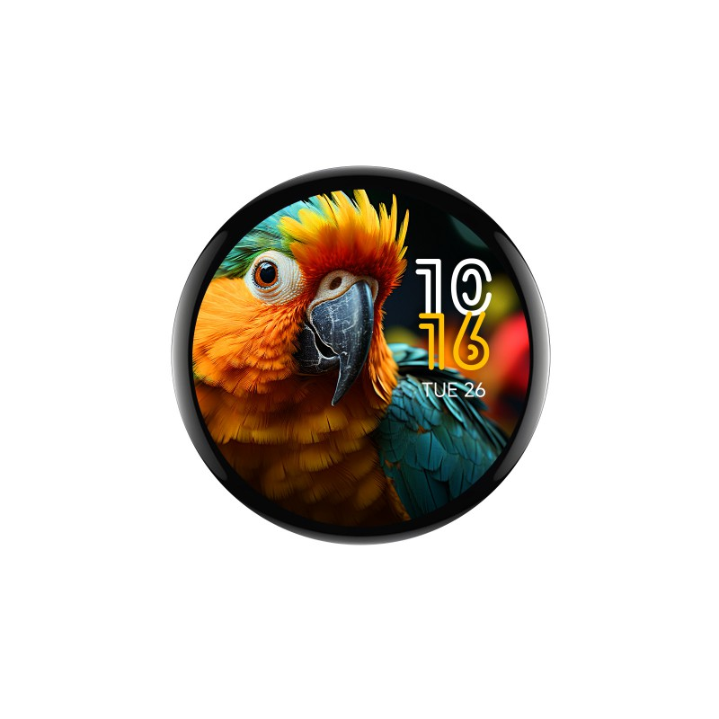

## Product specs

| Feature      | Spec                    |
| ------------ | ----------------------- |
| Screen       | CO5300 driver 466\*466 |
| Touch screen | CST9217                  |
| CPU          | ESP32-S3               |
| Flash        | 16MB                    |
| PSRAM        | 8MB                     |

## Product description

A circular 1.75in / 45mm AMOLED display with touchscreen, esp32s3 microcontroller, and dual microphones with AEC.
Avalible on [Waveshare](https://www.waveshare.com/esp32-s3-touch-amoled-1.75.htm?sku=31261) for ~$30.
Case and GPS versions are also available.

## Basic Config

```yaml
substitutions:
  name: "waveshare-s3-amoled-175"
  friendly_name: "Waveshare-S3-AMOLED-1.75in"
  # I2S Audio Config
  i2s_bps_spk: 16bit
  i2s_bps_mic: 16bit
  i2s_sample_rate_spk: 44100
  i2s_sample_rate_mic: 44100
  i2s_use_apll: true

esphome:
  name: "${name}"
  friendly_name: "${friendly_name}"
  platformio_options:
    board_build.flash_mode: dio
    board_build.f_flash: 80000000L
    board_build.f_cpu: 240000000L

esp32:
  variant: ESP32S3
  flash_size: 16MB
  framework:
    type: esp-idf

psram:
  mode: octal
  speed: 80MHz

# Enable logging
logger:

wifi:
  ssid: !secret wifi_ssid
  password: !secret wifi_password

# Include external components
external_components:
  - source: 
      type: git
      url: https://github.com/shelson/esphome-cst9217

# Bus Configuration
i2c:
  - id: bus_a
    sda: GPIO15
    scl: GPIO14
    scan: true

i2s_audio:
  - id: i2s_out
    i2s_lrclk_pin:
      number: GPIO45
      allow_other_uses: true
    i2s_bclk_pin:
      number: GPIO9
      allow_other_uses: true
    i2s_mclk_pin: GPIO42
  - id: i2s_in
    i2s_lrclk_pin:
      number: GPIO45
      allow_other_uses: true
    i2s_bclk_pin: 
      number: GPIO9
      allow_other_uses: true

spi:
  - id: display_qspi
    type: quad
    clk_pin: GPIO38
    data_pins:
      - GPIO4
      - GPIO5
      - GPIO6
      - GPIO7

# ADC and Mic Configuration
audio_adc:
  - platform: es7210
    id: adc_bus_a
    bits_per_sample: $i2s_bps_mic
    sample_rate: $i2s_sample_rate_mic

microphone:
  - platform: i2s_audio
    id: mic_a
    adc_type: external
    i2s_din_pin: GPIO10
    i2s_audio_id: i2s_in
    sample_rate: $i2s_sample_rate_mic
    bits_per_sample: $i2s_bps_mic
    pdm: False

# DAC and Speaker Configuration
audio_dac:
  - platform: es8311
    id: dac_bus_a
    bits_per_sample: $i2s_bps_spk
    sample_rate: $i2s_sample_rate_spk

speaker:
  - platform: i2s_audio
    i2s_audio_id: i2s_out
    id: speaker_a
    i2s_dout_pin: GPIO8
    dac_type: external
    timeout: never
    buffer_duration: 100ms
    audio_dac: dac_bus_a
    sample_rate: $i2s_sample_rate_spk
    bits_per_sample: $i2s_bps_spk
    use_apll: $i2s_use_apll
    channel: stereo

switch:
  - platform: gpio
    name: "Speaker Enable"
    pin: GPIO46
    restore_mode: RESTORE_DEFAULT_ON

# Display Configuration
display:
  - platform: mipi_spi
    id: disp1
    model: CO5300
    bus_mode: quad
    reset_pin: GPIO39
    cs_pin: GPIO12
    dimensions:
      height: 466
      width: 466

light:
  - platform: monochromatic
    id: display_backlight
    name: "Backlight"
    output: backlight_brightness
    default_transition_length:
      milliseconds: 0
    initial_state:
      brightness: 81%
    restore_mode:
      ALWAYS_ON

output:
  - platform: template
    id: backlight_brightness
    type: float
    write_action:
      then:
        - lambda: |-
            id(disp1).set_brightness(state*255);

# Touchscreen Configuration
touchscreen:
  - platform: cst9217
    display: disp1
    id: ts_disp1
    interrupt_pin: GPIO11
    reset_pin: GPIO40
    transform:
      mirror_x: true
      mirror_y: true
    on_update:
      - lambda: |-
          for (auto touch: touches)  {
              if (touch.state <= 2) {
                 ESP_LOGI("Touch points:", "id=%d x=%d, y=%d", touch.id, touch.x, touch.y);
              }
          }

```
